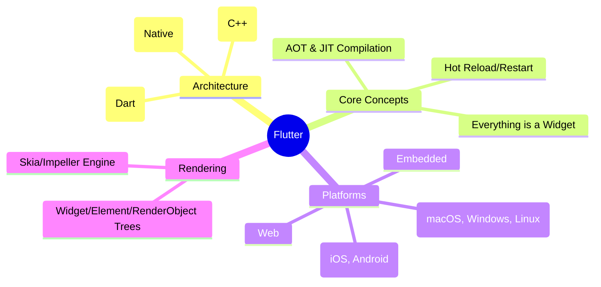
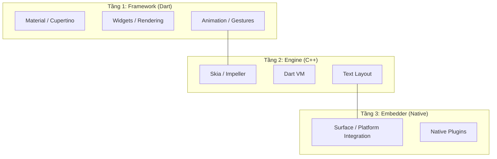
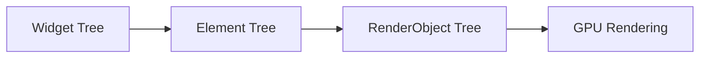

# 1. Introduction to Flutter

> [!abstract] TL;DR
> Flutter là UI framework của Google dùng Dart, cho phép build native app đa nền tảng (iOS, Android, Web, Desktop) từ một codebase duy nhất. Mọi thứ trong Flutter đều là **Widget**.

---

## Key Topics



---

## Core Concepts

### 1.1 Flutter là gì?

- Flutter là **open-source UI framework** do Google phát triển, dùng để xây dựng các ứng dụng biên dịch **native** sử dụng một **codebase** duy nhất.
- Flutter hỗ trợ chạy trên nhiều nền tảng như Android, iOS, Web, macOS, Linux và Windows. (6 platform)
- Flutter được viết bằng ngôn ngữ **Dart** với **Rendering Engine** gọi là **Skia**
- Flutter cho phép phát triển UI một cách liên tục thông qua các **Widget** có thể tái sử dụng.

##### **Lịch sử của Flutter**
- 2015: Sky project.
- 2017: Flutter Alpha.
- 2018: Flutter 1.0.
- 2021: Flutter 2.0 adds Web/Desktop.
- 2023–2025: Flutter 3.x stable.

##### **Declarative vs Imperative UI**

| Đặc điểm | Imperative (Native) | Declarative (Flutter) |
| :--- | :--- | :--- |
| **Cách làm** | Chỉ dẫn từng bước để đổi UI | Mô tả UI tương ứng với State |
| **Ví dụ** | `view.setText("Hello")` | `Text(state.message)` |
| **Tư duy** | "Làm thế nào" (How) | "Cái gì" (What) |

### 1.2 Tại sao lại là Flutter?

- Flutter đem lại nhiều tính năng mạnh mẽ cho việc phát triển UI.

| Tính năng | Mô tả |
| :--- | :--- |
| **Fast Development** | Sử dụng **Hot Reload**, **Hot Restart** để xem thay đổi tức thì |
| **Beautiful UI** | **Material** & **Cupertino Widgets** tích hợp sẵn |
| **Single Codebase** | Viết một lần → Chạy đa nền tảng (6+ platforms) |
| **Performance** | Sử dụng **Dart AOT** biên dịch trực tiếp sang mã máy, đạt hiệu năng gần như Native |
### **1.3 Lựa chọn Flutter hợp lý**

> [!abstract]   Từ chức năng đến quyết định
>- Mặc dù Flutter đem lại nhiều tính năng mạnh mẽ, vậy nhưng không có công nghệ nào có thể phù hợp hoàn toàn với mọi dự án, vậy nên ta phải chọn công cụ dựa trên bối cảnh dự án.

**Khi nào thì dùng Flutter?**

- Ta cần tạo ứng dụng đa nền tảng sử dụng cùng UI và Logic.
- Dành cho **MVP**, **Startups** và khi cần tạo **Prototype liên tục**.
- Các ứng dụng doanh nghiệp (Thương mại điện tử, Booking, Dashboard,...)
- Ứng dụng có tần suất sử dụng chức năng thiết bị ở mức vừa.
- Dành cho các đội ngũ có tài nguyên về Android, iOS giới hạn.

**Flutter tích hợp với mã nguồn Native**

> Do Flutter không thể xử lý mọi yêu cầu liên quan đến phần cứng, hiệu suất cao,... nên nó cần thông qua nền tảng Native để xử lý các tác vụ đó.

- **Flutter** chỉ xử lý các logic nghiệp vụ và UI.
- **Native code** sẽ xử lý các chức năng cụ thể của từng nền tảng.
- Việc giao tiếp được thực hiện qua **Platform Channels**
Ví dụ: **Camera**, **Bluetooth**, **NFC**, **Payment SDKs**, **OS-level services** được xử lý bằng **Native Code**.

**Flutter không loại bỏ hoàn toàn Native Code**

- Khi Flutter không trực tiếp hỗ trợ một tính năng nào đó, ta vẫn phải viết code Native (Kotlin hoặc Java cho Android, Swift cho iOS,...)
- Đây là một mô hình rất phổ biến trong các dự án thực tế

**Khi nào ta dùng Native Development?**

- Ứng dụng yêu cầu truy cập tuỳ chỉnh rất sâu vào hệ điều hành.
- Lập trình Game và đồ hoạ thời gian thực có hiệu năng cao.
- Cần quyền truy cập cực sâu vào phần cứng.
- Yêu cầu UI/UX khắt khe theo từng nền tảng.

>**Tóm lại:**
>Flutter dù mạnh, nhưng không phải lúc nào cũng là lựa chọn tối ưu

---

### 1.4 Tổng quan kiến trúc Flutter

Flutter có **3 tầng** kiến trúc chính:



###### **Luồng Rendering:** 


> [!info] Chi tiết các tầng
> - **Framework (Dart):** Nơi chúng ta viết code. Chứa các thư viện UI (Material, Cupertino), hệ thống Widget, Animation, và Gestures.
> - **Engine (C++):** Trái tim của Flutter. Xử lý việc vẽ (Rendering - Skia/Impeller), quản lý bộ nhớ (Dart VM), và text layout.
> - **Embedder:** Tầng giao tiếp với hệ điều hành (Android, iOS, Web...). Xử lý input từ người dùng, quản lý window và lifecycle.

---
### 1.5 Dart: Ngôn ngữ lập trình Flutter

**Dart** là ngôn ngữ lập trình được thiết kế để tạo giao diện người dùng (**UI**), kết hợp biên dịch bằng **AOT** và **JIT**. Nó hỗ trợ **null safety** và **strong typing**.

- **JIT (Just In Time)**: Biên dịch JIT sẽ xảy ra **trong khi** chương trình thực thi. Trong **Debug Mode**, Máy Ảo Dart (**Dart VM**) sẽ đọc và **inject code**, sau đó biên dịch lại thành ngôn ngữ máy **ngay lập tức** trong khi ứng dụng vẫn đang chạy. Đây chính là tính năng **Hot Reload**.
- **AOT (Ahead of Time)**: Biên dịch AOT thực thi trước khi phần mềm chạy.
- **Null Safety**: Dart phân biệt rõ các biến thành **Non-nullable** và **Nullable**, tránh lỗi **Null Pointer**.
- **Strong Typing**: Mỗi biến trong **Dart** đều phải có kiểu dữ liệu rõ ràng (khác với JS), một khi đã được gán kiểu, ta không thể tuỳ tiện thay đổi kiểu dữ liệu của nó.

**Một số tính năng của Dart:**

- Hướng đối tượng (Object Oriented)
- Hàm là các đối tượng hạng nhất. 
- Null safety
- Async/Await
___
### 1.6 Widget — Khái niệm nền tảng

> [!important] Everything is a Widget
> Trong Flutter, **mọi thứ đều là Widget**: Text, Button, Padding, Animation, Layout, thậm chí cả app theme.

Có 2 loại Widget chính:

| Widget            | Đặc điểm                  | Khi dùng                                  |
| :---------------- | :------------------------ | :---------------------------------------- |
| `StatelessWidget` | Immutable, không có state | UI tĩnh, chỉ phụ thuộc vào input          |
| `StatefulWidget`  | Có state, có thể rebuild  | UI dynamic, cần cập nhật theo user action |

```dart
// StatelessWidget
class MyText extends StatelessWidget {
  const MyText({super.key});

  @override
  Widget build(BuildContext context) {
    return const Text('Hello Flutter!');
  }
}

// StatefulWidget
class Counter extends StatefulWidget {
  const Counter({super.key});

  @override
  State<Counter> createState() => _CounterState();
}

class _CounterState extends State<Counter> {
  int _count = 0;

  @override
  Widget build(BuildContext context) {
    return Text('Count: $_count');
  }
}
```

---

### 1.7 Cấu trúc Project Flutter

```
my_flutter_app/
├── lib/
│   └── main.dart          ← Entry point của app
├── android/               ← Code đặc thù cho Android
├── ios/                   ← Code đặc thù cho iOS
├── web/                   ← Code đặc thù cho Web
├── pubspec.yaml           ← Dependencies & assets config
└── test/                  ← Unit & widget tests
```

---

### 1.8 Entry Point & App Structure

```dart
import 'package:flutter/material.dart';

void main() => runApp(const MyApp());  // Entry point

class MyApp extends StatelessWidget {
  const MyApp({super.key});

  @override
  Widget build(BuildContext context) {
    return MaterialApp(              // Root widget
      title: 'Flutter Demo',
      theme: ThemeData(
        colorScheme: ColorScheme.fromSeed(seedColor: Colors.deepPurple),
      ),
      home: const MyHomePage(),
    );
  }
}
```

---

### 1.9 Quy trình làm việc

Dưới đây là một số câu lệnh terminal dùng khi lập trình Flutter 

| Lệnh terminal           | Tác dụng                    |
| :---------------------- | :-------------------------- |
| `flutter doctor`        | Kiểm tra môi trường cài đặt |
| `flutter create <name>` | Tạo project mới             |
| `flutter run`           | Chạy app                    |
| `flutter build apk`     | Build Android APK           |
| `r` (trong terminal)    | Hot Reload                  |
| `R` (trong terminal)    | Hot Restart                 |

> [!tip] Hot Reload vs Hot Restart
> - **Hot Reload** (`r`): Inject code mới, giữ nguyên state. Dùng khi sửa UI.
> - **Hot Restart** (`R`): Restart app từ đầu, reset state. Dùng khi thêm state mới.

---

## Quick Reference

| Thuật ngữ      | Ý nghĩa                                      |
| :------------- | :------------------------------------------- |
| `Widget`       | Building block của mọi UI trong Flutter      |
| `BuildContext` | Vị trí của widget trong Widget Tree          |
| `Scaffold`     | Cấu trúc màn hình cơ bản (AppBar, Body, FAB) |
| `MaterialApp`  | Root widget với Material Design support      |
| `runApp()`     | Hàm khởi động app, inflate widget đầu tiên   |
| `setState()`   | Trigger rebuild UI khi state thay đổi        |

---

## Các lỗi thường gặp

> [!warning] Quên `const` Constructor
> Luôn dùng `const` cho widget không có dữ liệu động để Flutter có thể tối ưu việc render và tránh rebuild không cần thiết.
> ```dart
> // ❌ Sẽ rebuild mỗi lần parent rebuild
> child: Text('Hello')
> // ✅ Flutter skip rebuild nếu không thay đổi
> child: const Text('Hello')
> ```

> [!warning] setState() ở sai chỗ
> Chỉ gọi `setState()` bên trong class `State`, không gọi trong `StatelessWidget`.

---

## Related Notes

- **Slide:** [[Module1_Introduction_to_Flutter.pptx|Module 1 Slide]]
- **Lab:** [[1. Set up and Demo|Lab 1 - Setup & Demo]]
- **Tiếp theo:** [[2. Dart Essentials]]
- [[Flutter Dashboard]]
