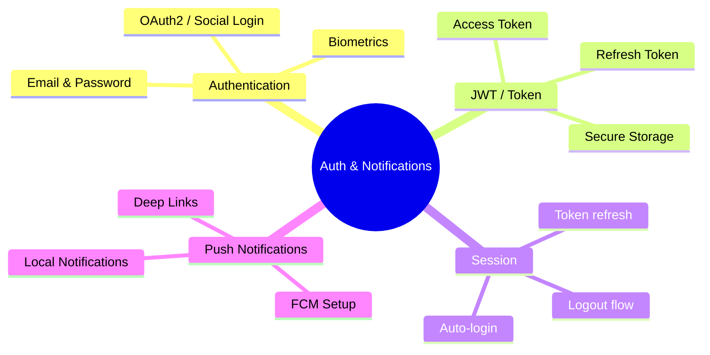

---
type: concept
module: 10
tags:
  - flutter/auth
  - flutter/security
  - flutter/notifications
slide: "[[Module10_Authentication, Session Management & Notifications.pptx|Module 10 Slide]]"
lab: "*(coming soon)*"
status: complete
date: 2026-05-11
---

# 10. Authentication, Session Management & Notifications

> [!abstract] TL;DR
> Authentication trong Flutter thường dùng JWT token (lưu trong `flutter_secure_storage`). Session management tự động refresh token. Push notifications dùng Firebase Cloud Messaging (FCM).

---

## Key Topics



---

## Core Concepts

### 10.1 JWT Authentication Flow

```
User → [Email + Password] → Server
Server → [Access Token + Refresh Token] → App
App lưu tokens trong SecureStorage
App gửi Access Token trong mọi API request (Authorization header)
Khi Access Token hết hạn → dùng Refresh Token để lấy token mới
Khi Refresh Token hết hạn → Logout, yêu cầu đăng nhập lại
```

---

### 10.2 Secure Token Storage

```yaml
dependencies:
  flutter_secure_storage: ^9.0.0
```

```dart
import 'package:flutter_secure_storage/flutter_secure_storage.dart';

class TokenStorage {
  static const _storage = FlutterSecureStorage(
    aOptions: AndroidOptions(encryptedSharedPreferences: true),
  );

  static const _accessTokenKey = 'access_token';
  static const _refreshTokenKey = 'refresh_token';

  static Future<void> saveTokens({
    required String accessToken,
    required String refreshToken,
  }) async {
    await _storage.write(key: _accessTokenKey, value: accessToken);
    await _storage.write(key: _refreshTokenKey, value: refreshToken);
  }

  static Future<String?> getAccessToken() =>
      _storage.read(key: _accessTokenKey);

  static Future<String?> getRefreshToken() =>
      _storage.read(key: _refreshTokenKey);

  static Future<void> clearAll() => _storage.deleteAll();
}
```

---

### 10.3 AuthService

```dart
class AuthService extends ChangeNotifier {
  User? _currentUser;
  bool _isLoading = false;

  User? get currentUser => _currentUser;
  bool get isLoggedIn => _currentUser != null;
  bool get isLoading => _isLoading;

  // Kiểm tra trạng thái đăng nhập khi app start
  Future<void> checkAuthStatus() async {
    final token = await TokenStorage.getAccessToken();
    if (token == null) return;

    try {
      _currentUser = await _fetchCurrentUser(token);
      notifyListeners();
    } catch (e) {
      await logout(); // Token invalid → logout
    }
  }

  Future<void> login(String email, String password) async {
    _isLoading = true;
    notifyListeners();

    try {
      final response = await _apiService.login(email: email, password: password);
      await TokenStorage.saveTokens(
        accessToken: response.accessToken,
        refreshToken: response.refreshToken,
      );
      _currentUser = response.user;
    } finally {
      _isLoading = false;
      notifyListeners();
    }
  }

  Future<void> logout() async {
    await TokenStorage.clearAll();
    _currentUser = null;
    notifyListeners();
  }
}
```

---

### 10.4 Auto-redirect theo Auth State

```dart
// MaterialApp với GoRouter (hoặc dùng Consumer)
class MyApp extends StatelessWidget {
  @override
  Widget build(BuildContext context) {
    return ChangeNotifierProvider(
      create: (_) => AuthService()..checkAuthStatus(),
      child: Consumer<AuthService>(
        builder: (context, auth, _) {
          return MaterialApp(
            home: auth.isLoading
                ? SplashScreen()
                : auth.isLoggedIn
                    ? HomeScreen()
                    : LoginScreen(),
          );
        },
      ),
    );
  }
}
```

---

### 10.5 HTTP Interceptor — Auto-inject Token

```dart
class AuthenticatedClient extends http.BaseClient {
  final http.Client _inner;
  final AuthService _auth;

  AuthenticatedClient(this._inner, this._auth);

  @override
  Future<http.StreamedResponse> send(http.BaseRequest request) async {
    final token = await TokenStorage.getAccessToken();
    if (token != null) {
      request.headers['Authorization'] = 'Bearer $token';
    }

    final response = await _inner.send(request);

    // Token hết hạn → refresh
    if (response.statusCode == 401) {
      final newToken = await _refreshToken();
      if (newToken != null) {
        // Retry request với token mới
        final retryRequest = request; // Clone request
        retryRequest.headers['Authorization'] = 'Bearer $newToken';
        return _inner.send(retryRequest);
      } else {
        await _auth.logout();
      }
    }
    return response;
  }

  Future<String?> _refreshToken() async { ... }
}
```

---

### 10.6 Firebase Cloud Messaging (FCM)

```yaml
dependencies:
  firebase_core: ^2.24.0
  firebase_messaging: ^14.7.0
  flutter_local_notifications: ^16.3.0
```

```dart
class NotificationService {
  static Future<void> initialize() async {
    // 1. Request permission
    final messaging = FirebaseMessaging.instance;
    final settings = await messaging.requestPermission(
      alert: true, badge: true, sound: true,
    );

    // 2. Get FCM token (gửi lên server để target device)
    final token = await messaging.getToken();
    print('FCM Token: $token');

    // 3. Handle foreground messages
    FirebaseMessaging.onMessage.listen((RemoteMessage message) {
      _showLocalNotification(message);
    });

    // 4. Handle background tap (app in background)
    FirebaseMessaging.onMessageOpenedApp.listen((RemoteMessage message) {
      _handleNotificationTap(message.data);
    });

    // 5. Handle terminated app tap
    final initialMessage = await messaging.getInitialMessage();
    if (initialMessage != null) {
      _handleNotificationTap(initialMessage.data);
    }
  }

  static void _showLocalNotification(RemoteMessage message) {
    // Dùng flutter_local_notifications để hiển thị
  }

  static void _handleNotificationTap(Map<String, dynamic> data) {
    // Navigate đến screen phù hợp dựa trên data
    final type = data['type'];
    final id = data['id'];
    // NavigationService.navigateTo('/detail/$id');
  }
}
```

---

### 10.7 Local Notifications

```dart
import 'package:flutter_local_notifications/flutter_local_notifications.dart';

final flutterLocalNotificationsPlugin = FlutterLocalNotificationsPlugin();

Future<void> showNotification({
  required String title,
  required String body,
  String? payload,
}) async {
  const androidDetails = AndroidNotificationDetails(
    'channel_id', 'channel_name',
    importance: Importance.max,
    priority: Priority.high,
  );

  await flutterLocalNotificationsPlugin.show(
    DateTime.now().millisecondsSinceEpoch ~/ 1000,
    title, body,
    const NotificationDetails(android: androidDetails),
    payload: payload,
  );
}

// Schedule notification
await flutterLocalNotificationsPlugin.zonedSchedule(
  id, title, body,
  TZDateTime.now(local).add(const Duration(hours: 1)),
  const NotificationDetails(android: androidDetails),
  uiLocalNotificationDateInterpretation:
      UILocalNotificationDateInterpretation.absoluteTime,
);
```

---

## Quick Reference

| Vấn đề | Giải pháp |
| :--- | :--- |
| Lưu token an toàn | `flutter_secure_storage` |
| Auto-inject token vào HTTP | Custom `http.BaseClient` |
| Redirect theo auth state | `ChangeNotifier` + `Consumer` |
| Push notification | Firebase Cloud Messaging |
| Local notification | `flutter_local_notifications` |
| Social login | `google_sign_in`, `sign_in_with_apple` |
| Biometric auth | `local_auth` |

---

## Common Pitfalls

> [!warning] Lưu token trong SharedPreferences
> SharedPreferences không được mã hóa. Dùng `flutter_secure_storage` cho mọi sensitive data (tokens, passwords, PII).

> [!warning] Không handle token refresh
> Khi Access Token hết hạn (thường 15-60 phút), app sẽ nhận 401. Cần interceptor để tự động refresh token, không bắt user đăng nhập lại.

---

## Related Notes

- **Slide:** [[Module10_Authentication, Session Management & Notifications.pptx|Module 10 Slide]]
- **Trước:** [[9. Local Storage & Persistence]]
- **Tiếp theo:** [[11. Testing & Debugging]]
- [[Flutter Dashboard]]
