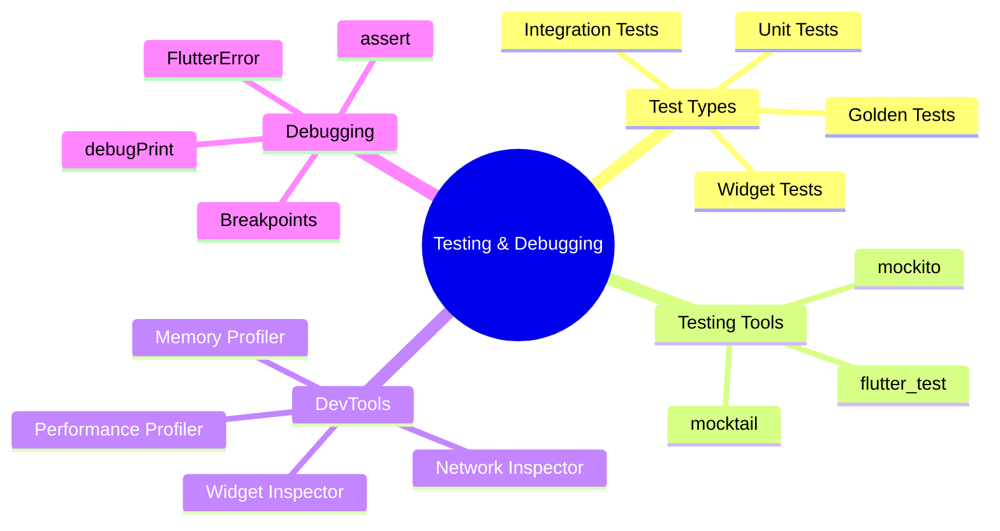

---
type: concept
module: 11
tags:
  - flutter/testing
  - flutter/debugging
  - flutter/devtools
slide: "[[Module11_Testing & Debugging in Flutter.pptx|Module 11 Slide]]"
lab: "*(coming soon)*"
status: complete
date: 2026-05-11
---

# 11. Testing & Debugging in Flutter

> [!abstract] TL;DR
> Flutter có 3 loại test: Unit (logic), Widget (UI), Integration (end-to-end). Flutter DevTools là bộ công cụ debugging mạnh mẽ để phân tích performance, widget tree, memory và network.

---

## Key Topics



---

## Core Concepts

### 11.1 Testing Pyramid

```
         /\
        /  \  Integration Tests
       /    \  (Slow, Real device)
      /------\
     /        \  Widget Tests
    /          \  (Medium, Mock environment)
   /------------\
  /              \  Unit Tests
 /________________\  (Fast, Pure Dart)
```

| Type | Speed | Scope | Package |
| :--- | :---: | :--- | :--- |
| Unit | ⚡ Fast | Pure logic, no UI | `test` |
| Widget | ⚡⚡ Medium | Widget rendering | `flutter_test` |
| Integration | 🐌 Slow | Real app, real device | `integration_test` |

---

### 11.2 Unit Tests

```dart
// test/services/cart_service_test.dart
import 'package:test/test.dart';
import 'package:myapp/services/cart_service.dart';

void main() {
  group('CartService', () {
    late CartService sut; // System Under Test

    setUp(() {
      sut = CartService(); // Fresh instance cho mỗi test
    });

    test('should start with empty cart', () {
      expect(sut.items, isEmpty);
      expect(sut.total, equals(0.0));
    });

    test('should add item correctly', () {
      final item = Item(id: '1', name: 'Flutter Book', price: 29.99);
      sut.addItem(item);

      expect(sut.items.length, equals(1));
      expect(sut.total, equals(29.99));
    });

    test('should throw when adding duplicate item', () {
      final item = Item(id: '1', name: 'Test', price: 10);
      sut.addItem(item);

      expect(() => sut.addItem(item), throwsArgumentError);
    });
  });
}
```

---

### 11.3 Mocking với Mockito/Mocktail

```dart
// Tạo mock
import 'package:mocktail/mocktail.dart';

class MockApiService extends Mock implements ApiService {}

void main() {
  group('PostRepository', () {
    late MockApiService mockApi;
    late PostRepository sut;

    setUp(() {
      mockApi = MockApiService();
      sut = PostRepository(apiService: mockApi);
    });

    test('should return posts from API', () async {
      // Arrange
      final fakePosts = [Post(id: 1, title: 'Test', body: 'Body', userId: 1)];
      when(() => mockApi.getPosts()).thenAnswer((_) async => fakePosts);

      // Act
      final result = await sut.getPosts();

      // Assert
      expect(result, equals(fakePosts));
      verify(() => mockApi.getPosts()).called(1);
    });

    test('should throw when API fails', () {
      when(() => mockApi.getPosts()).thenThrow(Exception('Network error'));
      expect(() => sut.getPosts(), throwsException);
    });
  });
}
```

---

### 11.4 Widget Tests

```dart
import 'package:flutter_test/flutter_test.dart';
import 'package:myapp/screens/counter_screen.dart';

void main() {
  testWidgets('Counter increments when button tapped', (WidgetTester tester) async {
    // Build widget
    await tester.pumpWidget(const MaterialApp(home: CounterScreen()));

    // Verify initial state
    expect(find.text('0'), findsOneWidget);
    expect(find.text('1'), findsNothing);

    // Tap button
    await tester.tap(find.byIcon(Icons.add));
    await tester.pump(); // Trigger rebuild

    // Verify updated state
    expect(find.text('1'), findsOneWidget);
  });

  testWidgets('Login form shows error when email is invalid', (tester) async {
    await tester.pumpWidget(const MaterialApp(home: LoginScreen()));

    // Enter invalid email
    await tester.enterText(find.byKey(Key('email_field')), 'notvalid');
    await tester.tap(find.byKey(Key('submit_button')));
    await tester.pump();

    // Error message appears
    expect(find.text('Email không hợp lệ'), findsOneWidget);
  });
}

// Common finders
find.text('Hello')           // Tìm theo text
find.byType(ElevatedButton)  // Tìm theo widget type
find.byKey(Key('my_key'))    // Tìm theo key
find.byIcon(Icons.add)       // Tìm theo icon
find.byTooltip('Submit')     // Tìm theo tooltip
```

---

### 11.5 Integration Tests

```dart
// integration_test/app_test.dart
import 'package:integration_test/integration_test.dart';
import 'package:flutter_test/flutter_test.dart';
import 'package:myapp/main.dart' as app;

void main() {
  IntegrationTestWidgetsFlutterBinding.ensureInitialized();

  group('Full app test', () {
    testWidgets('Login flow', (tester) async {
      app.main();
      await tester.pumpAndSettle(); // Wait for animations

      // Navigate to login
      expect(find.text('Login'), findsOneWidget);

      // Enter credentials
      await tester.enterText(find.byKey(Key('email')), 'user@test.com');
      await tester.enterText(find.byKey(Key('password')), 'password123');

      // Submit
      await tester.tap(find.text('Sign In'));
      await tester.pumpAndSettle();

      // Should be on home screen
      expect(find.text('Home'), findsOneWidget);
    });
  });
}

// Chạy integration test
// flutter test integration_test/app_test.dart -d <device_id>
```

---

### 11.6 Flutter DevTools

```bash
# Chạy DevTools
flutter run --debug
# Trong terminal sẽ hiển thị: "Flutter DevTools: http://127.0.0.1:..."
```

| Tool | Dùng khi |
| :--- | :--- |
| **Widget Inspector** | Debug layout issues, xem widget tree |
| **Performance Profiler** | Tìm jank (frame drops), expensive rebuilds |
| **CPU Profiler** | Tìm bottleneck trong Dart code |
| **Memory Profiler** | Phát hiện memory leaks |
| **Network Inspector** | Debug API calls, xem request/response |
| **Logging View** | Xem print() output |

---

### 11.7 Debugging Techniques

```dart
// debugPrint (tốt hơn print trong Flutter)
debugPrint('User logged in: ${user.email}');

// Assert (chỉ chạy trong debug mode)
assert(items.isNotEmpty, 'Cart cannot be empty');

// FlutterError.onError
FlutterError.onError = (details) {
  // Gửi lên crash reporting service (Crashlytics, Sentry)
  FirebaseCrashlytics.instance.recordFlutterFatalError(details);
};

// Xem widget rebuild
// Trong main.dart:
debugProfileBuildsEnabled = true; // Xem trên DevTools Timeline

// Highlight paint
debugRepaintRainbowEnabled = true; // Flash màu khi widget repaint

// Log layout
debugPrintLayouts = true;
```

---

## Quick Reference — Test Commands

```bash
# Chạy tất cả unit/widget tests
flutter test

# Chạy một file test cụ thể
flutter test test/services/cart_test.dart

# Chạy với coverage report
flutter test --coverage
genhtml coverage/lcov.info -o coverage/html

# Chạy integration tests
flutter test integration_test/ -d <device_id>

# Watch mode (re-run khi file thay đổi)
flutter test --watch
```

---

## Common Pitfalls

> [!warning] `pump()` vs `pumpAndSettle()`
> - `pump()`: 1 frame. Dùng khi không có animations.
> - `pumpAndSettle()`: Chạy đến khi không còn pending frames. Dùng khi có animations, navigation, async operations.

> [!warning] Không mock dependencies trong widget tests
> Nếu widget gọi API thật trong test → test sẽ chậm và flaky. Luôn mock external dependencies.

---

## Related Notes

- **Slide:** [[Module11_Testing & Debugging in Flutter.pptx|Module 11 Slide]]
- **Trước:** [[10. Authentication & Notifications]]
- **Tiếp theo:** [[12. Performance Optimization & Deployment]]
- [[Flutter Dashboard]]
