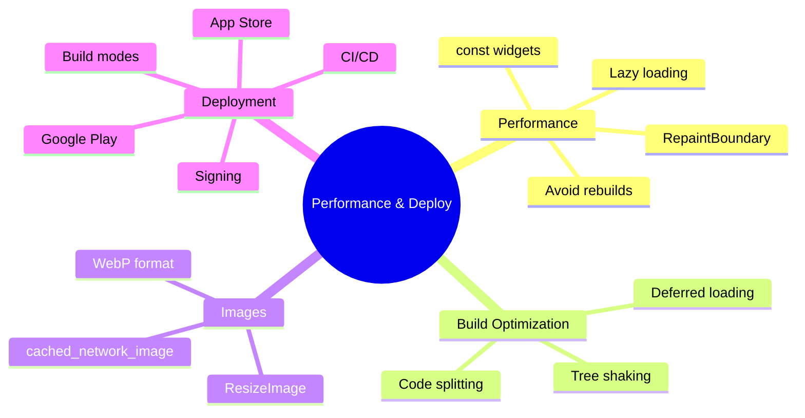

---
type: concept
module: 12
tags:
  - flutter/performance
  - flutter/deployment
  - flutter/optimization
slide: "[[Module12_Performance Optimization & App Deployment.pptx|Module 12 Slide]]"
lab: "*(coming soon)*"
status: complete
date: 2026-05-11
---

# 12. Performance Optimization & App Deployment

> [!abstract] TL;DR
> Performance Flutter tập trung vào: tránh rebuild không cần thiết, lazy loading, image caching và giữ 60fps. Deployment: sign app, build release APK/IPA, publish lên Google Play / App Store.

---

## Key Topics



---

## Core Concepts

### 12.1 Build Modes

| Mode | Command | Đặc điểm |
| :--- | :--- | :--- |
| **Debug** | `flutter run` | Hot reload, DevTools, chậm hơn |
| **Profile** | `flutter run --profile` | Gần release, DevTools available |
| **Release** | `flutter build apk` | AOT compiled, nhanh nhất |

```bash
# Profile mode để đo performance thực tế
flutter run --profile
```

> [!important] Đo performance trong Profile mode
> Đừng dùng Debug mode để đo performance — nó chậm hơn Release tới 10-20x do JIT compilation và debug overhead.

---

### 12.2 Tránh Rebuild Không Cần Thiết

#### Dùng `const` constructor

```dart
// ❌ Rebuild mỗi lần parent rebuild
child: Text('Static Text')

// ✅ Flutter skip nếu không thay đổi
child: const Text('Static Text')
```

#### Tách widget thành component nhỏ

```dart
// ❌ Toàn bộ màn hình rebuild khi counter thay đổi
class HomeScreen extends StatefulWidget {
  @override
  Widget build(BuildContext context) {
    return Column(children: [
      HeavyHeaderWidget(),  // Rebuild dù không liên quan
      Text('$_count'),
      // ...
    ]);
  }
}

// ✅ Chỉ CounterText rebuild
class CounterText extends StatelessWidget {
  final int count;
  const CounterText({required this.count});

  @override
  Widget build(BuildContext context) => Text('$count');
}
```

#### RepaintBoundary`

```dart
// Isolate widget khỏi repaint của parent
RepaintBoundary(
  child: ComplexAnimatedWidget(), // Tự repaint, không ảnh hưởng parent
)
```

---

### 12.3 ListView Performance

```dart
// ❌ Render tất cả items cùng lúc
ListView(children: items.map((i) => ItemWidget(i)).toList())

// ✅ Chỉ render items visible trong viewport
ListView.builder(
  itemCount: items.length,
  itemBuilder: (context, index) => ItemWidget(items[index]),
  // Optionally add item extent for even better performance
  itemExtent: 80.0, // Fixed height items
)

// ✅ Separators
ListView.separated(
  itemCount: items.length,
  separatorBuilder: (_, __) => const Divider(),
  itemBuilder: (context, index) => ItemWidget(items[index]),
)
```

---

### 12.4 Image Optimization

```dart
// cached_network_image: cache + loading state + error handling
import 'package:cached_network_image/cached_network_image.dart';

CachedNetworkImage(
  imageUrl: 'https://example.com/photo.jpg',
  placeholder: (context, url) => const CircularProgressIndicator(),
  errorWidget: (context, url, error) => const Icon(Icons.error),
  fit: BoxFit.cover,
  width: 200, height: 150,
  // Resize để giảm memory
  memCacheWidth: 400, // 2x physical pixels
  memCacheHeight: 300,
)

// ResizeImage: resize trước khi decode vào memory
Image(
  image: ResizeImage(
    NetworkImage(imageUrl),
    width: 400,
    height: 300,
  ),
  fit: BoxFit.cover,
)
```

---

### 12.5 Keys — Preserve Widget State

```dart
// Khi list items thay đổi thứ tự, dùng key để preserve state
ListView.builder(
  itemCount: items.length,
  itemBuilder: (context, index) {
    return ItemWidget(
      key: ValueKey(items[index].id), // ← Unique key per item
      item: items[index],
    );
  },
)

// GlobalKey: truy cập state của widget khác
final _formKey = GlobalKey<FormState>();
// ...
_formKey.currentState!.validate();
```

---

### 12.6 Build & Sign Android App

```bash
# 1. Tạo keystore
keytool -genkey -v -keystore ~/my-release-key.jks \
  -keyalg RSA -keysize 2048 -validity 10000 \
  -alias my-key-alias

# 2. Cấu hình android/key.properties
storePassword=<password>
keyPassword=<password>
keyAlias=my-key-alias
storeFile=<path>/my-release-key.jks

# 3. Cập nhật android/app/build.gradle
# (thêm signing config)

# 4. Build
flutter build appbundle          # Google Play (khuyên dùng)
flutter build apk --release      # APK trực tiếp
flutter build apk --split-per-abi  # Nhỏ hơn, một APK per ABI
```

---

### 12.7 Build & Sign iOS App

```bash
# Cần: Apple Developer Account, Xcode

# Build
flutter build ios --release

# Hoặc mở Xcode và Archive
# Xcode → Product → Archive → Distribute App
```

---

### 12.8 CI/CD với GitHub Actions

```yaml
# .github/workflows/flutter.yml
name: Flutter CI

on:
  push:
    branches: [ main ]
  pull_request:
    branches: [ main ]

jobs:
  test:
    runs-on: ubuntu-latest
    steps:
      - uses: actions/checkout@v4
      - uses: subosito/flutter-action@v2
        with:
          flutter-version: '3.19.0'

      - name: Install dependencies
        run: flutter pub get

      - name: Analyze
        run: flutter analyze

      - name: Test
        run: flutter test --coverage

      - name: Build APK
        run: flutter build apk --release
```

---

### 12.9 Performance Checklist

| Hành động | Tác dụng |
| :--- | :--- |
| ✅ Dùng `const` widgets | Tránh rebuild không cần thiết |
| ✅ `ListView.builder` thay `ListView` | Lazy loading, ít memory |
| ✅ `cached_network_image` | Cache + async loading |
| ✅ Tách widget nhỏ | Minimize rebuild scope |
| ✅ `RepaintBoundary` cho animations | Isolate repaint |
| ✅ `keys` trong dynamic lists | Preserve widget state |
| ✅ Measure trong Profile mode | Data chính xác |
| ✅ Build `--split-per-abi` | APK nhỏ hơn |
| ✅ Dùng `WebP` cho images | File size nhỏ hơn |
| ✅ Deferred loading (web) | Lazy load code chunks |

---

## Common Pitfalls

> [!warning] Debug mode vs Release performance
> App trong debug mode chậm hơn release tới 10-20x. Đừng phàn nàn về performance khi chạy `flutter run`.

> [!warning] `setState` trong `build()`
> Không bao giờ gọi `setState` bên trong `build()` — sẽ tạo infinite loop rebuild.

> [!caution] Quên obfuscate code trước khi release
> ```bash
> flutter build apk --obfuscate --split-debug-info=build/debug-info/
> ```
> Giúp tránh reverse engineering app của bạn.

---

## Related Notes

- **Slide:** [[Module12_Performance Optimization & App Deployment.pptx|Module 12 Slide]]
- **Trước:** [[11. Testing & Debugging]]
- **Back to start:** [[1. Introduction to Flutter]]
- [[Flutter Dashboard]]
