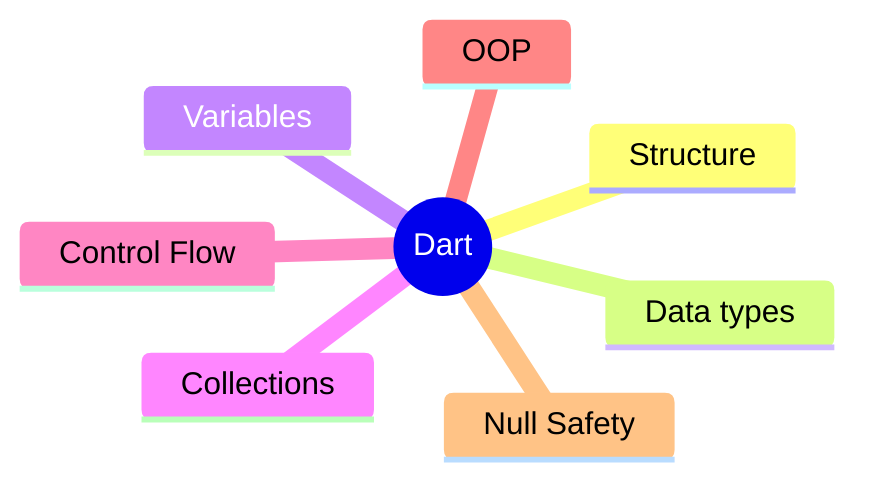

# 2. Dart Essentials

> [!abstract] TL;DR
> Dart là ngôn ngữ được tối ưu cho Client, dựa trên Class được phát triển bởi Google.
> - Nó được thiết kế dành cho các UI Framework (Flutter).
> - Hỗ trợ đa nền tảng (iOS, Android), Web, Desktop apps.
> - Fast Development & Production: JIT & AOT.
> - Có các mô hình đồng bộ tân tiến (Futures, Async/Await, Streams)

---

## Key Topics



---
## Core Concepts

___

### 2.1 Cấu trúc chương trình Dart

Mọi chương trình Dart đều bắt đầu tại hàm `main()`, đây gọi là entry-point. Hàm `print()` sẽ viết một dòng trong **Console**.

```Dart
void main() {
  print("Hello Dart");  
}
```
**Output:** Hello Dart

___

### 2.2 Các kiểu dữ liệu

Giống với các ngôn ngữ lập trình như Java hay C#, Dart cũng sử dụng các kiểu dữ liệu tương tự.

| Kiểu dữ liệu | Mô tả                                                           |
| ------------ | --------------------------------------------------------------- |
| Numbers      | Gồm có `int` (số nguyên) và `double` (số thực)                  |
| String       | Kiểu văn bản được đóng trong ngoặc kép `""`                     |
| bool         | Kiểu logic trả về `true` hoặc `false`                           |
| List         | Tập hợp đã sắp xếp các phần tử                                  |
| Set          | Tập hợp chưa sắp xếp các phần tử **độc nhất**                   |
| Map          | Các cặp key-value                                               |
| null         | Thể hiện giá trị rỗng                                           |
| Object       | Là lớp cơ bản của mọi đối tượng trong Dart                      |
| enum         | Danh sách cố định các giá trị hằng biến                         |
| Iterable     | Kiểu tập hợp trừu tượng dùng trong vòng lặp                     |
| **Never**    | Dùng cho các hàm không bao giờ trả về (mà luôn ném ra ngoại lệ) |
| **Dynamic**  | Kiểu động, có thể chứa mọi kiểu, được quyết định tại runtime    |
| void         | Thể hiện hàm không có kiểu trả về                               |

- Các kiểu cơ bản: int, double, String, bool, List, Set, Map
- Strong typing: `List<int>`, `Map<String, int>`,...

```Dart
int age = 20;
double gpa = 3.75;
String campus = "FPT HCM";
bool pass = true;
```

___

### 2.3 Các toán tử

Toán tử cho phép ta thực hiện các phép tính toán, so sánh và logic.

- Phép toán: `+` `-` `*` `/` `%`
- Phép so sánh: `>` `<` `>=` `<=` `==`
- Phép logic: `&&` `||` `!`

```Dart
int a = 5, b = 2;
print(a + b);
print(a > b);
```

___

### 2.4 Biến và Lưu trữ bộ nhớ

- `var` là biến suy đoán, Dart sẽ suy luận kiểu dữ liệu dựa vào giá trị gán.
- `dynamic` là biến động, kiểu dữ liệu của nó sẽ được quyết định khi chạy.
- `final` là hằng số tại runtime (Không yêu cầu gán giá trị ngay, nhưng chỉ được gán giá trị một lần).
- `const` là hằng số tại compile-time (Phải gán giá trị ngay, không thể gán lại giá trị khác).

```dart
// Type inference
var name = 'Flutter';        // String (inferred)
var count = 42;              // int (inferred)

// Explicit types
int age = 25;
double price = 9.99;
String title = 'Hello';
bool isActive = true;

// Constants
const pi = 3.14;             // Compile-time constant
final today = DateTime.now(); // Runtime constant
```

___

### 2.5 String và Nội suy chuỗi (Interpolation)

Thay vì ta phải cộng chuỗi như Java, Dart cho phép nội suy chuỗi, tức ta có thể chèn ngay giá trị của một biến vào chuỗi bằng cú pháp `$`.

```Dart
String name = "Huy Anh";
print("Hello $name");
print("Name length: ${name.length}");
```
**Output:** Hello Huy Anh. Name length: 7

```dart
String name = 'Flutter';
int version = 3;

print('Hello, $name!');               // Hello, Flutter!
print('Version: ${version + 1}');    // Version: 4
print('Length: ${name.length}');     // Length: 7

// Multi-line string
String multiLine = '''
  This is
  multi-line
''';
```

___

### 2.6 Collections (List, Set, Map)

> [!NOTE] Nhớ nhanh
> - **List**: các phần tử đã sắp xếp
> - **Set**: các phần tử là độc nhất
> - **Map**: Các cặp key-value

```Dart
List<int> nums = [1,2,3];
Set<int> s = {1,2,2,3};
var user = {"id":1, "name":"Nam"};
print(user["name"]);
```
**Output:** •{1,2,3}. Nam

#### List (Ordered, Duplicates allowed)

```dart
List<String> fruits = ['Apple', 'Banana', 'Cherry'];
fruits.add('Date');
fruits.remove('Banana');
print(fruits[0]);           // Apple
print(fruits.length);       // 3

// Spread operator
List<int> a = [1, 2, 3];
List<int> b = [0, ...a, 4]; // [0, 1, 2, 3, 4]
```

#### Set (Unordered, Unique values)

```dart
Set<String> tags = {'flutter', 'dart', 'mobile'};
tags.add('flutter'); // Ignored (duplicate)
print(tags.contains('dart')); // true
```

#### Map (Key-Value pairs)

```dart
Map<String, int> scores = {'Alice': 95, 'Bob': 87};
scores['Charlie'] = 92;
print(scores['Alice']);       // 95
print(scores.keys);           // (Alice, Bob, Charlie)
scores.forEach((k, v) => print('$k: $v'));
```

#### Collections: map/filter

Các tập hợp hỗ trợ một số hàm cho phép thao tác.
###### `map` - Biến đổi (Transform)

- **Cơ chế:** Duyệt qua từng phần tử và áp dụng một công thức biến đổi để tạo ra một phần tử mới.

- **Đặc điểm:** Số lượng phần tử không đổi (giữ nguyên độ dài), nhưng kiểu dữ liệu có thể thay đổi (ví dụ: biến danh sách `int` thành danh sách `String`).
###### `where` (Filter) - Sàng lọc

- **Cơ chế:** Chỉ giữ lại các phần tử thỏa mãn một điều kiện (predicate) nào đó.

- **Đặc điểm:** Kiểu dữ liệu không đổi, nhưng số lượng phần tử có thể ít đi (thay đổi độ dài).

###### **Tính chất "Lazy" (Lười biếng)**

Đây là một điểm cực kỳ quan trọng trong Dart:

- Khi bạn gọi `map` hoặc `where`, Dart chưa thực hiện tính toán ngay. Nó trả về một `Iterable` (một dạng "lời hứa" sẽ tính toán).

- Việc tính toán chỉ thực sự xảy ra khi bạn gọi các hàm "tiêu thụ" như `.toList()`, `.toSet()`, hoặc chạy vòng lặp `forEach`.

##### **Chaining (Chuỗi các thao tác)**

Ta có thể kết hợp nhiều thao tác liên tiếp nhau để xử lý dữ liệu phức tạp chỉ trong một dòng code. Điều này giúp code của ta rất sạch sẽ và chuyên nghiệp.

###### Ví dụ
```Dart
final numbers = [1, 2, 3, 4, 5];
//map
final squares = numbers.map((n) => pow(n,2));
//filter
final evens = numbers.where((n) => n.isEven);
//chain: square then keep > 5
final big = numbers.map((n) => pow(n,2)).where((n)) => n > 5);

//Lazy: các biến phía trên chưa thực hiện tính toán ngay, Dart chỉ thực hiện tính toán sau khi ta 'Materialize' (Thực hiện hoá) nó. Ta thực hiện hoá bằng các hàm .toList() hoặc .toSet() tương ứng với kiểu collection gốc.

//Materialize
squares.toList();
evens.toList();
big.toList();

//Map có thể thay đổi cả kiểu dữ liệu
final labels = numbers.map((n) => 'Item $n').toList();
print(labels);
```
___

### 2.7 Kiểm soát luồng

- If/else: Rẽ nhánh điều kiện với toán tử logic.

```Dart
int score = 80;
if(score >= 50) print("Pass");
else print("Fail");
```

- Switch: Phân biệt rõ ràng hơn các trường hợp rời rạc.

```Dart
var day = "Mon";  
switch(day) {
 case "Mon": print("Start"); break;
 case "Sun": print("End"); break;
 default: print("Other");
}
```

- Vòng lặp đếm cơ bản

```Dart
for(int i=0; i<3; i++) {  
 print(i);  
}
```

- Vòng lặp `for-in`: duyệt qua tập hợp.

```Dart
for(var x in [1,2,3]) print(x);
```

- Vòng lặp `forEach`: duyệt qua tập hợp theo kiểu gọi hàm.

```Dart
[1,2,3].forEach((e)=>print(e));
```

```dart
// if/else
int score = 85;
if (score >= 90) {
  print('A');
} else if (score >= 80) {
  print('B');
} else {
  print('C');
}

// Switch
String day = 'Monday';
switch (day) {
  case 'Monday':
  case 'Tuesday':
    print('Weekday');
    break;
  case 'Saturday':
  case 'Sunday':
    print('Weekend');
    break;
}

// Loops
for (int i = 0; i < 5; i++) { print(i); }
for (var fruit in fruits) { print(fruit); }
fruits.forEach((f) => print(f));

// Ternary
String label = score > 50 ? 'Pass' : 'Fail';
```

___

### 2.8 Hàm: Cơ đến và nâng cao

- Tham số và giá trị trả về:

```Dart
int add(int a,int b){  
  return a+b;  
}
print(add(2,3));
```

- Kiểu rút gọn về một dòng với `=>`:

```Dart
int add(int a,int b)=>a+b;
print(add(2,3));
```

- Tham số mặc định (Named optionals):

```Dart
void greet({String name = "Guest"}) { print(name); }  
greet(); // Guest  
greet(name: "Minh"); // Minh
```

```dart
// Regular function
int add(int a, int b) {
  return a + b;
}

// Arrow function (single expression)
int multiply(int a, int b) => a * b;

// Named parameters (optional by default)
void greet({String name = 'World', int times = 1}) {
  for (int i = 0; i < times; i++) print('Hello, $name!');
}
greet(name: 'Flutter', times: 3);

// Required named parameters
void createUser({required String email, required String password}) { }

// Higher-order functions
List<int> numbers = [1, 2, 3, 4, 5];
List<int> doubled = numbers.map((n) => n * 2).toList();
List<int> evens = numbers.where((n) => n % 2 == 0).toList();
int sum = numbers.reduce((a, b) => a + b);
```

___

### 2.9 OOP Basics

Dart hỗ trợ OOP (Giống Java) với các ý tưởng cốt lõi:
- Class: là bản vẽ cấu trúc để tạo nên các **Object**.
- Object: là các hình thức cụ thể của **Class**.
- Constructor: gồm **Default** và **Named**
- Inheritance
- Polymorphism
- Method Override

> [!NOTE] Notes:
> OOP sẽ là nền tảng để xây dựng UI với **Widget Tree** trong Flutter

```dart
class Animal {
  String name;
  int age;
// 1. Default constructor (Constructor chính)
 Animal(this.name, this.age); 
 // 2. Redirecting Constructor 
 // Ở đây ta khai báo một Named Constructor bằng cách 
 // gọi lại Constructor gốc: 
 Animal.unknown() : this('Unknown', 0); 
 // 3. Named Constructor khác
 Animal.newBorn(String name) : this(name, 0);

  // Method
  void speak() => print('$name makes a sound');

  // Getter
  String get info => '$name ($age years old)';
}

//Inheritance: Kế thừa các đặc điểm của Class gốc
class Dog extends Animal {
  String breed;

  Dog(String name, int age, this.breed) : super(name, age);

//Ghi đè: thay đổi cách hoạt động của method gốc
  @override
  void speak() => print('$name: Woof!'); // Override
}

void main() {
  Dog rex = Dog('Rex', 3, 'Labrador');
  rex.speak();          // Rex: Woof!
  print(rex.info);      // Rex (3 years old)
}
```

---

### 2.10 Null Safety

Dart có **null safety** — compiler đảm bảo biến không bao giờ là `null` trừ khi ta cho phép.

| Toán tử | Ý nghĩa                                     |
| ------- | ------------------------------------------- |
| `?`     | Khai báo một biến có thể `null`             |
| `??`    | Khai báo giá trị fallback nếu xảy ra `null` |
| `!`     | Ép buộc biến đó không được `null`           |

```dart
// Non-nullable (default)
String name = 'Flutter';     // Cannot be null
// name = null;              // Compile error

// Nullable với ?
String? nickname = null;     // Can be null

// Null-aware operators
print(nickname ?? 'No nickname');        // ?? : default value
print(nickname?.length);                 // ?. : null-safe access → null
print(nickname!.length);                 // ! : force unwrap (crash if null)

// Late keyword
late String lazyValue;       // Will be assigned before use
lazyValue = 'Hello';
print(lazyValue);
```

> [!warning] Dùng `!` cẩn thận
> Toán tử `!` ép buộc **unwrap nullable**. Nếu giá trị thực sự là `null`, app sẽ crash với `Null check operator used on a null value`.

---

### 2.11 Xử lý ngoại lệ

Việc xử lý ngoại lệ sẽ giúp ta tránh việc chương trình đột tử khi đang chạy.

- `try`: đánh dấu khối code có thể xảy ra lỗi.
- `on ... catch`: bắt lỗi xảy ra trong `try`, sau đó chạy khối code bên trong nó để xử lý lỗi.
- `finally`: khối lệnh này luôn chạy, thường dùng để đóng tài nguyên hoặc kết thúc bắt lỗi.

###### Chú ý:
- Ta sử dụng cú pháp `on ...` để khai báo một ngoại lệ cụ thể.
- Nếu không dùng `on`, hệ thống sẽ bắt chung `Exception`.
- Sử dụng `catch(e,stack)` để bắt ra lỗi (e) và stack trace.
- Nên ném ra ngoại lệ tuỳ chỉnh cho các **lỗi domain** (liên quan đến nghiệp vụ).

###### Ví dụ
```Dart
//Hàm dưới đây chủ động ném lỗi hoặc có thể xảy ra lỗi
int ParsePositiveInt(String s){
	final value = int.parse(s); //Có thể lỗi format
	if (value < 0) throw ArgumentError('Must be >= 0');
	return value;
}

void main() {
	try{
		int errorCount = 0;
		print(parsePositiveInt("12"));
		print(parsePositiveInt("-3")); //lỗi
	} on FormatException catch (e, stack) {
		print("Format error: $e");
		errorCount += 1;
	} on ArgumentError catch (e) {
		print("Argument error: ${e.message}");
		errorCount += 1;
	} catch (e, stack) {
		print("Unknown error: $e");
		errorCount += 1;
	} finally{
		print("Done parsing. $errorCount errors found.");
	}
}
```

___

### 2.12 Async / Await & Future

Async/ Await và Future được sử dụng để xử lý bất đồng bộ.

###### `Future<T>` 

**Future** đại diện cho một giá trị (kiểu Generic bất kỳ) mà bạn chưa có ngay bây giờ, nhưng sẽ nhận được vào một thời điểm nào đó trong tương lai.

Nó có 2 trạng thái chính:
- **Uncompleted:** Đang chờ xử lý.
- **Completed:** Đã xong, có thể trả về **giá trị** hoặc trả về **lỗi**.

###### `async`

Là từ khoá đặt sau tên hàm để khai báo một hàm bất đồng bộ. Hàm này sẽ trả về một `Future`.

###### `await`

Là từ khoá đặt trước khi gọi một hàm bất đồng bộ để chờ hàm đó trả về `Future`.

```dart
// Future: đại diện cho một giá trị trong tương lai
Future<String> fetchUsername() async {
  await Future.delayed(const Duration(seconds: 2)); // Giả lập độ trễ
  return 'FlutterDev';
}

// Sử dụng async/await
void main() async {
  print('Fetching...');
  String username = await fetchUsername();
  print('Username: $username');
}

// Xử lý lỗi
Future<void> loadData() async {
  try {
    String data = await fetchSomething();
    print(data);
  } catch (e) {
    print('Error: $e');
  }
}
```

---

### 2.13 Streams

```dart
// Stream: chuỗi các giá trị theo thời gian
Stream<int> countTo(int n) async* {
  for (int i = 1; i <= n; i++) {
    await Future.delayed(const Duration(seconds: 1));
    yield i; // Emit giá trị
  }
}

void main() async {
  await for (int value in countTo(5)) {
    print(value); // In 1, 2, 3, 4, 5 (mỗi giây 1 lần)
  }
}
```

| | Future | Stream |
| :--- | :--- | :--- |
| **Số lần trả về** | 1 lần | Nhiều lần |
| **Từ khóa** | `async`, `await` | `async*`, `yield` |
| **Lắng nghe** | `await future` | `await for` / `.listen()` |

---

## Quick Reference

| Operator | Ý nghĩa | Ví dụ |
| :--- | :--- | :--- |
| `??` | Null coalescing | `name ?? 'Default'` |
| `?.` | Null-safe call | `obj?.method()` |
| `!` | Force unwrap | `obj!.property` |
| `??=` | Assign if null | `name ??= 'Flutter'` |
| `=>` | Arrow function | `int add(a, b) => a + b` |
| `...` | Spread operator | `[...list1, ...list2]` |

---

## Common Pitfalls

> [!warning] `const` vs `final` vs `var`
> - `const`: Compile-time constant, không thể thay đổi, phải biết giá trị lúc compile.
> - `final`: Runtime constant, gán một lần, có thể tính toán lúc runtime.
> - `var`: Mutable, type được infer từ giá trị đầu tiên.

> [!warning] Quên `await`
> Nếu quên `await` trước `async` function, bạn nhận được `Future` object thay vì giá trị thực. Flutter sẽ không báo lỗi nhưng app sẽ hoạt động sai.

---

## Related Notes

- **Slide:** [[Module2_Dart_Essentials.pptx|Module 2 Slide]]
- **Lab:** [[2. Dart Essentials Practice|Lab 2 - Dart Essentials Practice]]
- **Trước:** [[1. Introduction to Flutter]]
- **Tiếp theo:** [[3. Advanced Dart]]
- [[Flutter Dashboard]]
