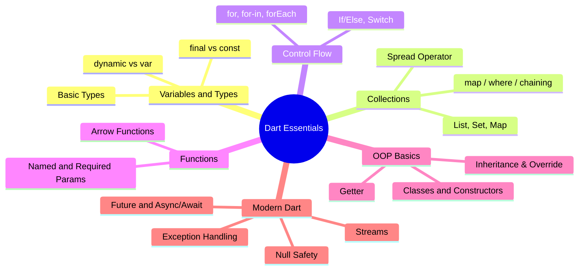

# 2. Dart Essentials

> [!abstract] TL;DR
> Dart là ngôn ngữ được tối ưu cho Client, dựa trên Class, phát triển bởi Google.
> - **Cú pháp:** Giống Java/C#, dễ học.
> - **Hiệu năng:** Kết hợp JIT (cho phát triển) và AOT (cho production).
> - **Tính năng chính:** Strong typing, Null safety, Async/Await, Collections mạnh mẽ.

---

## Key Topics



---

## Core Concepts

___

### 2.1 Cấu trúc chương trình Dart

Mọi chương trình Dart đều bắt đầu tại hàm `main()`, đây gọi là entry-point. Hàm `print()` sẽ viết một dòng trong **Console**.

```dart
void main() {
  print("Hello Dart");
}
```
**Output:** Hello Dart

___

### 2.2 Các kiểu dữ liệu

| Kiểu dữ liệu | Mô tả |
| :--- | :--- |
| `int` / `double` | Số nguyên / Số thực |
| `String` | Văn bản, đóng trong `""` hoặc `''` |
| `bool` | Logic: `true` hoặc `false` |
| `List` | Tập hợp có thứ tự, cho phép trùng |
| `Set` | Tập hợp không thứ tự, phần tử **độc nhất** |
| `Map` | Các cặp key-value |
| `null` | Giá trị rỗng |
| `Object` | Lớp cơ sở của mọi đối tượng trong Dart |
| `dynamic` | Kiểu động, quyết định tại runtime |
| `Never` | Hàm không bao giờ trả về (luôn throw) |
| `void` | Hàm không có kiểu trả về |

```dart
int age = 20;
double gpa = 3.75;
String campus = "FPT HCM";
bool pass = true;
```

___

### 2.3 Các toán tử

- Phép toán: `+` `-` `*` `/` `%`
- Phép so sánh: `>` `<` `>=` `<=` `==`
- Phép logic: `&&` `||` `!`

```dart
int a = 5, b = 2;
print(a + b); // 7
print(a > b); // true
```

___

### 2.4 Biến và Lưu trữ bộ nhớ

- **`var`**: Tự suy luận kiểu từ giá trị gán. Sau đó không thể đổi kiểu.
- **`dynamic`**: Kiểu động, có thể đổi kiểu dữ liệu bất cứ lúc nào (dùng cẩn thận).
- **`final`**: Hằng số **Runtime**. Không yêu cầu gán giá trị ngay, nhưng chỉ được gán một lần.
- **`const`**: Hằng số **Compile-time**. Phải gán giá trị ngay, không thể thay đổi.

```dart
var name = 'Flutter';         // String (inferred)
var count = 42;               // int (inferred)

int age = 25;
double price = 9.99;
bool isActive = true;

const pi = 3.14;              // Compile-time constant
final today = DateTime.now(); // Runtime constant
```

___

### 2.5 String và Nội suy chuỗi (Interpolation)

Thay vì cộng chuỗi như Java, Dart cho phép chèn ngay giá trị biến vào chuỗi bằng `$`.

```dart
String name = "Huy Anh";
print("Hello $name");              // Hello Huy Anh
print("Name length: ${name.length}"); // Name length: 7

// Multi-line string
String multiLine = '''
  This is
  multi-line
''';
```

___

### 2.6 Collections (List, Set, Map)

> [!NOTE] Nhớ nhanh
> - **List**: phần tử có thứ tự, cho phép trùng
> - **Set**: phần tử độc nhất, không có thứ tự
> - **Map**: các cặp key-value

#### List (Ordered, Duplicates allowed)

```dart
List<String> fruits = ['Apple', 'Banana', 'Cherry'];
fruits.add('Date');
fruits.remove('Banana');
print(fruits[0]);     // Apple
print(fruits.length); // 3

// Spread operator
List<int> a = [1, 2, 3];
List<int> b = [0, ...a, 4]; // [0, 1, 2, 3, 4]
```

#### Set (Unordered, Unique values)

```dart
Set<String> tags = {'flutter', 'dart', 'mobile'};
tags.add('flutter'); // Bị bỏ qua (duplicate)
print(tags.contains('dart')); // true
```

#### Map (Key-Value pairs)

```dart
Map<String, int> scores = {'Alice': 95, 'Bob': 87};
scores['Charlie'] = 92;
print(scores['Alice']);  // 95
scores.forEach((k, v) => print('$k: $v'));
```

#### Collections: `map` / `where` / Chaining

###### `map` — Biến đổi (Transform)
- Duyệt từng phần tử, áp dụng công thức để tạo phần tử mới.
- Số lượng phần tử không đổi, nhưng kiểu có thể thay đổi.

###### `where` — Sàng lọc (Filter)
- Chỉ giữ lại phần tử thỏa mãn điều kiện (predicate).
- Kiểu không đổi, số lượng có thể ít đi.

###### Tính chất "Lazy"
`map` và `where` chưa thực hiện tính toán ngay — chúng trả về một `Iterable`. Tính toán chỉ xảy ra khi gọi `.toList()`, `.toSet()`, hoặc `forEach`.

```dart
final numbers = [1, 2, 3, 4, 5];

// map: bình phương
final squares = numbers.map((n) => n * n);

// where: lọc số chẵn
final evens = numbers.where((n) => n.isEven);

// chain: bình phương rồi lấy số > 5
final big = numbers.map((n) => n * n).where((n) => n > 5);

// Materialize (thực hiện hoá)
squares.toList(); // [1, 4, 9, 16, 25]
evens.toList();   // [2, 4]
big.toList();     // [9, 16, 25]

// map có thể thay đổi kiểu dữ liệu
final labels = numbers.map((n) => 'Item $n').toList();
print(labels); // [Item 1, Item 2, ...]
```

___

### 2.7 Kiểm soát luồng

```dart
// if/else
int score = 85;
if (score >= 90) {
  print('A');
} else if (score >= 80) {
  print('B');
} else {
  print('C');
}

// Switch
String day = 'Monday';
switch (day) {
  case 'Monday':
  case 'Tuesday':
    print('Weekday');
    break;
  case 'Saturday':
  case 'Sunday':
    print('Weekend');
    break;
  default:
    print('Other');
}

// Vòng lặp
for (int i = 0; i < 3; i++) { print(i); }
for (var x in [1, 2, 3]) { print(x); }
[1, 2, 3].forEach((e) => print(e));

// Ternary
String label = score > 50 ? 'Pass' : 'Fail';
```

___

### 2.8 Hàm

```dart
// Regular function
int add(int a, int b) {
  return a + b;
}

// Arrow function (single expression)
int multiply(int a, int b) => a * b;

// Named parameters (optional by default)
void greet({String name = 'World', int times = 1}) {
  for (int i = 0; i < times; i++) print('Hello, $name!');
}
greet(name: 'Flutter', times: 3);

// Required named parameters
void createUser({required String email, required String password}) { }

// Higher-order functions
List<int> numbers = [1, 2, 3, 4, 5];
List<int> doubled = numbers.map((n) => n * 2).toList();
List<int> evens = numbers.where((n) => n % 2 == 0).toList();
int sum = numbers.reduce((a, b) => a + b);
```

___

### 2.9 OOP Basics

Dart hỗ trợ OOP với các ý tưởng cốt lõi:
- **Class**: bản vẽ cấu trúc để tạo nên các **Object**.
- **Object**: các thể hiện cụ thể của **Class**.
- **Constructor**: gồm **Default**, **Named**, và **Redirecting**.
- **Inheritance**, **Polymorphism**, **Method Override**.

> [!NOTE] Notes
> OOP là nền tảng để xây dựng UI với **Widget Tree** trong Flutter.

```dart
class Animal {
  String name;
  int age;

  // 1. Default constructor
  Animal(this.name, this.age);

  // 2. Redirecting Constructor (Named Constructor gọi lại constructor gốc)
  Animal.unknown() : this('Unknown', 0);

  // 3. Named Constructor thông thường
  Animal.newBorn(String name) : this(name, 0);

  // Method
  void speak() => print('$name makes a sound');

  // Getter
  String get info => '$name ($age years old)';
}

// Inheritance
class Dog extends Animal {
  String breed;

  Dog(String name, int age, this.breed) : super(name, age);

  @override
  void speak() => print('$name: Woof!');
}

void main() {
  Dog rex = Dog('Rex', 3, 'Labrador');
  rex.speak();      // Rex: Woof!
  print(rex.info);  // Rex (3 years old)
}
```

---

### 2.10 Null Safety

Dart đảm bảo biến không bao giờ là `null` trừ khi được khai báo tường minh.

| Toán tử | Ý nghĩa |
| :--- | :--- |
| `?` | Khai báo biến có thể `null` |
| `??` | Giá trị fallback nếu `null` |
| `?.` | Truy cập an toàn (null-safe access) |
| `!` | Ép buộc không `null` (force unwrap) |
| `late` | Khởi tạo muộn, gán trước khi dùng |

```dart
String name = 'Flutter';   // Non-nullable, không thể gán null
String? nickname = null;    // Nullable

print(nickname ?? 'No nickname');  // No nickname
print(nickname?.length);           // null (không crash)
// print(nickname!.length);        // Crash nếu null!

late String lazyValue;
lazyValue = 'Hello';
print(lazyValue);
```

> [!warning] Dùng `!` cẩn thận
> Toán tử `!` ép buộc **unwrap nullable**. Nếu giá trị thực sự là `null`, app sẽ crash với `Null check operator used on a null value`.

---

### 2.11 Xử lý ngoại lệ

- **`try`**: Đánh dấu khối code có thể xảy ra lỗi.
- **`on ... catch`**: Bắt và xử lý lỗi cụ thể.
- **`finally`**: Luôn chạy dù có lỗi hay không. Dùng để đóng tài nguyên.

###### Chú ý:
- Dùng `on ExceptionType` để bắt lỗi cụ thể.
- Dùng `catch(e, stack)` để lấy thông tin lỗi và stack trace.
- Nên ném ngoại lệ tuỳ chỉnh cho các **lỗi domain** (liên quan đến nghiệp vụ).

```dart
int parsePositiveInt(String s) {
  final value = int.parse(s); // Có thể lỗi FormatException
  if (value < 0) throw ArgumentError('Must be >= 0');
  return value;
}

void main() {
  int errorCount = 0;
  try {
    print(parsePositiveInt("12"));
    print(parsePositiveInt("-3")); // Lỗi ArgumentError
  } on FormatException catch (e) {
    print("Format error: $e");
    errorCount += 1;
  } on ArgumentError catch (e) {
    print("Argument error: ${e.message}");
    errorCount += 1;
  } catch (e, stack) {
    print("Unknown error: $e");
    errorCount += 1;
  } finally {
    print("Done. $errorCount errors found.");
  }
}
```

___

### 2.12 Async / Await & Future

Dùng để xử lý các tác vụ tốn thời gian (gọi API, đọc file) mà không làm đứng UI.

###### `Future<T>`
Đại diện cho một giá trị **chưa có ngay** nhưng sẽ nhận được trong tương lai. Có 2 trạng thái:
- **Uncompleted**: Đang chờ xử lý.
- **Completed**: Đã xong — trả về **giá trị** hoặc **lỗi**.

###### `async` / `await`
- **`async`**: Khai báo hàm bất đồng bộ (hàm sẽ trả về `Future`).
- **`await`**: Chờ kết quả của một `Future` trước khi tiếp tục.

```dart
Future<String> fetchUsername() async {
  await Future.delayed(const Duration(seconds: 2)); // Giả lập delay
  return 'FlutterDev';
}

void main() async {
  print('Fetching...');
  String username = await fetchUsername();
  print('Username: $username');
}

// Xử lý lỗi với async/await
Future<void> loadData() async {
  try {
    String data = await fetchSomething();
    print(data);
  } catch (e) {
    print('Error: $e');
  }
}
```

---

### 2.13 Streams

Stream là một dòng chảy gồm nhiều giá trị, lỗi, hoặc thông báo hoàn thành tại các thời điểm khác nhau.

###### Cách hoạt động
- **Producer**: Nơi tạo ra dữ liệu.
- **Stream**: Con đường mà dữ liệu đi qua.
- **Listener**: Người tiếp nhận dữ liệu.

###### Hai loại Stream
- **Single-subscription** (Mặc định): Chỉ cho phép một Listener. Stream kết thúc khi Listener huỷ nghe.
- **Broadcast**: Nhiều Listener có thể nghe cùng lúc.

```dart
Stream<int> countTo(int n) async* {
  for (int i = 1; i <= n; i++) {
    await Future.delayed(const Duration(seconds: 1));
    yield i; // Emit giá trị
  }
}

void main() async {
  await for (int value in countTo(5)) {
    print(value); // In 1, 2, 3, 4, 5 (mỗi giây 1 lần)
  }
}
```

| | Future | Stream |
| :--- | :--- | :--- |
| **Số lần trả về** | 1 lần duy nhất | Nhiều lần (dòng chảy) |
| **Từ khóa** | `async`, `await` | `async*`, `yield` |
| **Lắng nghe** | `await future` | `await for` / `.listen()` |
| **Ví dụ thực tế** | HTTP Request | Firebase Realtime, Sensor data |

---

## Quick Reference

| Operator | Ý nghĩa | Ví dụ |
| :--- | :--- | :--- |
| `??` | Null coalescing | `name ?? 'Default'` |
| `?.` | Null-safe call | `obj?.method()` |
| `!` | Force unwrap | `obj!.property` |
| `??=` | Assign if null | `name ??= 'Flutter'` |
| `=>` | Arrow function | `int add(a, b) => a + b` |
| `...` | Spread operator | `[...list1, ...list2]` |

---

## Các lỗi thường gặp

> [!warning] `const` vs `final` vs `var`
> - `const`: Compile-time constant, **phải** biết giá trị lúc compile. Không thể thay đổi.
> - `final`: Runtime constant, gán một lần khi chạy. Không cần gán ngay khi khai báo.
> - `var`: Mutable, type được infer từ giá trị đầu tiên. Sau đó kiểu không thể đổi.

> [!warning] Quên `await`
> Nếu quên `await` trước `async` function, bạn nhận được `Future` object thay vì giá trị thực. Flutter sẽ không báo lỗi nhưng app sẽ hoạt động sai.

---

## Related Notes

- **Slide:** [[Module2_Dart_Essentials.pptx|Module 2 Slide]]
- **Lab:** [[2. Dart Essentials Practice|Lab 2 - Dart Essentials Practice]]
- **Trước:** [[1. Introduction to Flutter]]
- **Tiếp theo:** [[3. Advanced Dart]]
- [[Flutter Dashboard]]
