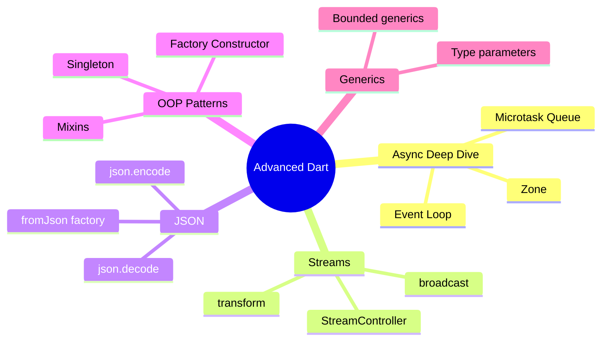

---
type: concept
module: 3
tags:
  - dart/advanced
  - dart/async
  - dart/oop
slide: "[[Module3_Advanced_Dart.pptx|Module 3 Slide]]"
lab: "[[3. Advanced Dart Practice|Lab 3]]"
status: complete
date: 2026-05-11
---

# 3. Advanced Dart

> [!abstract] TL;DR
> Dart nâng cao bao gồm các design patterns (Factory, Singleton), Generics, xử lý JSON, stream transformations, và hiểu Event Loop / Microtask Queue — nền tảng để viết code Flutter production-ready.

---

## Key Topics



---

## Core Concepts

### 3.1 Event Loop & Microtask Queue

Dart là **single-threaded** nhưng xử lý async thông qua Event Loop.

```
┌───────────────────────────────┐
│        Dart Isolate           │
│  ┌─────────────────────────┐  │
│  │   Microtask Queue       │  │  ← Ưu tiên cao nhất
│  │  (scheduleMicrotask)    │  │
│  └─────────────────────────┘  │
│  ┌─────────────────────────┐  │
│  │     Event Queue         │  │  ← Future, I/O, Timer
│  │  (Future, async/await)  │  │
│  └─────────────────────────┘  │
└───────────────────────────────┘
```

```dart
import 'dart:async';

void main() {
  print('1 - Sync');

  scheduleMicrotask(() => print('2 - Microtask'));

  Future(() => print('3 - Future (Event Queue)'));

  print('4 - Sync');
}
// Output: 1 → 4 → 2 → 3
```

> [!important] Thứ tự thực thi
> **Sync code** → **Microtasks** → **Event Queue (Futures)**

---

### 3.2 StreamController & Broadcast Streams

```dart
import 'dart:async';

class ProductRepository {
  // Broadcast: nhiều listener cùng lúc
  final _controller = StreamController<Product>.broadcast();

  Stream<Product> get liveProducts => _controller.stream;

  void addProduct(Product p) {
    _controller.add(p); // Emit giá trị
  }

  void dispose() => _controller.close(); // Quan trọng: đóng stream khi xong
}

// Lắng nghe
repo.liveProducts.listen(
  (product) => print('New: ${product.name}'),
  onError: (e) => print('Error: $e'),
  onDone: () => print('Stream closed'),
);
```

#### Stream Transformations

```dart
Stream<int> numbers = Stream.fromIterable([1, 2, 3, 4, 5]);

numbers
  .map((n) => n * n)          // Transform: bình phương
  .where((n) => n % 2 == 0)   // Filter: chỉ số chẵn
  .listen(print);              // Output: 4, 16
```

---

### 3.3 JSON Serialization

```dart
import 'dart:convert';

class User {
  final String name;
  final String email;
  final int age;

  User({required this.name, required this.email, required this.age});

  // Deserialize: JSON Map → Object
  factory User.fromJson(Map<String, dynamic> json) {
    return User(
      name: json['name'] as String,
      email: json['email'] as String,
      age: json['age'] as int,
    );
  }

  // Serialize: Object → JSON Map
  Map<String, dynamic> toJson() => {
    'name': name,
    'email': email,
    'age': age,
  };
}

// Parse từ JSON string
String jsonString = '{"name": "Alice", "email": "alice@example.com", "age": 25}';
Map<String, dynamic> jsonMap = json.decode(jsonString);
User user = User.fromJson(jsonMap);

// Convert sang JSON string
String encoded = json.encode(user.toJson());

// Parse list
List<dynamic> jsonList = json.decode('[{"name":"A",...}, {"name":"B",...}]');
List<User> users = jsonList.map((j) => User.fromJson(j)).toList();
```

---

### 3.4 Factory Constructors & Singleton

```dart
// Singleton pattern dùng factory constructor
class AppConfig {
  static final AppConfig _instance = AppConfig._internal();

  // Private constructor
  AppConfig._internal();

  // Factory trả về instance duy nhất
  factory AppConfig() => _instance;

  String apiBaseUrl = 'https://api.example.com';
}

void main() {
  final config1 = AppConfig();
  final config2 = AppConfig();
  print(identical(config1, config2)); // true — cùng một instance
}
```

#### Factory với Cache

```dart
class Connection {
  static final Map<String, Connection> _cache = {};
  final String host;

  Connection._create(this.host);

  factory Connection(String host) {
    return _cache.putIfAbsent(host, () => Connection._create(host));
  }
}
```

---

### 3.5 Generics

```dart
// Generic class
class Repository<T> {
  final List<T> _items = [];

  void add(T item) => _items.add(item);
  List<T> getAll() => List.unmodifiable(_items);
  T? findById(bool Function(T) predicate) {
    try {
      return _items.firstWhere(predicate);
    } catch (_) {
      return null;
    }
  }
}

// Sử dụng
final userRepo = Repository<User>();
userRepo.add(User(name: 'Alice', email: 'a@b.com', age: 25));

// Bounded generics
class NumberBox<T extends num> {
  T value;
  NumberBox(this.value);
  T doubled() => (value * 2) as T;
}
```

---

### 3.6 Mixins

```dart
// Mixin: tái sử dụng code mà không cần kế thừa
mixin Serializable {
  Map<String, dynamic> toJson();

  String toJsonString() => json.encode(toJson());
}

mixin Validatable {
  bool validate();

  void assertValid() {
    if (!validate()) throw Exception('Validation failed');
  }
}

class Product with Serializable, Validatable {
  String name;
  double price;

  Product({required this.name, required this.price});

  @override
  Map<String, dynamic> toJson() => {'name': name, 'price': price};

  @override
  bool validate() => name.isNotEmpty && price > 0;
}
```

---

### 3.7 Extension Methods

```dart
// Thêm method vào type có sẵn mà không cần kế thừa
extension StringUtils on String {
  bool get isValidEmail => contains('@') && contains('.');
  String get capitalize => '${this[0].toUpperCase()}${substring(1)}';
}

extension ListUtils<T> on List<T> {
  List<T> sortedBy(Comparable Function(T) key) {
    return [...this]..sort((a, b) => key(a).compareTo(key(b)));
  }
}

// Sử dụng
print('test@email.com'.isValidEmail); // true
print('hello'.capitalize);            // Hello
```

---

## Quick Reference

| Pattern | Khi dùng |
| :--- | :--- |
| **Factory Constructor** | Control quá trình tạo object (cache, singleton, type dispatch) |
| **Mixin** | Tái sử dụng methods giữa nhiều class không liên quan |
| **Generic** | Type-safe collections và repositories |
| **Extension** | Thêm method vào existing types |
| **StreamController** | Push-based reactive data flow |

---

## Common Pitfalls

> [!warning] Quên đóng StreamController
> Luôn gọi `_controller.close()` trong `dispose()` để tránh memory leak, đặc biệt trong Flutter StatefulWidget.

> [!warning] Duration không phải Number
> Khi trừ 2 `DateTime`, kết quả là `Duration` — không phải `int`. Phải dùng `.inDays`, `.inHours`...
> ```dart
> // ❌ Sai
> int days = DateTime.now() - someDate;
> // ✅ Đúng
> int days = DateTime.now().difference(someDate).inDays;
> ```

---

## Related Notes

- **Slide:** [[Module3_Advanced_Dart.pptx|Module 3 Slide]]
- **Lab:** [[3. Advanced Dart Practice|Lab 3 - Advanced Dart Practice]]
- **Trước:** [[2. Dart Essentials]]
- **Tiếp theo:** [[4. Flutter UI Fundamentals]]
- [[Flutter Dashboard]]
