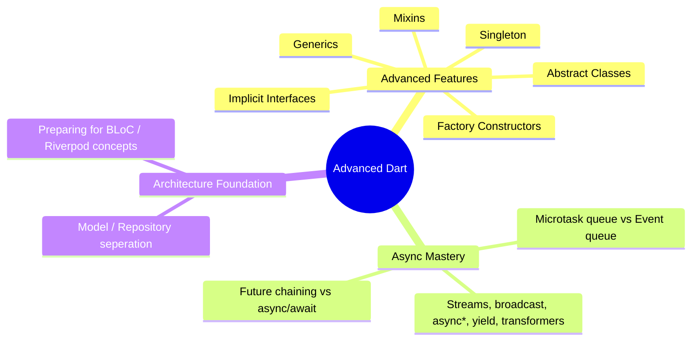
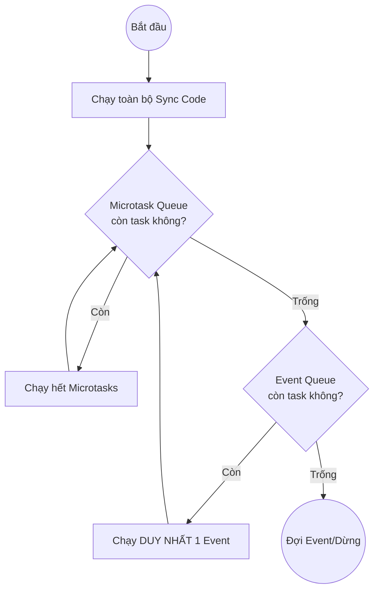
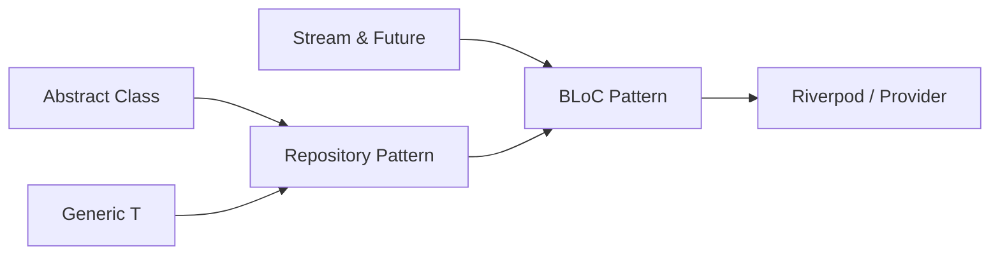

# 3. Advanced Dart

> [!abstract] TL;DR
> Dart nâng cao bao gồm:
> - Các khái niệm sâu hơn về OOP được sử dụng trong Flutter.
> - Lập trình Generic để tái sử dụng thành phần.
> - Tìm hiểu cách hoặc động của async và event loops trong Dart.
> - Cấu trúc của Stream đằng sau StreamBuilder
> - Repository Pattern để chuẩn bị cho quản lý State.

---

## Key Topics



---

## Advanced Features

### 3.1 Abstract Classes (Class trừu tượng)

> [!abstract] Khái niệm
> Các Abstract Class giúp định hình cấu trúc mà không cần hoàn thiện đầy đủ hành vi cho Class. Nó ép buộc các subclass phải triển khai theo các chức năng đã đặt sẵn trong nó.

Trong Flutter, `State<T>` là một abstract class, các Widget sẽ triển khai các phương thức bên trong nó để định hình hành vi của UI.

```Dart
import 'package:flutter/material.dart';

// 1. Lớp Widget kế thừa StatefulWidget
class ServiceCounter extends StatefulWidget {
  final String serviceName;
  const ServiceCounter({super.key, required this.serviceName});

  @override
  State<ServiceCounter> createState() => _ServiceCounterState();
}

// 2. Lớp State kế thừa State<ServiceCounter>
// Đây chính là nơi bạn thực hiện logic và lưu trữ dữ liệu
class _ServiceCounterState extends State<ServiceCounter> {
  // Khai báo biến trạng thái
  int _remainingSessions = 10;

  void _useSession() {
    // Sử dụng setState để thông báo cho Flutter vẽ lại giao diện
    setState(() {
      if (_remainingSessions > 0) {
        _remainingSessions--;
      }
    });
  }

  @override
  Widget build(BuildContext context) {
    return Column(
      children: [
        Text('Dịch vụ: ${widget.serviceName}'),
        Text(
          'Số buổi còn lại: $_remainingSessions',
          style: const TextStyle(fontSize: 24, fontWeight: FontWeight.bold),
        ),
        Elevated NorthButton(
          onPressed: _useSession,
          child: const Text('Sử dụng 1 buổi'),
        ),
      ],
    );
  }
}
```

### 3.2 Implicit Interfaces (Interface ngầm định)

Trong Dart, ta không cần khai báo các interface nhưu Java, mọi Class trong Dart khi được tạo ra sẽ tự động định hình nên một interface tương ứng.

```Dart
//Khai báo class Bird
class Bird {
	  void fly() => print("Bird flying");
  }
//Bird được dùng lại như một interface
class Eagle implements Bird {
	  void fly() => print("Eagle gliding");
  }
```

Vậy khi này `implements` khác gì `extends`?

- `extends` kế thừa toàn bộ từ lớp cha, sau đó có thể tuỳ ý thay đổi phương thức bên trong. Một Class chỉ có thể kể thừa duy nhất 1 Class cha.
- `implements` bắt buộc triển khai các phương thức của interface, nhưng bắt buộc viết lại logic từ đầu. Một Class có thể kế thừa nhiều interface cùng lúc.

Ngoài ra, ta có từ khoá khác là `with` với khái niệm Mixin.  

### 3.3 Mixins

**Mixin** là sự hoà trộn giữa `kế thừa` và `triển khai`, cụ thể: `mixin` tạo ra một Class với mục đích cung cấp chức năng mà không bị ràng buộc như `kế thừa`. Cùng lúc đó, ta cũng không cần phải cam kết phải làm toàn bộ chức năng của một `interface`.

**Ví dụ:** Ta có hai Class là `Chim` và `Máy bay`, cả hai đều phải `Bay`. Ta không thể kế thừa vì bản chất hai vật thể này khác nhau.
---> Khi đó ta tạo ra một Mixin `Bay` như một chức năng để gắn vào hai Class trên.

```Dart
mixin Flyable {
	void fly() => print("I can fly!");
	}
class Plane with Flyable{
	void sound() => print("I am plane!");
	}
class Bird with Flyable{
	void sound() => print("I am bird!");
	}
```

Đối với Flutter, nó dùng `mixins` cho `animation`, `scrolling`, `lifecycle support`.

###### Mixin Constraints (Ràng buộc mixin)

Ta có thể tạo ràng buộc cho các "tính năng" Mixin. Việc này được thực hiện với keyword `on`. Khi đó, `A with B on C` có nghĩa là để sử dụng mixin B thì A phải là Class con của C.
**Nói dể hiểu:** `on` biến một Mixin thành một tính năng mà chỉ một dòng tộc của Class có thể dùng.

```Dart
class Animal {
  void breathe() => print("Breathing...");
}

// Mixin này "phụ thuộc" vào Animal
mixin Walker on Animal {
  void walk() {
    breathe(); // Có thể gọi phương thức của Animal vì chắc chắn subclass sẽ có nó
    print("Walking with legs");
  }
}

class Dog extends Animal with Walker {} // Hợp lệ

// class Airplane with Walker {} // LỖI! Airplane không kế thừa Animal nên không được dùng Walker
```

### 3.4 Factory Constructors

Thông thường, một constructor mặc định sẽ luôn tạo ra một thực thể (instance) mới của class đó mỗi khi được gọi. Tuy nhiên, **Factory Constructor** cung cấp khả năng kiểm soát việc tạo đối tượng:

- **Kiểm soát việc tạo instance**: Không phải lúc nào cũng trả về một đối tượng mới.
    
- **Mục đích sử dụng**: Thường được dùng để quản lý việc tạo đối tượng (Object creation), bộ nhớ đệm (Caching), hoặc phân tích dữ liệu từ JSON (JSON parse).

```dart
// Factory dispatch: trả về đúng subtype dựa vào input
abstract class Shape {
  factory Shape.from(String type) {
    switch (type) {
      case 'circle': return Circle(radius: 5);
      case 'square': return Square(side: 4);
      default: throw ArgumentError('Unknown: $type');
    }
  }
  double area();
}

class Circle implements Shape {
  final double radius;
  Circle({required this.radius});
  @override double area() => 3.14159 * radius * radius;
}

class Square implements Shape {
  final double side;
  Square({required this.side});
  @override double area() => side * side;
}

// Sử dụng
Shape s = Shape.from('circle');
```

**Factory với Cache:**

```dart
class Connection {
  static final Map<String, Connection> _cache = {};
  final String host;

  Connection._create(this.host);

  factory Connection(String host) {
    // Chỉ tạo mới nếu chưa có trong cache
    return _cache.putIfAbsent(host, () => Connection._create(host));
  }
}
```

###### Các trường hợp sử dụng

- Khi chỉ trả về một instance (Singleton services,...)
- Khi muốn chuyển đổi format (`.fromJson()`)
- Khi muốn check kiểu trước khi tạo (Database adapters)
- Khi muốn tạo bất đồng bộ (Tải tài nguyên trước khi xây dựng một object)

---

### 3.5 Generics

> [!abstract] Khái niệm
> **Generics** cho phép viết code tái sử dụng bằng cách cho một **Class** nhận nhiều kiểu dữ liệu mà vẫn **type-safe**. Thay vì dùng `dynamic` (gây mất type check), ta dùng type parameter `<T>`. Generics được sử dụng ở mọi nơi trong Flutter (Widgets, Async, Forms)

Trong Dart, ta có các Class mặc định sau sử dụng Generic:
- `Future<T>`
- `Stream<T>`
- `List<T>`
- `Map<K,V>`

```dart
// Một class Repository dùng chung cho mọi Model
class Repository<T> {
  final List<T> _items = [];

  void add(T item) => _items.add(item);
  List<T> getAll() => List.unmodifiable(_items);

  T? find(bool Function(T) predicate) {
    try { return _items.firstWhere(predicate); }
    catch (_) { return null; }
  }
}

// Sử dụng: Cùng 1 class Repository nhưng áp dụng cho nhiều kiểu
final userRepo    = Repository<User>();
final productRepo = Repository<Product>();
```

**Bounded Generics** — Giới hạn `T` phải là subtype của một kiểu:

```dart
// T bắt buộc phải là kiểu số (int hoặc double)
class NumberBox<T extends num> {
  T value;
  NumberBox(this.value);
  T get doubled => (value * 2) as T;
}
```

---
### 3.6 Collection - if / for / spread

Trong Dart, **Collection if**, **for**, và **spread** (được giới thiệu từ bản 2.3) là các tính năng cực kỳ hữu ích giúp bạn xây dựng các `List`, `Set`, hoặc `Map` một cách linh hoạt và ngắn gọn hơn ngay trong lúc khai báo.
##### 1. Toán tử Spread (`...` và `...?`)

Toán tử Spread cho phép bạn chèn nhiều phần tử của một collection vào một collection khác một cách nhanh chóng.

- **`...` (Spread operator):** Chèn tất cả phần tử của một danh sách vào danh sách khác.
    
- **`...?` (Null-aware spread operator):** Giống như trên, nhưng sẽ không báo lỗi nếu danh sách được chèn bị `null`.
###### Ví dụ
```Dart
var list1 = [1,2,3];
var list2 = [0, ...list1, 4]; //spread: [0,1,2,3,4]

List<int>? list3;
var list4 = [0, ...?list3]; //Trả ra [0] - không lỗi
```

##### 2. Collection `if`

Tính năng này cho phép bạn thêm một phần tử vào collection dựa trên một điều kiện logic (`bool`) mà không cần dùng đến các hàm `add()` hay các cấu trúc điều kiện phức tạp bên ngoài.
###### Ví dụ
```Dart
bool isManager = true;

var nav = [
  'Home',
  'Furniture',
  'Plants',
  if (isManager) 'Inventory' // 'Inventory' chỉ được thêm nếu isManager là true
];
```

Tương tự ta có thể dùng `if-else` trong Collection:
###### Ví dụ
```Dart
var loginStatus = [
  'Home',
  isLoggedIn ? 'Logout' : 'Login' // Cách cũ dùng ternary
];

// Hoặc dùng Collection if-else:
var nav2 = [
  'Home',
  if (isLoggedIn) 'Profile' else 'Sign In'
];
```

##### 3. Collection `for`

Tương tự như `if`, Collection `for` cho phép bạn sử dụng vòng lặp để tạo ra các phần tử ngay bên trong literal của collection. Điều này rất hữu ích khi bạn muốn biến đổi hoặc lặp qua một danh sách khác để tạo danh sách mới.
###### Ví dụ:

```Dart
//Tạo ra một list String từ list int với vòng lặp for
var listOfInts = [1, 2, 3];
var listOfStrings = [
  '#0',
  for (var i in listOfInts) '#$i'
];
// Result: ['#0', '#1', '#2', '#3']
```

### 4. Kết hợp tất cả lại

Sức mạnh thực sự nằm ở việc bạn có thể lồng ghép và kết hợp cả ba tính năng này để xử lý các UI logic phức tạp (đặc biệt phổ biến khi code Flutter trong mảng `children`).
###### Ví dụ tổng hợp:
```Dart
bool hasSpecialOffer = true;
var extras = ['Discount Coupon', 'Free Shipping'];

var shoppingCart = [
  'Laptop',
  'Mouse',
  if (hasSpecialOffer) ...extras, // Kết hợp if và spread
  for (int i = 1; i <= 3; i++) 'Gift Card $i' // Thêm 3 thẻ quà tặng
];

/* Kết quả:
[
  'Laptop', 
  'Mouse', 
  'Discount Coupon', 
  'Free Shipping', 
  'Gift Card 1', 
  'Gift Card 2', 
  'Gift Card 3'
]
*/
```

___

### 3.7 Custom Exceptions

**Custom Exceptions** được sử dụng để xử lý các ngoại lệ liên quan đến **nghiệp vụ (business logic)** và **domain** của hệ thống. Thay vì sử dụng các exception chung chung, việc định nghĩa exception riêng giúp mã nguồn dễ đọc, dễ bảo trì và thể hiện đúng ngữ cảnh lỗi.

>[!question] Ví dụ:
> Trong một hệ thống quản lý kho, nếu một **Nhân viên** cố truy cập vào khu vực quản lý nhập/xuất chỉ dành cho **Quản lý**, hệ thống nên ném ra một custom exception như `AuthorizationException` để biểu thị hành vi truy cập không hợp lệ theo quyền hạn được cấp.

###### Ví dụ code:
```Dart
class AuthorizationException implements Exception {
  final String message;
  AuthorizationException(this.message);
  @override
  String toString() {
    return 'AuthorizationException: $message';
  }
}

void accessInventoryManagement(bool isManager) {
  if (!isManager) {
    throw AuthorizationException(
      'Bạn không có quyền truy cập khu vực quản lý nhập/xuất',
    );
  }
  print('Truy cập thành công');
}
```

Việc ném ra các lỗi có tên mang ý nghĩa và trả về thông điệp rõ ràng sẽ giúp cho việc debug trở nên dễ dàng hơn.

___

### 3.8 Event Loop & Microtasks

Để xây dựng một ứng dụng Flutter hay Dart mượt mà, việc hiểu **Event Loop** không chỉ là kiến thức nền tảng mà còn là "bí thuật" để tránh tình trạng giật lag (jank). Dù Dart là ngôn ngữ đơn luồng (single-threaded), nó vẫn xử lý các tác vụ bất đồng bộ cực kỳ hiệu quả nhờ cơ chế này.

Hãy tưởng tượng Event Loop giống như một vòng lặp `while(true)` liên tục kiểm tra xem có việc gì cần làm không.
##### 1. Cấu trúc của Event Loop

Trong một Isolate của Dart (đơn vị thực thi), Event Loop quản lý hai hàng đợi (queues) với mức độ ưu tiên khác nhau:

- **Microtask Queue:** Chứa các tác vụ nhỏ, ngắn gọn, cần thực hiện ngay lập tức sau khi code đồng bộ (synchronous) chạy xong nhưng trước khi trả lại quyền điều khiển cho Event Queue.
    
- **Event Queue:** Chứa các sự kiện bên ngoài như I/O, vẽ giao diện (drawing events), phản hồi từ người dùng (tap, click), Timer, hoặc các Future.
##### 2. Quy trình thực thi (The Priority Rule)



Event Loop hoạt động theo một quy tắc "ưu tiên tuyệt đối" rất nghiêm ngặt:

1. Thực hiện toàn bộ code **đồng bộ** (Main function).
    
2. Kiểm tra **Microtask Queue**. Nếu có task, chạy hết sạch các task trong hàng đợi này.
    
3. Khi Microtask Queue **trống**, nó sẽ lấy **duy nhất một** sự kiện từ **Event Queue** để xử lý.
    
4. Sau khi xong một sự kiện đó, nó quay lại bước 2 (kiểm tra lại Microtask Queue).
	
>[!warning] Lưu ý quan trọng: 
>Chỉ cần Microtask Queue còn việc, Event Loop sẽ "đóng băng" Event Queue. Nếu bạn đưa quá nhiều thứ vào Microtask, UI sẽ bị đứng hình vì các sự kiện vẽ lại màn hình (vốn nằm trong Event Queue) không bao giờ được chạm tới.

##### 3. So sánh Future và Microtask

|                   | Microtask Queue        | Event Queue               |
| :---------------- | :--------------------- | :------------------------ |
| **Độ ưu tiên**    | Cao hơn (chạy trước)   | Thấp hơn                  |
| **Kích hoạt bởi** | `scheduleMicrotask()`  | `Future`, Timer, I/O      |
| **Sử dụng khi**   | Cần chạy ngay sau sync | Tác vụ async thông thường |
###### Future (Event Queue)

Khi bạn dùng `Future`, Dart sẽ đẩy callback của nó vào cuối **Event Queue**.

```Dart
Future(() => print('Đây là một Event'));
```

###### scheduleMicrotask (Microtask Queue)

Nếu bạn cần chạy một tác vụ ngay sau khi code hiện tại xong nhưng không muốn chờ đợi các sự kiện I/O hay UI khác chen vào giữa.

```Dart
scheduleMicrotask(() => print('Đây là một Microtask'));
```

##### 4. Ví dụ thực tế về luồng chạy

Hãy thử đoán thứ tự in ra của đoạn code sau:

```Dart
void main() {
  print('1. Synchronous');
  Future(() => print('2. Event Queue (Future)'));
  Future.microtask(() => print('3. Microtask Queue'));
  scheduleMicrotask(() => print('4. Microtask Queue 2'));
  print('5. Synchronous end');
}
```

- Trước hết, **Dart** sẽ chạy các code **đồng bộ** trước: `1` -> `5`
- Sau đó, các **microtask** được thực hiện ngay khi hàm `main()` kết thúc: `3` -> `4`
- Cuối cùng khi không còn các microtask, các **Event** như `Future` sẽ được thực thi: `2`
> [!important] Thứ tự thực thi
> **Sync code** → **Microtasks** → **Event Queue (Futures)**

>[!warning] Chú ý:
>Khi gặp các tác vụ xử lý dữ liệu cực nặng, đừng chỉ dùng `Future`. Hãy cân nhắc sử dụng **Isolate** (một luồng riêng biệt hoàn toàn) để thực hiện tính toán, sau đó gửi kết quả về luồng chính. Điều này giúp Event Loop của luồng chính luôn rảnh tay để giữ cho UI mượt mà.

___

### 3.9 Future Chaining (Fluent API)

**Future Chaining** biến các thao tác bất đồng bộ thành một đường ống (pipeline) xử lý dữ liệu mượt mà. Thay vì viết code theo kiểu "cầu thang" (nested), chúng ta viết theo kiểu "dòng chảy".

Có 2 cách viết async code, cùng cho ra một kết quả nhưng khác nhau về độ dễ đọc:

```dart
// Cách 1: .then() chaining (Khó đọc khi lồng ghép nhiều)
fetchUser()
  .then((user) => fetchOrders(user.id))
  .then((orders) => print(orders))
  .catchError((e) => print('Error: $e'))
  .whenComplete(() => print('Done'));

// Cách 2: async/await — Dễ đọc hơn (Giống code đồng bộ), nên dùng
Future<void> loadData() async {
  try {
    final user   = await fetchUser();
    final orders = await fetchOrders(user.id);
    print(orders);
  } catch (e) {
    print('Error: $e');
  } finally {
    print('Done');
  }
}
```

**Chạy song song với `Future.wait`:**

```dart
// ❌ Tuần tự — chậm (tổng thời gian = A + B)
final user   = await fetchUser();
final config = await fetchConfig();

// ✅ Song song — nhanh hơn (tổng thời gian = max(A, B))
final results = await Future.wait([fetchUser(), fetchConfig()]);
final user   = results[0] as User;
final config = results[1] as Config;
```

##### 1. Bản chất của việc Chaining

Trong Dart, mỗi khi bạn gọi phương thức `.then()`, nó sẽ trả về **một Future mới**. Điều này cho phép bạn nối dài chuỗi xử lý. Giá trị trả về của callback trong `.then()` trước sẽ là dữ liệu đầu vào cho `.then()` tiếp theo.
###### Ví dụ kinh điển:
```Dart
void main() {
  print('Bắt đầu nấu ăn...');

  muaThit()
    .then((thit) => ruaThit(thit))   // Lấy thit từ muaThit truyền vào ruaThit
    .then((thitSach) => nauThit(thitSach))
    .then((monAn) => print('Thưởng thức: $monAn'))
    .catchError((e) => print('Có lỗi rồi: $e'))
    .whenComplete(() => print('Dọn bếp!'));
}
```

Trong kiến trúc phần mềm, cách viết này tương ứng với pattern **Pipes and Filters**. Mỗi hàm trong `.then()` đóng vai trò là một bộ lọc (filter), nhận đầu vào, biến đổi nó và đẩy sang mắt xích tiếp theo.

- **Ưu điểm:** Tách biệt rõ ràng trách nhiệm (Single Responsibility). Bạn có thể dễ dàng tách các hàm biến đổi ra riêng để unit test.

- **Hạn chế:** Nếu một bước ở giữa cần dữ liệu của _cả bước 1 và bước 2_, việc dùng chaining thuần túy sẽ trở nên rất cồng kềnh so với `async/await`.

##### 2. Sự khác biệt về kiểu dữ liệu (Type Safety)

Dart là một ngôn ngữ **strongly typed**, vì vậy mỗi mắt xích trong chuỗi chaining đều được định nghĩa kiểu rõ ràng:

```Dart
Future<int>(() => 1)           // Trả về Future<int>
  .then((v) => 'Số: $v')      // Biến đổi sang Future<String>
  .then((s) => s.length)      // Biến đổi ngược lại Future<int>
  .then((l) => print(l));     // Thực thi action cuối cùng
```

>[!warning] Chú ý:
>Nếu không xử dụng cú pháp arrow `.then((v) => v + 1)` - tự động return. Ta cần chú ý phải return cho từng bước, nếu không giá trị trả về cho bước đó sẽ là null.
##### 3. Khi nào nên dùng Chaining thay vì `async/await`?

| Trường hợp               | `.then`                                                                  | `async/await`                                                  |
| ------------------------ | ------------------------------------------------------------------------ | -------------------------------------------------------------- |
| Dòng chảy đơn giản       | Tốt cho việc pipe dữ liệu 1-1                                            | Code dài dòng                                                  |
| Logic rẽ nhánh           | Khó xử lý (phải lồng `if-else` vào callback)                             | Xử lỷ tự nhiên và dễ dàng                                      |
| Hiệu năng                | Có lợi thế nhỏ vì không phải tạo ra `state machine` phức tạp như `async` | Tạo ra `state machine` bên dưới nhưng độ trễ là không đáng kể. |
| Nhu cầu sử dụng lại biến | Khó (Kết quả của mỗi bước sẽ mất đi khi bị biến đổi).                    | Dễ dàng truy cập mọi biến trong cùng scope.                    |

___

### 3.10 Stream Generators - Controller và Broadcast

##### 1. Stream Generators: `async*` và `yield`

Nếu `Future` giống như một đơn hàng Shopee (đợi một lúc rồi nhận một gói hàng), thì `Stream` giống như đăng ký tạp chí dài kỳ hoặc xem livestream (nhận nhiều gói tin theo trình tự).

###### `async*` (Async Generator)

Khi bạn đánh dấu một function là `async*`, bạn đang nói với Dart: "Hàm này sẽ trả về một `Stream`, và tôi sẽ cung cấp dữ liệu cho nó một cách từ từ".

###### `yield` (Sản xuất giá trị)

Từ khóa `yield` đóng vai trò như một lệnh "phát sóng". Nó đẩy một giá trị vào Stream nhưng **không kết thúc** hàm. Hàm sẽ tạm dừng tại đó cho đến khi có người "nghe" (listen) giá trị tiếp theo.

**Tại sao dùng nó?**

- **Tiết kiệm bộ nhớ:** Thay vì tạo ra một List khổng lồ rồi trả về một lúc, bạn trả về từng phần tử ngay khi chúng sẵn sàng.
    
- **Code sạch:** Thay vì quản lý logic thêm dữ liệu thủ công, bạn dùng vòng lặp `for` tự nhiên.
    
##### 2. StreamController: "Trạm điều phối" dữ liệu

Trong khi Generator (`async*`) tự động tạo Stream, thì `StreamController` cho phép bạn **tự tay kiểm soát** việc đưa dữ liệu vào Stream từ bất kỳ đâu trong code của bạn thông qua một "cổng nạp" gọi là **Sink**.

- **Sink:** Nơi bạn dùng lệnh `.add(value)` để đẩy dữ liệu vào.
    
- **Stream:** Nơi các bên liên quan dùng lệnh `.listen()` để nhận dữ liệu ra.

##### 3. Broadcast Streams: Một người nói, nhiều người nghe

Mặc định, một Stream trong Dart là **Single-subscription** (chỉ cho phép một người nghe duy nhất). Nếu người thứ hai cố gắng `.listen()`, ứng dụng sẽ báo lỗi.

**`StreamController.broadcast()`** thay đổi luật chơi này:

- Nó biến Stream thành một "đài phát thanh".
    
- Bất kỳ ai cũng có thể bật radio lên và nghe tại cùng một thời điểm.
    
- Dữ liệu được gửi đi đồng thời cho tất cả các listeners đang hoạt động.

##### 4. Phân tích ví dụ

Hãy nhìn vào cách luồng dữ liệu vận hành:

```Dart
var c = StreamController.broadcast();
// Đăng ký Listener A
c.stream.listen((v) => print("A:$v"));
// Đăng ký Listener B
c.stream.listen((v) => print("B:$v"));
// Gửi dữ liệu vào "Sink"
c..add(1)..add(2);
```

**Cơ chế thực thi:**

1. Tạo stream ở trạng thái broadcast, khi này stream có hơn 1 người nghe.
	
2. `c.stream.listen` cho phép tạo ra một Listener lắng nghe và xử lý dữ liệu được broadcast, ở đây ta tạo ra 2 listener đại diện cho A và B tiếp nhận dữ liệu từ stream.
	
3. Khi ta chạy `.add(1)`, stream giờ đây đã có thêm dữ liệu là `1`, khi đó Controller ngay lập tức thông báo cho tất cả các Listener đang theo dõi.
    
4. `Listener A` nhận được `1` -> In ra `A:1`.
    
5. `Listener B` nhận được `1` -> In ra `B:1`.
    
6. Sau đó quá trình lặp lại tương tự với giá trị `2` từ bước thứ 3.
    

> **Lưu ý quan trọng:** Trong Broadcast Stream, nếu một Listener đăng ký **sau** khi dữ liệu đã được gửi đi, nó sẽ bỏ lỡ (miss) những dữ liệu đó. Nó chỉ nghe được những gì phát từ thời điểm nó bắt đầu "bắt sóng".

**StreamController & Broadcast:**

```dart
import 'dart:async';

class EventBus {
  // Dùng broadcast để cho phép nhiều listener cùng lúc
  final _controller = StreamController<String>.broadcast();

  Stream<String> get events => _controller.stream;
  void emit(String event) => _controller.add(event);
  void dispose() => _controller.close(); // Luôn close khi dùng xong
}

final bus = EventBus();
bus.events.listen((e) => print('Listener 1: $e'));
bus.events.listen((e) => print('Listener 2: $e'));
bus.emit('login'); // Cả 2 listener đều nhận được
```

**async\* và yield** — Tạo Stream generator (Sản sinh dữ liệu liên tục):

```dart
Stream<int> countdown(int from) async* {
  for (int i = from; i >= 0; i--) {
    await Future.delayed(const Duration(seconds: 1));
    yield i; // Phát ra từng giá trị
  }
}

void main() async {
  await for (final n in countdown(5)) {
    print(n); // 5, 4, 3, 2, 1, 0
  }
}
```

**Stream Transformers (Xử lý dữ liệu trên luồng):**

```dart
Stream<int> numbers = Stream.fromIterable([1, 2, 3, 4, 5]);

numbers
  .map((n) => n * n)          // Biến đổi: [1, 4, 9, 16, 25]
  .where((n) => n % 2 == 0)   // Lọc: [4, 16]
  .listen(print);              // Output: 4, 16
```

### 3.11 Singleton

> [!abstract] Khái niệm
> **Singleton** đảm bảo chỉ có **một instance duy nhất** trong toàn bộ vòng đời app. Thường dùng cho Config, Service Locator, hoặc Shared State.

```dart
class AppConfig {
  // Static field: khởi tạo 1 lần duy nhất khi class được load
  static final AppConfig _instance = AppConfig._internal();

  // Private constructor — bên ngoài không thể gọi AppConfig() để tạo mới
  AppConfig._internal();

  // Factory luôn trả về cùng một instance đã lưu
  factory AppConfig() => _instance;

  String apiBaseUrl = 'https://api.example.com';
  bool isDarkMode = false;
}

void main() {
  final a = AppConfig();
  final b = AppConfig();
  print(identical(a, b)); // true — cùng trỏ về một object
}
```

---

## Architecture Foundation

### 3.10 Model / Repository Separation

**Repository Pattern** đóng vai trò là một "người quản kho" (mediator) đứng giữa giao diện người dùng (UI) và các nguồn dữ liệu (Data Sources). Thay vì UI phải tự hỏi: "Tôi nên lấy data từ API hay từ database cục bộ?", nó chỉ cần yêu cầu Repository cung cấp thông tin.

> [!abstract] Khái niệm
> Tách biệt **Model** (cấu trúc dữ liệu) khỏi **Repository** (logic truy xuất dữ liệu). Đây là nền tảng cốt lõi cho mọi kiến trúc Flutter.

##### 1. Luồng hoạt động (The Data Flow)

Trong kiến trúc sạch (Clean Architecture), luồng đi sẽ như sau:

**UI** $\rightarrow$ **State Management (Bloc/Riverpod)** $\rightarrow$ **Repository** $\rightarrow$ **Data Source (API/DB)**.

##### 2. Tại sao nên dùng Abstract Class (Interface)?

Trong thực tế, để đảm bảo tính **Testable** (dễ kiểm thử) và **Maintainable** (dễ bảo trì), chúng ta thường định nghĩa một bản thiết kế (Interface) trước khi viết code xử lý thật. Điều này cho phép bạn tráo đổi các nguồn dữ liệu mà không làm hỏng UI.

###### Ví dụ:
```Dart
// 1. Định nghĩa "hợp đồng" (Interface)
abstract class IUserRepository {
  Future<String> getUser();
}

// 2. Triển khai thật (Production version - lấy từ API)
class UserRepositoryImpl implements IUserRepository {
  @override
  Future<String> getUser() async {
    // Giả lập gọi API qua Network
    await Future.delayed(Duration(seconds: 1));
    return "Anna (From API)";
  }
}

// 3. Triển khai giả (Mock version - dùng để Test nhanh)
class MockUserRepository implements IUserRepository {
  @override
  Future<String> getUser() async {
    return "Test User";
  }
}
```


```dart
// Model: Chứa cấu trúc data và logic chuyển đổi (fromJson/toJson)
class Product {
  final String id;
  final String name;
  final double price;

  const Product({required this.id, required this.name, required this.price});

  factory Product.fromJson(Map<String, dynamic> json) => Product(
        id: json['id'],
        name: json['name'],
        price: (json['price'] as num).toDouble(),
      );
}

// Abstract Repository: Định nghĩa "hợp đồng" interface
abstract class ProductRepository {
  Future<List<Product>> getAll();
  Future<Product?> getById(String id);
  Future<void> save(Product product);
}

// Concrete Repository: Triển khai cụ thể (vd: lưu vào Ram, sau này có thể đổi sang API dễ dàng)
class LocalProductRepository implements ProductRepository {
  final List<Product> _store = [];

  @override
  Future<List<Product>> getAll() async => List.unmodifiable(_store);

  @override
  Future<Product?> getById(String id) async {
    try { return _store.firstWhere((p) => p.id == id); }
    catch (_) { return null; }
  }

  @override
  Future<void> save(Product p) async => _store.add(p);
}
```

---

### 3.11 Chuẩn bị cho BLoC / Riverpod

##### State Management

Dù bạn dùng Bloc, Riverpod hay Provider, Repository luôn được "tiêm" (Inject) vào để sử dụng.

- **Với Riverpod:**
    
```Dart
    final userRepoProvider = Provider<IUserRepository>((ref) => UserRepositoryImpl());
    
    final userProvider = FutureProvider<String>((ref) {
      return ref.watch(userRepoProvider).getUser();
    });
```
    
- **Với UI:**

```Dart
    // UI chỉ việc "lắng nghe" và hiển thị, không cần quan tâm getUser() chạy thế nào
    final userAsync = ref.watch(userProvider);
    return userAsync.when(
      data: (name) => Text("Hello $name"),
      loading: () => CircularProgressIndicator(),
      error: (e, stack) => Text("Error: $e"),
    );
```

---

##### Lợi ích thực tế

| Lợi ích | Giải thích |
| :--- | :--- |
| **Decoupling** | UI không cần biết logic xử lý JSON hay SQL. Nó chỉ nhận về Object đã được parse. |
| **Single Source of Truth** | Mọi thay đổi về cách lấy dữ liệu chỉ cần sửa tại 1 file Repository duy nhất. |
| **Easy Testing** | Bạn có thể viết Unit Test cho logic UI bằng cách dùng `MockUserRepository` mà không cần bật mạng hay Server. |
| **Caching Logic** | Repository là nơi tuyệt vời để đặt logic: "Nếu có cache thì lấy từ DB, nếu không thì mới gọi API". |

##### Gợi ý mở rộng: Data Mapping

Trong các hệ thống lớn (như Microservices), dữ liệu từ API (DTO - Data Transfer Object) thường khác với dữ liệu hiển thị trên UI. Repository chính là nơi thực hiện việc **Mapping** (chuyển đổi) này để đảm bảo UI luôn nhận được dữ liệu "sạch" nhất.

> **Note:** Việc sử dụng Repository Pattern kết hợp với mô hình **SOLID** (đặc biệt là Dependency Inversion) sẽ giúp code của bạn đạt chuẩn công nghiệp, cực kỳ dễ bàn giao và mở rộng sau này.

> [!NOTE] Tại sao cần kiến trúc?
> Khi app phình to, việc gọi `setState()` khắp nơi sẽ gây rối loạn. Các state management pattern như **BLoC** hay **Riverpod** đều được xây dựng từ những khái niệm đã học ở module này.



| Concept đã học | Ứng dụng thực tế |
| :--- | :--- |
| `Stream` + `async*` | BLoC input/output stream |
| `abstract class` | Khai báo Repository interface |
| `Generic<T>` | Type-safe State & Repository |
| `factory` constructor | Dependency Injection (DI) |
| `Singleton` | AppConfig, Share Preferences service |

---

### 3.12 Best Practice để cải hiện Performance

Khi bạn kết hợp một kiến trúc tốt với các quy tắc hiệu năng, ứng dụng của bạn không chỉ chạy đúng mà còn chạy mượt (60/120 FPS).

#### 1. Mô hình Kiến trúc Chuẩn (The Blueprint)

Trong môi trường thực tế, luồng dữ liệu thường tuân theo một quy trình nghiêm ngặt để đảm bảo tính dễ bảo trì (maintainability) và dễ mở rộng (scalability).

- **Model:** Định nghĩa cấu trúc dữ liệu (Data Class/Entity). Đây là ngôn ngữ chung giữa Frontend và Backend.
    
- **Repository:** Đóng vai trò là "nguồn dữ liệu duy nhất" (Single Source of Truth). UI không cần biết dữ liệu đến từ đâu.
    
- **Stream/Future:** Là "ống dẫn" dữ liệu bất đồng bộ từ Repo về phía giao diện.
    
- **Widgets Rebuild:** UI chỉ là cái bóng của State. Khi dữ liệu trong ống dẫn thay đổi, UI tự động vẽ lại.
    
#### 2. Tối ưu Hiệu năng: "Vàng" nằm ở Main Isolate

Như chúng ta đã thảo luận về **Event Loop**, Main Isolate là nơi gánh vác mọi việc từ xử lý sự kiện đến vẽ giao diện. Bảo vệ nó là ưu tiên số 1.

###### A. Tránh làm tắc nghẽn Main Isolate

Mọi vòng lặp nặng (ví dụ: xử lý hàng ngàn bản ghi dữ liệu thô) nếu đặt trực tiếp trong hàm `build` hoặc các hàm xử lý sự kiện sẽ gây ra hiện tượng **Jank** (lag).

- **Giải pháp:** Đưa các logic tính toán nặng ra khỏi luồng chính.
    

###### B. Tận dụng `const` Widgets để giảm chi phí Rebuild

Đây là cách dễ nhất nhưng hiệu quả nhất để tăng tốc Flutter.

- Khi bạn dùng `const`, Flutter sẽ hiểu rằng Widget này **không bao giờ thay đổi**.
    
- Trong quá trình rebuild, Flutter sẽ **bỏ qua hoàn toàn** việc so sánh và vẽ lại các `const` widgets, giúp tiết kiệm chu kỳ CPU đáng kể.
    
```Dart
// Tốt
const Text('Tên người dùng:'), 

// Không tốt (nếu chuỗi này là cố định)
Text('Tên người dùng:'), 
```

###### C. Phân biệt I/O và CPU Bound

Hiểu rõ sự khác biệt giữa hai loại tác vụ này giúp bạn chọn công cụ đúng:

|**Loại tác vụ**|**Đặc điểm**|**Công cụ nên dùng**|
|---|---|---|
|**I/O Bound**|Đợi phản hồi từ bên ngoài (API, Database, Đọc file).|`Future`, `Stream`, `async/await`.|
|**CPU Bound**|Tính toán cực nặng, mã hóa, xử lý ảnh, nén dữ liệu.|`Isolate` (Luồng riêng biệt).|
## Quick Reference

| Pattern | Khi dùng |
| :--- | :--- |
| **Abstract Class** | Định nghĩa bộ khung, ép các subclass phải implement |
| **Implicit Interface** | Cần implement nhiều "hợp đồng" cùng lúc |
| **Mixin** | Chia sẻ behavior giữa các class không có chung class cha |
| **Factory Constructor** | Cần kiểm soát tạo object (Cache, Singleton, Type dispatch) |
| **Generic `<T>`** | Viết code tái sử dụng mà vẫn giữ được type-safe |
| **Singleton** | Cần đảm bảo chỉ có 1 instance tồn tại |
| **Repository Pattern** | Tách biệt logic truy cập dữ liệu ra khỏi logic giao diện |

---

## Common Pitfalls

> [!warning] `extends` vs `implements` vs `with`
> - `extends`: kế thừa 1 class, lấy cả logic hàm và giao diện.
> - `implements`: chỉ lấy interface, phải **tự viết lại toàn bộ** logic hàm.
> - `with`: lấy toàn bộ logic từ mixin, có thể áp dụng nhiều mixin cùng lúc.

> [!warning] Quên đóng StreamController
> Luôn gọi `_controller.close()` trong hàm `dispose()` để tránh rò rỉ bộ nhớ (memory leak).

> [!warning] Gọi tuần tự các Future không phụ thuộc
> Nhiều `await` gọi liên tiếp sẽ làm app chậm đi. Nếu các task độc lập với nhau, hãy gọi `Future.wait([...])` để chạy song song.

---

## Related Notes

- **Slide:** [[Module3_Advanced_Dart.pptx|Module 3 Slide]]
- **Lab:** [[3. Advanced Dart Practice|Lab 3 - Advanced Dart Practice]]
- **Trước:** [[2. Dart Essentials]]
- **Tiếp theo:** [[4. Flutter UI Fundamentals]]
- [[Flutter Dashboard]]

