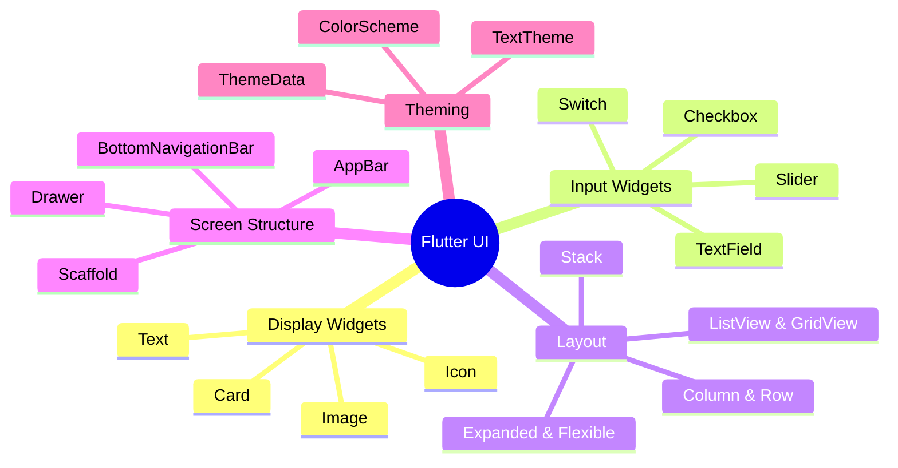

---
type: concept
module: 4
tags:
  - flutter/ui
  - flutter/widgets
  - flutter/layout
slide: "[[Module4_Flutter UI Fundamentals.pptx|Module 4 Slide]]"
lab: "[[4. Flutter UI Fundamentals Lab|Lab 4]]"
status: complete
date: 2026-05-11
---

# 4. Flutter UI Fundamentals

> [!abstract] TL;DR
> Flutter UI được xây dựng từ Widget tree. Layout dùng `Column`, `Row`, `Stack` để sắp xếp. `Scaffold` cung cấp cấu trúc màn hình. `ThemeData` quản lý style toàn app.

---

## Key Topics



---

## Core Concepts

### 4.1 Display Widgets

```dart
// Text với styling
Text(
  'Hello Flutter',
  style: TextStyle(
    fontSize: 24,
    fontWeight: FontWeight.bold,
    color: Colors.deepPurple,
  ),
  maxLines: 2,
  overflow: TextOverflow.ellipsis,
)

// Image
Image.network('https://example.com/photo.jpg',
  width: 200, height: 150, fit: BoxFit.cover)
Image.asset('assets/logo.png', width: 100)

// Icon
Icon(Icons.favorite, color: Colors.red, size: 32)

// Card
Card(
  elevation: 4,
  shape: RoundedRectangleBorder(borderRadius: BorderRadius.circular(12)),
  child: ListTile(
    leading: Icon(Icons.person),
    title: Text('Alice'),
    subtitle: Text('alice@email.com'),
    trailing: Icon(Icons.arrow_forward_ios),
    onTap: () => print('Tapped!'),
  ),
)
```

---

### 4.2 Input Widgets

```dart
// TextField cơ bản
final controller = TextEditingController();

TextField(
  controller: controller,
  decoration: InputDecoration(
    labelText: 'Email',
    hintText: 'Enter your email',
    prefixIcon: Icon(Icons.email),
    border: OutlineInputBorder(),
  ),
  keyboardType: TextInputType.emailAddress,
  onChanged: (value) => print(value),
)

// Switch
bool _isOn = false;
Switch(
  value: _isOn,
  onChanged: (value) => setState(() => _isOn = value),
)

// Slider
double _value = 0.5;
Slider(
  value: _value,
  min: 0.0, max: 1.0,
  onChanged: (v) => setState(() => _value = v),
)

// Checkbox
bool _checked = false;
Checkbox(
  value: _checked,
  onChanged: (v) => setState(() => _checked = v!),
)
```

---

### 4.3 Layout Widgets

#### Column & Row

```dart
Column(
  mainAxisAlignment: MainAxisAlignment.center,    // Vertical axis
  crossAxisAlignment: CrossAxisAlignment.start,   // Horizontal axis
  children: [
    Text('First'),
    SizedBox(height: 16),  // Spacer
    Text('Second'),
    Text('Third'),
  ],
)

Row(
  mainAxisAlignment: MainAxisAlignment.spaceBetween,
  children: [
    Text('Left'),
    Spacer(),             // Flexible spacer
    Text('Right'),
  ],
)
```

> [!tip] `mainAxisAlignment` vs `crossAxisAlignment`
> - **Column**: main axis = **vertical**, cross axis = horizontal
> - **Row**: main axis = **horizontal**, cross axis = vertical

#### Expanded & Flexible

```dart
Row(
  children: [
    Expanded(flex: 2, child: Container(color: Colors.blue)),   // 2/3
    Expanded(flex: 1, child: Container(color: Colors.red)),    // 1/3
  ],
)
```

#### Stack

```dart
Stack(
  children: [
    Image.network(posterUrl, fit: BoxFit.cover),   // Bottom layer
    Positioned(                                      // Top layer
      bottom: 0, left: 0, right: 0,
      child: Container(
        decoration: BoxDecoration(
          gradient: LinearGradient(
            begin: Alignment.bottomCenter,
            end: Alignment.topCenter,
            colors: [Colors.black87, Colors.transparent],
          ),
        ),
        child: Text(title, style: TextStyle(color: Colors.white)),
      ),
    ),
  ],
)
```

#### ListView & GridView

```dart
// ListView.builder (efficient cho list dài)
ListView.builder(
  itemCount: items.length,
  itemBuilder: (context, index) {
    return ListTile(title: Text(items[index]));
  },
)

// GridView
GridView.count(
  crossAxisCount: 2,
  crossAxisSpacing: 8,
  mainAxisSpacing: 8,
  children: items.map((i) => ItemCard(item: i)).toList(),
)

// GridView.builder (efficient)
GridView.builder(
  gridDelegate: SliverGridDelegateWithFixedCrossAxisCount(crossAxisCount: 2),
  itemCount: items.length,
  itemBuilder: (context, i) => ItemCard(item: items[i]),
)
```

---

### 4.4 Scaffold — Screen Structure

```dart
Scaffold(
  appBar: AppBar(
    title: Text('My App'),
    backgroundColor: Theme.of(context).colorScheme.inversePrimary,
    actions: [
      IconButton(icon: Icon(Icons.search), onPressed: () {}),
    ],
  ),
  body: Center(child: Text('Body Content')),
  floatingActionButton: FloatingActionButton(
    onPressed: () {},
    child: Icon(Icons.add),
  ),
  floatingActionButtonLocation: FloatingActionButtonLocation.centerDocked,
  bottomNavigationBar: BottomNavigationBar(
    currentIndex: _selectedIndex,
    onTap: (i) => setState(() => _selectedIndex = i),
    items: [
      BottomNavigationBarItem(icon: Icon(Icons.home), label: 'Home'),
      BottomNavigationBarItem(icon: Icon(Icons.person), label: 'Profile'),
    ],
  ),
  drawer: Drawer(child: /* drawer content */),
)
```

---

### 4.5 Theming

```dart
MaterialApp(
  theme: ThemeData(
    colorScheme: ColorScheme.fromSeed(
      seedColor: Colors.deepPurple,
      brightness: Brightness.light,
    ),
    textTheme: TextTheme(
      displayLarge: TextStyle(fontSize: 32, fontWeight: FontWeight.bold),
      bodyMedium: TextStyle(fontSize: 16),
    ),
    appBarTheme: AppBarTheme(
      centerTitle: true,
      elevation: 0,
    ),
    useMaterial3: true,
  ),
  darkTheme: ThemeData(
    colorScheme: ColorScheme.fromSeed(
      seedColor: Colors.deepPurple,
      brightness: Brightness.dark,
    ),
  ),
  themeMode: ThemeMode.system, // system / light / dark
)

// Truy cập theme trong widget
Color primary = Theme.of(context).colorScheme.primary;
TextStyle body = Theme.of(context).textTheme.bodyMedium!;
```

---

### 4.6 Decoration & Styling

```dart
Container(
  width: 200, height: 100,
  padding: EdgeInsets.all(16),
  margin: EdgeInsets.symmetric(horizontal: 16, vertical: 8),
  decoration: BoxDecoration(
    color: Colors.white,
    borderRadius: BorderRadius.circular(16),
    boxShadow: [
      BoxShadow(
        color: Colors.black26,
        blurRadius: 8, offset: Offset(0, 4),
      ),
    ],
    border: Border.all(color: Colors.grey.shade200),
    gradient: LinearGradient(
      colors: [Colors.purple, Colors.blue],
    ),
  ),
  child: Text('Styled Container'),
)
```

---

## Quick Reference — Common Widgets

| Widget | Dùng khi | Key Props |
| :--- | :--- | :--- |
| `Text` | Hiển thị văn bản | `style`, `maxLines`, `overflow` |
| `Container` | Wrap + style | `padding`, `margin`, `decoration` |
| `Column` | Stack dọc | `mainAxisAlignment`, `crossAxisAlignment` |
| `Row` | Stack ngang | `mainAxisAlignment`, `crossAxisAlignment` |
| `Expanded` | Fill không gian còn lại | `flex` |
| `SizedBox` | Khoảng cách cố định | `width`, `height` |
| `Padding` | Thêm padding | `padding: EdgeInsets...` |
| `Center` | Căn giữa | `child` |
| `Scaffold` | Cấu trúc màn hình | `appBar`, `body`, `fab` |
| `ListView.builder` | List dynamic | `itemCount`, `itemBuilder` |

---

## Common Pitfalls

> [!warning] `ListView` inside `Column` — Lỗi overflow
> `ListView` có infinite height mặc định. Khi đặt trong `Column`, nó không biết chiều cao mình nên bao nhiêu.
> ```dart
> // ❌ Lỗi: ListView cần chiều cao cố định
> Column(children: [ListView(...)])
>
> // ✅ Cách 1: Wrap bằng Expanded
> Column(children: [Expanded(child: ListView(...))])
>
> // ✅ Cách 2: Shrink wrap
> ListView(shrinkWrap: true, physics: NeverScrollableScrollPhysics(), ...)
> ```

> [!warning] `setState()` gây rebuild toàn bộ widget
> Chỉ đặt state gần với widget cần rebuild nhất để tránh rebuild không cần thiết.

---

## Related Notes

- **Slide:** [[Module4_Flutter UI Fundamentals.pptx|Module 4 Slide]]
- **Lab:** [[4. Flutter UI Fundamentals Lab|Lab 4 - UI Fundamentals]]
- **Widget Library:** [[]]
- **Trước:** [[3. Advanced Dart]]
- **Tiếp theo:** [[5. Navigation & State Management]]
- [[Flutter Dashboard]]
