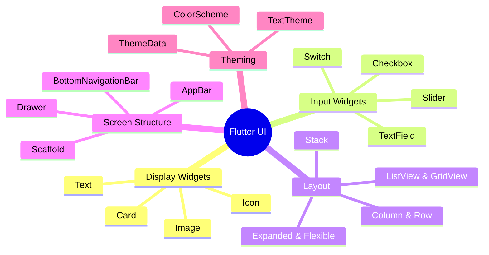
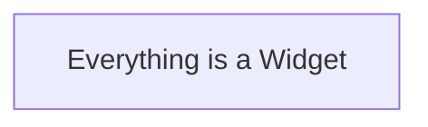

# 4. Flutter UI Fundamentals

> [!abstract] TL;DR
> Flutter UI được xây dựng từ Widget tree. Layout dùng `Column`, `Row`, `Stack` để sắp xếp. `Scaffold` cung cấp cấu trúc màn hình. `ThemeData` quản lý style toàn app.

---

## Key Topics



---

## Core Concepts

### 4.1 Introduction: Everything is a Widget

Trong Flutter, UI được xây dựng bằng cách sắp xếp các **Widgets**. Việc hiểu rõ về Widget sẽ giúp ta phân mảnh UI thành những miếng LEGO nhỏ để tái sử dụng.

Widget mô tả cấu trúc bố cục (layout), ngoại hình (style) và các hành vi (interaction).

Mỗi một màn hình, mỗi nút bấm, mỗi một văn bản đều là một Widget.

**Ví dụ:**
```Dart
import 'package:flutter/material.dart';

void main() => runApp(const MyApp());

class MyApp extends StatelessWidget {
	const MyApp({super.key})
}

Widget build(BuildContext context) {
	return const MaterialApp(
		home: Scaffold(
			body: Center(
				child: Text(
				"Everything is a Widget",
				style: TextStyle(fontSize:26, fontWeight: fontWeight.bold),
				),
			),
		),
	);
}
```
**Output:**

### 4.2 Display Widgets (Text, Image, Icon, Card, ListTile)

##### 1. Text (Hiển thị văn bản)

Đây là widget cơ bản nhất nhưng lại có rất nhiều tùy chỉnh về kiểu dáng (Typography).

**Ví dụ:**
```dart
// Text với styling
Text(
  'Hello Flutter',
  style: TextStyle(
    fontSize: 24,
    fontWeight: FontWeight.bold,
    color: Colors.deepPurple,
  ),
  maxLines: 2,
  overflow: TextOverflow.ellipsis,
  textAlign: TextAlign.center,
)
```
**Mẹo:** Nên dùng `Text.rich` nếu bạn muốn hiển thị một đoạn văn có nhiều định dạng khác nhau (ví dụ: "Tôi đồng ý với **Điều khoản**").

##### 2. Image (Hiển thị hình ảnh)

Flutter hỗ trợ nhiều nguồn ảnh khác nhau: từ thư mục dự án (Assets), từ internet (Network), hoặc từ bộ nhớ máy (File).

**Ví dụ:**
```Dart
// Load ảnh từ Internet
Image.network(
  'https://example.com/logo.png',
  width: 100,
  height: 100,
  fit: BoxFit.cover, // Cách ảnh lấp đầy khung hình
)

//Load ảnh từ file nội bộ dự án
Image.asset('assets/logo.png', width: 100)
```
**Lưu ý:** Khi dùng `Image.asset`, đừng quên khai báo đường dẫn trong file `pubspec.yaml`.

##### 3. Icon (Biểu tượng)

Biểu tượng giúp UI trực quan hơn mà không tốn nhiều dung lượng như hình ảnh. Flutter đi kèm với bộ thư viện **Material Design Icons** rất đồ sộ. Nó cung cấp giao diện đồng nhất trên khắp các thiết bị.

Thường được dùng cho:
- Nút bấm điều hướng.
- Nút thao tác (thêm, sửa, xoá,...)
- Biểu thị trạng thái.

**Ví dụ:**
```Dart
const Icon(
  Icons.home_work_outlined,
  color: Colors.green,
  size: 30.0,
)
```

##### 4. ListTile (Dòng danh sách tiêu chuẩn)

Đây là một "widget lắp ghép" cực kỳ tiện lợi để tạo ra các danh sách (List). Nó đã được chia sẵn các vị trí: bắt đầu (leading), giữa (title/subtitle), và kết thúc (trailing).

**Ví dụ:**
```Dart
ListTile(
  leading: const CircleAvatar(child: Icon(Icons.person)), // Ảnh đại diện bên trái
  title: const Text('Đặng Nguyễn Huy Anh'),
  subtitle: const Text('Sinh viên FPT University'),
  trailing: const Icon(Icons.arrow_forward_ios), // Mũi tên bên phải
  onTap: () => print('Nhấn vào hàng này'),
)
```

##### 5. Card (Thẻ chứa nội dung)

Card giúp tạo hiệu ứng chiều sâu (elevation) và bo góc, làm cho các thành phần UI trông giống như các tấm thẻ vật lý chồng lên nhau. Đây là linh hồn của Material Design.

**Ví dụ:**
```Dart
Card(
  elevation: 4.0, // Độ đổ bóng
  shape: RoundedRectangleBorder(borderRadius: BorderRadius.circular(15)),
  child: const Padding(
    padding: EdgeInsets.all(16.0),
    child: Text('Nội dung bên trong thẻ'),
  ),
)
```

hoặc

```Dart
// Card
Card(
  elevation: 4,
  shape: RoundedRectangleBorder(borderRadius: BorderRadius.circular(12)),
  child: ListTile(
    leading: Icon(Icons.person),
    title: Text('Alice'),
    subtitle: Text('alice@email.com'),
    trailing: Icon(Icons.arrow_forward_ios),
    onTap: () => print('Tapped!'),
  ),
)
```

##### 6. CircleAvatar (Ảnh đại diện hình tròn)

Đúng như tên gọi, đây là widget chuyên dụng để hiển thị ảnh đại diện người dùng hoặc các icon hình tròn.

**Ví dụ:**
```Dart
const CircleAvatar(
  radius: 30, // Bán kính
  backgroundColor: Colors.blue,
  backgroundImage: NetworkImage('https://avatar_url.png'),
  child: Text('AH'), // Hiển thị chữ nếu ảnh chưa load xong
)
```

### 4.3 Input Widgets (Slider, Switch, Radio, Pickers)

##### 1. Text Field (Ô nhập văn bản)

Đây là Widget phức tạp và quan trọng nhất. Nó cho phép người dùng nhập liệu từ bàn phím. Bạn có thể dùng `TextEditingController` để kiểm soát giá trị hoặc lắng nghe sự thay đổi.

**Ví dụ:**
```Dart
final TextEditingController _controller = TextEditingController();

TextField(
  controller: _controller,
  decoration: InputDecoration(
    labelText: 'Họ và tên',
    hintText: 'Nhập tên đầy đủ của bạn',
    prefixIcon: Icon(Icons.person),
    border: OutlineInputBorder(), // Tạo khung bao quanh
  ),
  onChanged: (text) {
    print("Dữ liệu đang nhập: $text");
  },
)
```

##### 2. Slider (Thanh trượt)

Dùng để chọn một giá trị trong một khoảng xác định (ví dụ: điều chỉnh âm lượng, chọn mức lương mong muốn).

**Ví dụ:**
```Dart
// Slider
double _value = 0.5;
Slider(
  value: _value,
  min: 0.0, max: 1.0,
  onChanged: (v) => setState(() => _value = v),
)
```

##### 3. Switch (Công tắc)

Dùng cho các cài đặt Bật/Tắt (Binary choice). Rất phổ biến trong trang Settings của các ứng dụng (Bật/tắt cài đặt, chế độ Ngày/đêm,...).

**Ví dụ:**
```Dart
bool _isDarkTheme = false;

Switch(
  value: _isDarkTheme,
  activeColor: Colors.blue,
  onChanged: (bool value) {
    setState(() {
      _isDarkTheme = value;
    });
  },
)
```

##### 4. Radio (Nút chọn một)

Dùng khi có một danh sách các lựa chọn và người dùng **chỉ được chọn duy nhất một** (Chọn ngành học,...)

**Ví dụ:**
```Dart
int? _selectedValue = 1;

Column(
  children: [
    Radio<int>(
      value: 1,
      groupValue: _selectedValue,
      onChanged: (int? value) {
        setState(() { _selectedValue = value; });
      },
    ),
    Radio<int>(
      value: 2,
      groupValue: _selectedValue,
      onChanged: (int? value) {
        setState(() { _selectedValue = value; });
      },
    ),
  ],
)
```

hoặc

```Dart
import 'package:flutter/material.dart';

void main() => runApp(const RadioDemoApp());

class RadioDemoApp extends StatelessWidget {
  const RadioDemoApp({super.key});
  @override
  Widget build(BuildContext context) => const MaterialApp(home: RadioScreen());
}

class RadioScreen extends StatefulWidget {
  const RadioScreen({super.key});
  @override State<RadioScreen> createState() => _RadioScreenState();
}

class _RadioScreenState extends State<RadioScreen> {
  String? quality = 'HD';
  @override
  Widget build(BuildContext context) {
    return Scaffold(
      appBar: AppBar(title: const Text('RadioListTile')),
      body: Column(
        children: [
        
          RadioListTile<String>(
            title: const Text('SD'),
            value: 'SD',
            groupValue: quality,
            onChanged: (v) => setState(() => quality = v),
          ),

          RadioListTile<String>(
            title: const Text('HD'),
            value: 'HD',
            groupValue: quality,
            onChanged: (v) => setState(() => quality = v),
          ),

          RadioListTile<String>(
            title: const Text('4K'),
            value: '4K',
            groupValue: quality,
            onChanged: (v) => setState(() => quality = v),
          ),
        ],
      ),
    );
  }
}
```
##### 5. Checkbox (Ô tích chọn)

Dùng khi bạn muốn người dùng chọn một hoặc nhiều lựa chọn độc lập (VD: Chọn một hoặc nhiều topping cho đồ uống).

**Ví dụ:**
```Dart
bool _isAccepted = false;

Checkbox(
  value: _isAccepted,
  onChanged: (bool? newValue) {
    setState(() {
      _isAccepted = newValue ?? false; // Xử lý trường hợp null
    });
  },
)
```

- **Mẹo:** Nên dùng `CheckboxListTile` để có cả phần Text tiêu đề và có thể nhấn vào cả dòng để tích chọn, giúp trải nghiệm người dùng tốt hơn trên di động.

##### 6. Date/TimePicker

TimePicker và DatePicker cho người dùng chọn một ngày hoặc một giờ cụ thể từ giao diện lịch và đồng hồ. Nó được sử dụng trong các ứng dụng đặt lịch hẹn, các tác vụ liên quan đến lịch và nhập liệu form (Ngày tháng năm sinh, đặt lịch hẹn,...). Flutter cung cấp các hàm có sẵn để hiển thị các Dialog chọn ngày hoặc giờ theo chuẩn Material Design.

**Ví dụ:**
```Dart
DateTime _selectedDate = DateTime.now();

void _presentDatePicker() {
  showDatePicker(
    context: context,
    initialDate: DateTime.now(),
    firstDate: DateTime(2020),
    lastDate: DateTime(2030),
  ).then((pickedDate) {
    if (pickedDate == null) return;
    setState(() {
      _selectedDate = pickedDate;
    });
  });
}

// Gọi hàm này khi nhấn một Button
```

hoặc

```Dart
class TimePickerDemo extends StatefulWidget {
  const TimePickerDemo({super.key});
  @override State<TimePickerDemo> createState() => _TimePickerDemoState();
}

class _TimePickerDemoState extends State<TimePickerDemo> {
  TimeOfDay? selected;
  Future<void> pick() async {
    final t = await showTimePicker(context: context, initialTime: TimeOfDay.now());
    if (t != null) setState(() => selected = t);
  }

  @override
  Widget build(BuildContext context) {
    final text = selected == null ? 'No time' : 'Selected: ${selected!.format(context)}';
    return Center(
      child: Column(mainAxisAlignment: MainAxisAlignment.center, children: [
        Text(text, style: const TextStyle(fontSize: 18)),
        const SizedBox(height: 12),
        ElevatedButton(onPressed: pick, child: const Text('Pick Time')),
      ]),
    );
  }
}
```

##### Tổng kết:

| **Widget**    | **Kiểu dữ liệu** | **Sử dụng tốt nhất khi...**                                     |
| ------------- | ---------------- | --------------------------------------------------------------- |
| **TextField** | `String`         | Nhập tên, mật khẩu, tìm kiếm, email.                            |
| **Checkbox**  | `bool`           | Đồng ý điều khoản, chọn nhiều tùy chọn trong danh sách.         |
| **Switch**    | `bool`           | Thay đổi cài đặt hệ thống (Theme, Sound, Privacy).              |
| **Radio**     | `T` (Generic)    | Chọn duy nhất một lựa chọn (Giới tính, Phương thức thanh toán). |

### 4.4 Layout Basics (Column, Row, ListView, Padding)

Trong Flutter, mọi thứ đều là Widget, và Layout Widget có nhiệm vụ sắp xếp các Widget con (`children`) theo không gian 2 chiều.

##### 1. Column (Sắp xếp theo chiều dọc)

Dùng khi bạn muốn các thành phần xếp chồng lên nhau từ trên xuống dưới.

- **Trục chính (MainAxis):** Chiều dọc.
    
- **Trục phụ (CrossAxis):** Chiều ngang.
    
**Ví dụ:**
```Dart
Column(
  mainAxisAlignment: MainAxisAlignment.center, // Căn giữa theo chiều dọc
  crossAxisAlignment: CrossAxisAlignment.start, // Căn lề trái theo chiều ngang
  children: [
    Text('Tiêu đề bài học'),
    Text('Mô tả chi tiết...'),
    ElevatedButton(onPressed: () {}, child: Text('Bắt đầu')),
  ],
)
```

##### 2. Row (Sắp xếp theo chiều ngang)

Dùng khi bạn muốn các thành phần nằm cạnh nhau trên cùng một hàng (ví dụ: các icon mạng xã hội hoặc dòng chứa Giá tiền và Nút mua).

- **Trục chính (MainAxis):** Chiều ngang.
    
- **Trục phụ (CrossAxis):** Chiều dọc.
    
**Ví dụ:**
```Dart
Row(
  mainAxisAlignment: MainAxisAlignment.spaceBetween, // Đẩy 2 widget ra 2 đầu
  children: [
    Icon(Icons.star, color: Colors.yellow),
    Text('4.5/5 (100 đánh giá)'),
    Text('Xem thêm'),
  ],
)
```

##### 3. Expanded & Flexible (Phân chia không gian)

Cả hai đều được dùng bên trong `Row` hoặc `Column` để kiểm soát cách Widget con chiếm lĩnh không gian còn trống.

- **Expanded:** Ép Widget con phải **chiếm toàn bộ** phần không gian còn lại của trục chính.
    
- **Flexible:** Cho phép Widget con có kích thước **tối đa** bằng phần không gian còn lại, nhưng nó có thể nhỏ hơn nếu nội dung bên trong không cần nhiều diện tích đến thế.
    
> [!hint]
> **Mẹo (flex factor):** Bạn dùng thuộc tính `flex` (mặc định là 1) để chia tỉ lệ. Ví dụ: Widget A có `flex: 2`, Widget B có `flex: 1` $\rightarrow$ A sẽ to gấp đôi B.

##### 4. Stack (Xếp chồng lên nhau)

Nếu `Row/Column` là dàn hàng ngang/dọc, thì `Stack` cho phép các Widget **đè lên nhau** theo chiều sâu (Z-axis). Widget nào viết sau trong code sẽ nằm đè lên trên.

- Dùng để tạo: Ảnh nền có chữ đè lên, nút "X" trên góc ảnh, hoặc các hiệu ứng layer phức tạp (Thẻ bài xếp chồng,...).
    
- **Positioned:** Là "cặp bài trùng" của Stack, giúp bạn đặt chính xác vị trí của Widget con (cách top, bottom, left, right bao nhiêu pixel).
    
**Ví dụ:**
```Dart
Stack(
  children: [
    Image.network('https://news_cover.jpg'),
    Positioned(
      bottom: 10,
      right: 10,
      child: Icon(Icons.favorite, color: Colors.red),
    ),
  ],
)
```
##### 5. ListView (Danh sách có khả năng cuộn)

Khi số lượng phần tử vượt quá kích thước màn hình, `Column` sẽ gây lỗi tràn màn hình (Overflow). `ListView` giải quyết vấn đề này bằng cách cho phép người dùng cuộn (scroll).

**Ví dụ (Dạng cơ bản):**
```Dart
ListView(
  children: [
    ListTile(title: Text('Bài 1: Giới thiệu')),
    ListTile(title: Text('Bài 2: Cấu trúc dự án')),
    // Thêm nhiều ListTile khác...
  ],
)
```
**Mẹo tối:** Nếu danh sách có hàng ngàn phần tử (như danh sách khóa học), hãy dùng **`ListView.builder`**. Nó chỉ vẽ những phần tử đang hiển thị trên màn hình, giúp tiết kiệm bộ nhớ cực kỳ hiệu quả.
###### ListView.builder:
Cực kỳ quan trọng. Nó chỉ khởi tạo các item khi chúng sắp hiện ra màn hình. Ví dụ trong dự án có 1000 khoá học phải render, builder sẽ không dựng tất cả 1000 cái mà chỉ dựng một số khoá học đủ để fill màn hình.

##### 6. GridView (Lưới)

Dùng để hiện thị nội dung dạng lưới (VD: Bộ sưu tập ảnh,...)
- **SliverGridDelegateWithFixedCrossAxisCount:** Giúp bạn chỉ định cố định số cột (ví dụ: luôn hiển thị 2 cột).

**Ví dụ:**
```Dart
GridView.builder(
  gridDelegate: const SliverGridDelegateWithFixedCrossAxisCount(
    crossAxisCount: 2, // Hiển thị 2 cột
    mainAxisSpacing: 10,
    crossAxisSpacing: 10,
  ),
  itemBuilder: (context, index) => Card(child: Text('Item $index')),
)
```

##### 7. Padding (Tạo khoảng cách đệm)

Thay vì để các Widget dính sát vào mép màn hình hoặc dính vào nhau, bạn dùng `Padding` để tạo khoảng không gian bao quanh.

**Ví dụ:**
```Dart
Padding(
  padding: const EdgeInsets.all(16.0), // Cách đều 4 phía 16 pixel
  child: Text('Nội dung này có khoảng thở'),
)
```
**Cách dùng khác:** `EdgeInsets.symmetric(vertical: 10, horizontal: 20)` để căn chỉnh riêng biệt trên/dưới và trái/phải.

##### 8. Sized Box (Hộp rỗng)

Thay vì dùng `Padding()` rườm rà để giãn cách các Widget, ta có thể đặt vào giữa chúng một chiếc hộp rỗng có độ lớn tuỳ chỉnh để ngăn cách.

- **Tạo khoảng trống:** Giữa hai `Text` trong một `Column`, bạn chèn một `SizedBox(height: 10)` để chúng không dính vào nhau.
    
- **Cố định kích thước:** Ép một `Button` phải có chiều rộng nhất định.
    
**Ví dụ:**
```Dart
Column(
  children: [
    Text('Tiêu đề'),
    SizedBox(height: 20), // Tạo khoảng trống 20px theo chiều dọc
    Text('Nội dung'),
  ],
)
```

##### 9. Kết hợp: Layout lồng nhau (Nested Layouts)

Đây là cách bạn tạo ra các giao diện thực tế. Hãy tưởng tượng một dòng thông báo trong hệ thống **Spa Management** của bạn:

**Ví dụ:**
```Dart
Padding(
  padding: const EdgeInsets.symmetric(horizontal: 10, vertical: 5),
  child: Row(
    children: [
      Icon(Icons.access_time),
      SizedBox(width: 10), // Tạo khoảng trống nhỏ giữa Icon và Column
      Column(
        crossAxisAlignment: CrossAxisAlignment.start,
        children: [
          Text('Lịch hẹn mới', style: TextStyle(fontWeight: FontWeight.bold)),
          Text('Khách hàng: Nguyễn Văn A'),
        ],
      ),
    ],
  ),
)
```

##### Tư duy tối ưu Layout:

1. **Tránh lồng nhau quá sâu:** Việc lồng quá nhiều `Column` trong `Row` rồi lại trong `Column` có thể làm giảm hiệu năng render. Hãy cố gắng giữ cấu trúc phẳng nhất có thể.

2. **Sử dụng `Expanded` hoặc `Flexible`:** Khi đặt một `ListView` bên trong một `Column`, bạn sẽ gặp lỗi "Infinite Height". Hãy bọc `ListView` bằng `Expanded` để nó chiếm toàn bộ phần diện tích còn lại.

3. **Const everywhere:** Như chúng ta đã nói, hãy dùng `const` cho `Padding` hoặc `EdgeInsets` cố định để tối ưu quá trình rebuild.

### 4.5 App Structure (Scaffold, Theme, Navigation)

Đây là những thành phần giúp kết nối các Widget đơn lẻ thành một ứng dụng hoàn chỉnh, có hệ thống và phong cách nhất quán.

##### 1. Scaffold (Bộ khung màn hình)

Nếu coi một ứng dụng là một tòa nhà, thì `Scaffold` chính là khung xương của mỗi tầng. Nó cung cấp cấu trúc chuẩn cho một màn hình theo phong cách Material Design với các vị trí được định nghĩa sẵn.

**Các thành phần chính:**

- `appBar`: Thanh công cụ phía trên (thường dùng cho tiêu đề).
    
- `body`: Nội dung chính của màn hình.
    
- `floatingActionButton`: Nút hành động nổi (thường dùng để thêm mới).
    
- `drawer`: Menu ngăn kéo bên trái.
    
- `bottomNavigationBar`: Thanh điều hướng phía dưới.
	
- `divider`: Một thanh ngang nhỏ để phân chia nội dung.
	
- `spacer`: Đẩy hai phần tử bao lấy nó ra rìa.
    
**Ví dụ:**
```Dart
Scaffold(
  //Thanh trên cùng - tiêu đề của app
  appBar: AppBar( 
    title: const Text('UniTV News'),
    backgroundColor: Colors.blue,
  ),
  //Phần thân: nội dung
  body: const Center(child: Text('Nội dung tin tức ở đây')),
  //Action Button: nút tròn thường dùng để thêm nội dung
  floatingActionButton: FloatingActionButton(
    onPressed: () {},
    child: const Icon(Icons.add),
  ),
);
```

##### 2. Theme (Quản lý phong cách nhất quán)

Thay vì phải chỉnh màu sắc, font chữ cho từng Widget một (rất tốn công và dễ sai sót), bạn dùng `Theme` để định nghĩa một bộ nhận diện thương hiệu cho toàn bộ ứng dụng.

- **Tầm quan trọng:** Giúp bạn đổi màu toàn bộ ứng dụng chỉ trong 1 giây. Rất hữu ích khi làm chức năng **Dark Mode**.
    
**Ví dụ trong `MaterialApp`:**
```Dart
MaterialApp(
  theme: ThemeData(
    primarySwatch: Colors.blue, // Màu chủ đạo
    fontFamily: 'Roboto', // Font chữ toàn ứng dụng
    textTheme: const TextTheme(
      displayLarge: TextStyle(fontSize: 32, fontWeight: FontWeight.bold),
      bodyMedium: TextStyle(fontSize: 16, color: Colors.black87),
    ),
  ),
  home: const MyHomePage(),
);
```
**Cách sử dụng trong Widget con:** `Theme.of(context).primaryColor` — Điều này giúp Widget tự động cập nhật nếu Theme thay đổi.

##### 3. Navigation (Điều hướng màn hình)

Flutter quản lý các màn hình theo cơ chế **Stack** (Ngăn xếp). Bạn "đè" một màn hình mới lên trên màn hình cũ (Giống như Breadcrumbs).

- **`Navigator.push`**: Chuyển sang màn hình mới.
    
- **`Navigator.pop`**: Quay về màn hình trước đó.
    
**Ví dụ:**
```Dart
// Chuyển sang trang chi tiết khóa học
ElevatedButton(
  onPressed: () {
    Navigator.push(
      context,
      MaterialPageRoute(builder: (context) => const DetailScreen()),
    );
  },
  child: const Text('Xem chi tiết'),
);

// Ở màn hình DetailScreen, để quay lại:
IconButton(
  icon: const Icon(Icons.back),
  onPressed: () => Navigator.pop(context),
);
```
**Giải thích:** 
Ở đây Navigatior sẽ làm việc với một stack có 2 page, đó là Main Screen và Detail Screen, dưới dạng: main/detail, khi `.pop()` ta chỉ còn main, tương tự `.push()` vào ta có main/detail.


### 4.6 Design Polish (Spacing, Consistency)

### 4.7 Common Errors & Fixes

### 4.8 Practice Task & Summary


### 4.3 Layout Widgets

#### Column & Row

```dart
Column(
  mainAxisAlignment: MainAxisAlignment.center,    // Vertical axis
  crossAxisAlignment: CrossAxisAlignment.start,   // Horizontal axis
  children: [
    Text('First'),
    SizedBox(height: 16),  // Spacer
    Text('Second'),
    Text('Third'),
  ],
)

Row(
  mainAxisAlignment: MainAxisAlignment.spaceBetween,
  children: [
    Text('Left'),
    Spacer(),             // Flexible spacer
    Text('Right'),
  ],
)
```

> [!tip] `mainAxisAlignment` vs `crossAxisAlignment`
> - **Column**: main axis = **vertical**, cross axis = horizontal
> - **Row**: main axis = **horizontal**, cross axis = vertical

#### Expanded & Flexible

```dart
Row(
  children: [
    Expanded(flex: 2, child: Container(color: Colors.blue)),   // 2/3
    Expanded(flex: 1, child: Container(color: Colors.red)),    // 1/3
  ],
)
```

#### Stack

```dart
Stack(
  children: [
    Image.network(posterUrl, fit: BoxFit.cover),   // Bottom layer
    Positioned(                                      // Top layer
      bottom: 0, left: 0, right: 0,
      child: Container(
        decoration: BoxDecoration(
          gradient: LinearGradient(
            begin: Alignment.bottomCenter,
            end: Alignment.topCenter,
            colors: [Colors.black87, Colors.transparent],
          ),
        ),
        child: Text(title, style: TextStyle(color: Colors.white)),
      ),
    ),
  ],
)
```

#### ListView & GridView

```dart
// ListView.builder (efficient cho list dài)
ListView.builder(
  itemCount: items.length,
  itemBuilder: (context, index) {
    return ListTile(title: Text(items[index]));
  },
)

// GridView
GridView.count(
  crossAxisCount: 2,
  crossAxisSpacing: 8,
  mainAxisSpacing: 8,
  children: items.map((i) => ItemCard(item: i)).toList(),
)

// GridView.builder (efficient)
GridView.builder(
  gridDelegate: SliverGridDelegateWithFixedCrossAxisCount(crossAxisCount: 2),
  itemCount: items.length,
  itemBuilder: (context, i) => ItemCard(item: items[i]),
)
```

---

### 4.4 Scaffold — Screen Structure

```dart
Scaffold(
  appBar: AppBar(
    title: Text('My App'),
    backgroundColor: Theme.of(context).colorScheme.inversePrimary,
    actions: [
      IconButton(icon: Icon(Icons.search), onPressed: () {}),
    ],
  ),
  body: Center(child: Text('Body Content')),
  floatingActionButton: FloatingActionButton(
    onPressed: () {},
    child: Icon(Icons.add),
  ),
  floatingActionButtonLocation: FloatingActionButtonLocation.centerDocked,
  bottomNavigationBar: BottomNavigationBar(
    currentIndex: _selectedIndex,
    onTap: (i) => setState(() => _selectedIndex = i),
    items: [
      BottomNavigationBarItem(icon: Icon(Icons.home), label: 'Home'),
      BottomNavigationBarItem(icon: Icon(Icons.person), label: 'Profile'),
    ],
  ),
  drawer: Drawer(child: /* drawer content */),
)
```

---

### 4.5 Theming

```dart
MaterialApp(
  theme: ThemeData(
    colorScheme: ColorScheme.fromSeed(
      seedColor: Colors.deepPurple,
      brightness: Brightness.light,
    ),
    textTheme: TextTheme(
      displayLarge: TextStyle(fontSize: 32, fontWeight: FontWeight.bold),
      bodyMedium: TextStyle(fontSize: 16),
    ),
    appBarTheme: AppBarTheme(
      centerTitle: true,
      elevation: 0,
    ),
    useMaterial3: true,
  ),
  darkTheme: ThemeData(
    colorScheme: ColorScheme.fromSeed(
      seedColor: Colors.deepPurple,
      brightness: Brightness.dark,
    ),
  ),
  themeMode: ThemeMode.system, // system / light / dark
)

// Truy cập theme trong widget
Color primary = Theme.of(context).colorScheme.primary;
TextStyle body = Theme.of(context).textTheme.bodyMedium!;
```

---

### 4.6 Decoration & Styling

```dart
Container(
  width: 200, height: 100,
  padding: EdgeInsets.all(16),
  margin: EdgeInsets.symmetric(horizontal: 16, vertical: 8),
  decoration: BoxDecoration(
    color: Colors.white,
    borderRadius: BorderRadius.circular(16),
    boxShadow: [
      BoxShadow(
        color: Colors.black26,
        blurRadius: 8, offset: Offset(0, 4),
      ),
    ],
    border: Border.all(color: Colors.grey.shade200),
    gradient: LinearGradient(
      colors: [Colors.purple, Colors.blue],
    ),
  ),
  child: Text('Styled Container'),
)
```

---

## Quick Reference

##### Common Widgets

| Widget                  | Dùng khi                                                                     | Key Props                                            |
| :---------------------- | :--------------------------------------------------------------------------- | :--------------------------------------------------- |
| `Text`                  | Hiển thị văn bản                                                             | `style`, `maxLines`, `overflow`                      |
| `Container`             | Wrap + style                                                                 | `padding`, `margin`, `decoration`                    |
| `Column`                | Stack dọc                                                                    | `mainAxisAlignment`, `crossAxisAlignment`            |
| `Row`                   | Stack ngang                                                                  | `mainAxisAlignment`, `crossAxisAlignment`            |
| `Expanded`              | Fill không gian còn lại                                                      | `flex`                                               |
| `SizedBox`              | Khoảng cách cố định                                                          | `width`, `height`                                    |
| `Padding`               | Thêm padding                                                                 | `padding: EdgeInsets...`                             |
| `Center`                | Căn giữa                                                                     | `child`                                              |
| `Scaffold`              | Cấu trúc màn hình                                                            | `appBar`, `body`, `fab`                              |
| `ListView.builder`      | List dynamic                                                                 | `itemCount`, `itemBuilder`                           |
| `Stack`                 | Khi cần xếp các lớp Widget đè lên nhau (Z-axis).                             | `alignment`, `children`. Dùng kèm với `Positioned`.  |
| `Positioned`            | Định vị chính xác Widget con trong một `Stack`.                              | `top`, `bottom`, `left`, `right`.                    |
| `Card`                  | Tạo khối nội dung có hiệu ứng đổ bóng và bo góc (Material).                  | `elevation`, `shape`, `color`.                       |
| `ListTile`              | Tạo một hàng danh sách tiêu chuẩn có Icon và Text.                           | `leading`, `title`, `subtitle`, `trailing`, `onTap`. |
| `Image`                 | Hiển thị hình ảnh từ Assets hoặc Network.                                    | `fit: BoxFit.cover`, `width`, `height`.              |
| `Icon`                  | Hiển thị biểu tượng từ bộ Material Icons.                                    | `Icons.name`, `size`, `color`.                       |
| `GestureDetector`       | Khi muốn biến bất kỳ Widget nào (như `Container` hay `Image`) thành nút bấm. | `onTap`, `onDoubleTap`, `onLongPress`.               |
| `SingleChildScrollView` | Khi nội dung trong một trang bị tràn (Overflow) nhưng không dùng ListView.   | `child`, `scrollDirection`.                          |
| `Divider`               | Tạo đường kẻ ngang phân chia giữa các mục/section.                           | `thickness`, `indent`, `color`.                      |
| `CircleAvatar`          | Hiển thị ảnh đại diện (User Profile) hình tròn.                              | `backgroundImage`, `radius`.                         |

##### Navigation Widgets

|**Widget**|**Dùng khi**|**Key Props**|
|---|---|---|
|**AppBar**|Thanh tiêu đề phía trên cùng màn hình.|`title`, `actions`, `leading`.|
|**BottomNavigationBar**|Thanh điều hướng 3-5 mục chính ở dưới cùng.|`items`, `currentIndex`, `onTap`.|
|**FloatingActionButton**|Nút bấm tròn nổi trên màn hình (thường dùng để "Thêm").|`onPressed`, `child`.|

## Common Pitfalls

> [!warning] ListView inside Column $\rightarrow$ Wrap với Expanded
> Đây là lỗi kinh điển khiến màn hình trắng xóa và Console báo lỗi **"Vertical viewport was given unbounded height"**.
> - **Tại sao lỗi:** `Column` muốn các con của nó có chiều cao tự nhiên, nhưng `ListView` lại mặc định muốn chiếm vô hạn chiều cao để cuộn. Hai bên "không hiểu nhau" dẫn đến crash.  
> - **Cách Fix:** Bọc `ListView` bằng `Expanded`. Điều này thông báo cho ListView rằng: "Bạn chỉ được phép cao bằng phần còn lại của Column thôi".

> [!warning] Overflow on small screens $\rightarrow$ Flexible / SingleChildScrollView
> Lỗi này xuất hiện dưới dạng dải màu vàng đen (như băng rôn cảnh báo) ở mép màn hình khi nội dung dài hơn kích thước vật lý của điện thoại.
> - **Xử lý bằng `Flexible`:** Dùng trong `Row/Column` để Widget con có thể co giãn, tránh việc "lấn chiếm" không gian của thằng khác.
> 
> - **Xử lý bằng `SingleChildScrollView`:** Bọc bên ngoài toàn bộ `Column` của một trang (như trang Đăng ký/Đăng nhập). Khi bàn phím hiện lên hoặc màn hình quá nhỏ, người dùng có thể cuộn để xem hết các ô nhập liệu.

> [!warning] UI not updating $\rightarrow$ Forgot `setState()`
> Bạn đã thay đổi giá trị của biến (ví dụ: `_counter++`), nhưng màn hình vẫn trơ trơ.
> - **Tại sao lỗi:** Trong `StatefulWidget`, Flutter chỉ vẽ lại giao diện khi hàm `setState()` được gọi. Nó giống như một nút "Refresh" để Flutter biết trạng thái đã thay đổi.
> - **Cách Fix:** Luôn đặt logic thay đổi biến bên trong `setState(() { ... });`
> ```Dart
> // Đúng
> onPressed: () {
> 	setState(() {
> 		_isLiked = !_isLiked;
>	});
> }
> ```

> [!warning] `setState()` gây rebuild toàn bộ widget
> Chỉ đặt state gần với widget cần rebuild nhất để tránh rebuild không cần thiết.

---

## Related Notes

- **Slide:** [[Module4_Flutter UI Fundamentals.pptx|Module 4 Slide]]
- **Lab:** [[4. Flutter UI Fundamentals Lab|Lab 4 - UI Fundamentals]]
- **Widget Library:** [[]]
- **Trước:** [[3. Advanced Dart]]
- **Tiếp theo:** [[5. Navigation & State Management]]
- [[Flutter Dashboard]]
