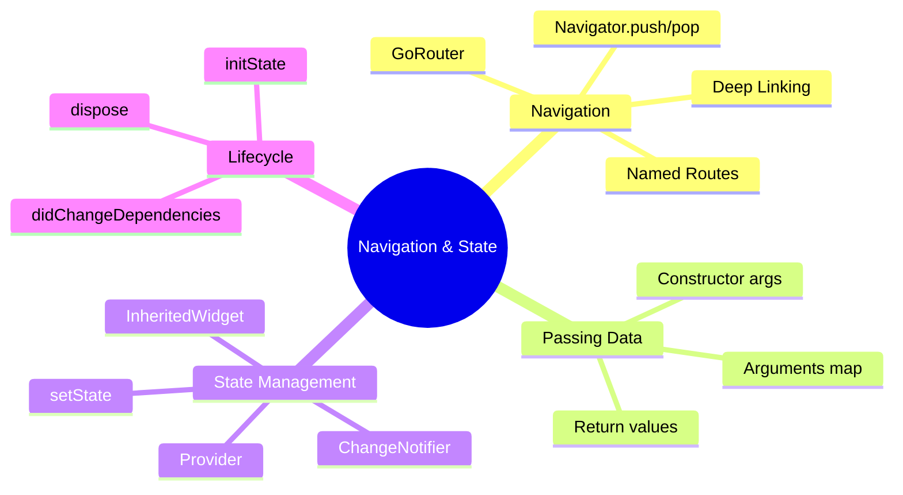

---
type: concept
module: 5
tags:
  - flutter/navigation
  - flutter/state-management
  - flutter/provider
slide: "[[Module5_Navigation & State Management in Flutter.pptx|Module 5 Slide]]"
lab: "[[5. Movie Detail App - Navigation Lab|Lab 5]]"
status: complete
date: 2026-05-11
---

# 5. Navigation & State Management

> [!abstract] TL;DR
> Flutter navigation dùng `Navigator` (stack-based) hoặc `GoRouter` (declarative). State management có nhiều level: `setState` → `InheritedWidget` → `Provider` → `Riverpod/Bloc`.

---

## Key Topics



---

## Core Concepts

### 5.1 Navigator — Stack-based Navigation

Flutter dùng **stack navigation**: push để đi tới, pop để quay lại.

```dart
// Push: đi đến màn hình mới
Navigator.push(
  context,
  MaterialPageRoute(builder: (context) => DetailScreen(item: item)),
);

// Pop: quay lại
Navigator.pop(context);

// Pop với kết quả trả về
Navigator.pop(context, 'result_data');

// Push và chờ kết quả
final result = await Navigator.push(
  context,
  MaterialPageRoute(builder: (_) => FormScreen()),
);
print('User returned: $result');

// PushReplacement: thay thế màn hình hiện tại (không thể back)
Navigator.pushReplacement(
  context,
  MaterialPageRoute(builder: (_) => HomeScreen()),
);

// PushAndRemoveUntil: xóa toàn bộ stack
Navigator.pushAndRemoveUntil(
  context,
  MaterialPageRoute(builder: (_) => LoginScreen()),
  (route) => false, // Xóa tất cả
);
```

---

### 5.2 Named Routes

```dart
// Khai báo routes trong MaterialApp
MaterialApp(
  initialRoute: '/',
  routes: {
    '/': (context) => HomeScreen(),
    '/detail': (context) => DetailScreen(),
    '/profile': (context) => ProfileScreen(),
  },
)

// Navigate
Navigator.pushNamed(context, '/detail');

// Truyền arguments
Navigator.pushNamed(context, '/detail', arguments: {'id': 42, 'title': 'Movie'});

// Nhận arguments
final args = ModalRoute.of(context)!.settings.arguments as Map;
final id = args['id'];
```

---

### 5.3 Truyền Data giữa Screens

```dart
// Cách 1: Constructor (đơn giản nhất)
class DetailScreen extends StatelessWidget {
  final Movie movie;
  const DetailScreen({super.key, required this.movie});
  // ...
}
// Sử dụng:
Navigator.push(context, MaterialPageRoute(
  builder: (_) => DetailScreen(movie: selectedMovie),
));

// Cách 2: Nhận return value
Future<void> _openEditor() async {
  final updatedItem = await Navigator.push<Item>(
    context,
    MaterialPageRoute(builder: (_) => EditScreen(item: currentItem)),
  );
  if (updatedItem != null) setState(() => currentItem = updatedItem);
}
```

---

### 5.4 State Management

#### Level 1: `setState` (Local state)

```dart
class CounterScreen extends StatefulWidget {
  const CounterScreen({super.key});
  @override
  State<CounterScreen> createState() => _CounterScreenState();
}

class _CounterScreenState extends State<CounterScreen> {
  int _count = 0;

  @override
  Widget build(BuildContext context) {
    return ElevatedButton(
      onPressed: () => setState(() => _count++),
      child: Text('Count: $_count'),
    );
  }
}
```

> [!tip] Khi dùng setState?
> - State chỉ cần trong một widget duy nhất.
> - Không cần chia sẻ với widget khác.

---

#### Level 2: `ChangeNotifier` + `Provider`

```dart
// 1. Tạo ChangeNotifier model
class CartModel extends ChangeNotifier {
  final List<Item> _items = [];
  List<Item> get items => List.unmodifiable(_items);
  int get count => _items.length;

  void addItem(Item item) {
    _items.add(item);
    notifyListeners(); // Thông báo cho tất cả listeners rebuild
  }

  void removeItem(Item item) {
    _items.remove(item);
    notifyListeners();
  }
}

// 2. Cung cấp ở cấp cao nhất
void main() {
  runApp(
    ChangeNotifierProvider(
      create: (context) => CartModel(),
      child: MyApp(),
    ),
  );
}

// 3. Consume state
class CartIcon extends StatelessWidget {
  @override
  Widget build(BuildContext context) {
    // Chỉ rebuild khi CartModel.notifyListeners() được gọi
    final count = context.watch<CartModel>().count;
    return Badge(label: Text('$count'), child: Icon(Icons.shopping_cart));
  }
}

// 4. Gọi action (không cần rebuild widget này)
class AddButton extends StatelessWidget {
  @override
  Widget build(BuildContext context) {
    return ElevatedButton(
      onPressed: () => context.read<CartModel>().addItem(item),
      child: Text('Add to Cart'),
    );
  }
}
```

| Method | Dùng khi | Rebuild? |
| :--- | :--- | :---: |
| `context.watch<T>()` | Cần đọc và rebuild khi thay đổi | ✅ |
| `context.read<T>()` | Chỉ gọi action, không cần rebuild | ❌ |
| `context.select<T, R>()` | Chỉ rebuild khi một phần cụ thể thay đổi | Partial |

---

### 5.5 Widget Lifecycle (StatefulWidget)

```dart
class MyWidget extends StatefulWidget { ... }

class _MyWidgetState extends State<MyWidget> {
  @override
  void initState() {
    super.initState();
    // Gọi 1 lần khi widget được tạo
    // Dùng để: fetch data, setup controllers, start timers
  }

  @override
  void didChangeDependencies() {
    super.didChangeDependencies();
    // Gọi khi InheritedWidget thay đổi
    // Dùng để: đọc Theme, MediaQuery, Provider lần đầu
  }

  @override
  void didUpdateWidget(MyWidget oldWidget) {
    super.didUpdateWidget(oldWidget);
    // Gọi khi parent rebuild widget với config mới
  }

  @override
  void dispose() {
    // Gọi khi widget bị removed — QUAN TRỌNG: cleanup resources
    controller.dispose();
    subscription.cancel();
    focusNode.dispose();
    super.dispose();
  }

  @override
  Widget build(BuildContext context) { ... }
}
```

---

### 5.6 Hero Animation

Tự động animate widget giữa hai màn hình khi navigate.

```dart
// Màn hình 1 (Source)
Hero(
  tag: 'movie-poster-${movie.id}', // Tag phải unique
  child: Image.network(movie.posterUrl),
)

// Màn hình 2 (Destination)
Hero(
  tag: 'movie-poster-${movie.id}', // Cùng tag
  child: Image.network(movie.posterUrl, width: double.infinity),
)
```

---

## Quick Reference

| Method | Mục đích |
| :--- | :--- |
| `Navigator.push()` | Đi đến màn hình mới |
| `Navigator.pop()` | Quay lại màn hình trước |
| `Navigator.pushReplacement()` | Thay thế, không back được |
| `Navigator.pushAndRemoveUntil()` | Reset toàn bộ stack |
| `context.watch<T>()` | Đọc state + rebuild theo |
| `context.read<T>()` | Gọi action, không rebuild |
| `notifyListeners()` | Trigger rebuild cho tất cả listeners |

---

## Common Pitfalls

> [!warning] Dùng `context` sau `await` — BuildContext lỗi
> Sau `await`, widget có thể đã bị disposed. Luôn kiểm tra `mounted` trước khi dùng context.
> ```dart
> Future<void> _doSomething() async {
>   await someAsyncOperation();
>   if (!mounted) return; // ← Kiểm tra trước
>   Navigator.pop(context);
> }
> ```

> [!warning] Quên dispose resources
> `TextEditingController`, `AnimationController`, `FocusNode`, `StreamSubscription` đều phải được `dispose()` trong `dispose()` method.

---

## Related Notes

- **Slide:** [[Module5_Navigation & State Management in Flutter.pptx|Module 5 Slide]]
- **Lab:** [[5. Movie Detail App - Navigation Lab|Lab 5 - Movie Detail App]]
- **Trước:** [[4. Flutter UI Fundamentals]]
- **Tiếp theo:** [[6. Responsive UI & Adaptive Layouts]]
- [[Flutter Dashboard]]
