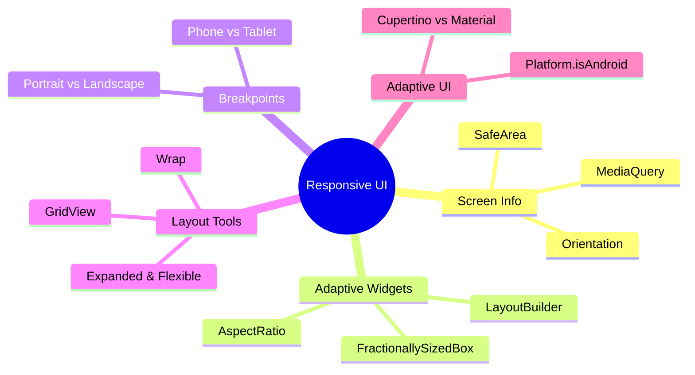

---
type: concept
module: 6
tags:
  - flutter/responsive
  - flutter/layout
  - flutter/adaptive
slide: "[[Module6_Responsive Ui & Adaptive Layouts.pptx|Module 6 Slide]]"
lab: "[[6. Responsive Movie Genre Screen Lab|Lab 6]]"
status: complete
date: 2026-05-11
---

# 6. Responsive UI & Adaptive Layouts

> [!abstract] TL;DR
> Responsive UI = layout tự điều chỉnh theo kích thước màn hình. Dùng `MediaQuery` để lấy thông tin màn hình, `LayoutBuilder` để đo không gian khả dụng, `Wrap` & `GridView` để tự wrap nội dung.

---

## Key Topics



---

## Core Concepts

### 6.1 MediaQuery — Lấy thông tin màn hình

```dart
@override
Widget build(BuildContext context) {
  final mediaQuery = MediaQuery.of(context);
  final screenWidth = mediaQuery.size.width;
  final screenHeight = mediaQuery.size.height;
  final topPadding = mediaQuery.padding.top;        // Status bar height
  final bottomPadding = mediaQuery.padding.bottom;  // Home indicator
  final isLandscape = mediaQuery.orientation == Orientation.landscape;
  final textScaleFactor = mediaQuery.textScaler;    // User font size preference

  return Container(
    width: screenWidth * 0.8, // 80% của màn hình
    child: Text('Screen: ${screenWidth.toStringAsFixed(0)}px'),
  );
}
```

---

### 6.2 LayoutBuilder — Responsive theo không gian có sẵn

`LayoutBuilder` cho biết không gian mà widget hiện tại được phân bổ (không phải toàn bộ màn hình).

```dart
LayoutBuilder(
  builder: (BuildContext context, BoxConstraints constraints) {
    final availableWidth = constraints.maxWidth;

    if (availableWidth < 600) {
      // Phone layout: single column
      return ListView.builder(
        itemCount: items.length,
        itemBuilder: (_, i) => ItemCard(item: items[i]),
      );
    } else if (availableWidth < 900) {
      // Tablet layout: 2 columns
      return GridView.count(crossAxisCount: 2, children: ...);
    } else {
      // Desktop layout: 3 columns
      return GridView.count(crossAxisCount: 3, children: ...);
    }
  },
)
```

> [!tip] MediaQuery vs LayoutBuilder
> - **MediaQuery**: Kích thước toàn bộ màn hình. Dùng cho breakpoints toàn cục.
> - **LayoutBuilder**: Không gian widget con được cấp. Dùng cho component-level responsive.

---

### 6.3 Breakpoints — Chuẩn quy ước

| Breakpoint | Width | Layout |
| :--- | :--- | :--- |
| **Mobile (S)** | < 600px | 1 cột |
| **Mobile (L)** | 600–900px | 2 cột |
| **Tablet** | 900–1200px | 3 cột hoặc side panel |
| **Desktop** | > 1200px | Multi-column, sidebar |

```dart
// Helper class
class Breakpoints {
  static bool isMobile(BuildContext context) =>
      MediaQuery.of(context).size.width < 600;
  static bool isTablet(BuildContext context) =>
      MediaQuery.of(context).size.width >= 600 &&
      MediaQuery.of(context).size.width < 1200;
  static bool isDesktop(BuildContext context) =>
      MediaQuery.of(context).size.width >= 1200;
}
```

---

### 6.4 Wrap — Tự xuống dòng

```dart
Wrap(
  spacing: 8,         // Khoảng cách ngang giữa items
  runSpacing: 8,      // Khoảng cách dọc giữa hàng
  alignment: WrapAlignment.start,
  children: genres.map((genre) =>
    FilterChip(
      label: Text(genre),
      selected: selectedGenres.contains(genre),
      onSelected: (selected) { ... },
    ),
  ).toList(),
)
```

---

### 6.5 SafeArea — Tránh Notch & System UI

```dart
Scaffold(
  body: SafeArea(
    child: Column(
      children: [
        // Content sẽ không bị che bởi status bar, notch, home indicator
      ],
    ),
  ),
)
```

---

### 6.6 Orientation-aware Layout

```dart
class ResponsiveHome extends StatelessWidget {
  @override
  Widget build(BuildContext context) {
    return OrientationBuilder(
      builder: (context, orientation) {
        return orientation == Orientation.portrait
            ? PortraitLayout()
            : LandscapeLayout();
      },
    );
  }
}
```

---

### 6.7 FractionallySizedBox & AspectRatio

```dart
// FractionallySizedBox: % của parent
FractionallySizedBox(
  widthFactor: 0.8,   // 80% chiều rộng parent
  heightFactor: 0.5,  // 50% chiều cao parent
  child: MyWidget(),
)

// AspectRatio: giữ tỉ lệ
AspectRatio(
  aspectRatio: 16 / 9, // Luôn giữ 16:9
  child: Image.network(imageUrl, fit: BoxFit.cover),
)
```

---

### 6.8 Adaptive UI — Platform-specific

```dart
import 'dart:io' show Platform;
import 'package:flutter/cupertino.dart';

Widget buildButton(BuildContext context) {
  if (Platform.isIOS) {
    return CupertinoButton(child: Text('OK'), onPressed: () {});
  }
  return ElevatedButton(child: Text('OK'), onPressed: () {});
}

// Hoặc dùng Theme.of(context).platform
bool isIOS = Theme.of(context).platform == TargetPlatform.iOS;
```

---

## Quick Reference

| Widget | Dùng khi |
| :--- | :--- |
| `MediaQuery.of(context).size` | Cần kích thước màn hình |
| `LayoutBuilder` | Responsive theo không gian widget |
| `SafeArea` | Tránh system UI overlap |
| `Wrap` | Chips, tags tự xuống dòng |
| `OrientationBuilder` | Khác nhau theo portrait/landscape |
| `FractionallySizedBox` | Kích thước theo % parent |
| `AspectRatio` | Giữ tỉ lệ chiều rộng/cao |

---

## Common Pitfalls

> [!warning] Hardcode kích thước pixel
> Đừng dùng kích thước cố định như `width: 375` — sẽ trông sai trên màn hình khác.
> Dùng `MediaQuery`, `Expanded`, `FractionallySizedBox` thay thế.

> [!warning] MediaQuery trong initState
> Không thể dùng `MediaQuery.of(context)` trong `initState()`. Dùng trong `build()` hoặc `didChangeDependencies()`.

---

## Related Notes

- **Slide:** [[Module6_Responsive Ui & Adaptive Layouts.pptx|Module 6 Slide]]
- **Lab:** [[6. Responsive Movie Genre Screen Lab|Lab 6 - Responsive Movie Genre Screen]]
- **Trước:** [[5. Navigation & State Management]]
- **Tiếp theo:** [[7. Forms & Validation]]
- [[Flutter Dashboard]]
