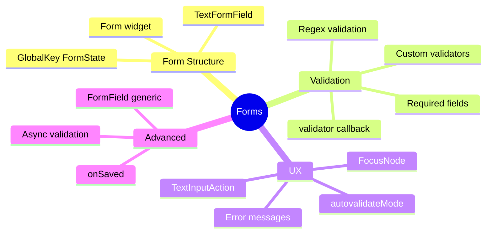

---
type: concept
module: 7
tags:
  - flutter/forms
  - flutter/validation
  - flutter/ux
slide: "[[Module7_Forms and Validation.pptx|Module 7 Slide]]"
lab: "[[7. Signup Form Validation Lab|Lab 7]]"
status: complete
date: 2026-05-11
---

# 7. Forms & Validation

> [!abstract] TL;DR
> Flutter Forms dùng `Form` + `GlobalKey<FormState>` làm container. `TextFormField` có validator built-in. `FocusNode` quản lý keyboard flow. `autovalidateMode` cho real-time feedback.

---

## Key Topics



---

## Core Concepts

### 7.1 Form Structure

```dart
class SignupScreen extends StatefulWidget { ... }

class _SignupScreenState extends State<SignupScreen> {
  // GlobalKey để tham chiếu đến FormState
  final _formKey = GlobalKey<FormState>();

  // Controllers để đọc giá trị
  final _emailController = TextEditingController();
  final _passwordController = TextEditingController();

  @override
  void dispose() {
    _emailController.dispose();
    _passwordController.dispose();
    super.dispose();
  }

  @override
  Widget build(BuildContext context) {
    return Scaffold(
      body: Form(
        key: _formKey,
        autovalidateMode: AutovalidateMode.onUserInteraction,
        child: ListView(
          padding: EdgeInsets.all(16),
          children: [
            TextFormField(
              controller: _emailController,
              decoration: InputDecoration(labelText: 'Email'),
              validator: _validateEmail,
            ),
            // ... thêm fields
            ElevatedButton(
              onPressed: _submit,
              child: Text('Submit'),
            ),
          ],
        ),
      ),
    );
  }

  void _submit() {
    if (_formKey.currentState!.validate()) {
      _formKey.currentState!.save(); // Trigger onSaved callbacks
      // Xử lý submit
    }
  }
}
```

---

### 7.2 Validators

```dart
// Required field
String? _validateRequired(String? value) {
  if (value == null || value.trim().isEmpty) {
    return 'Trường này là bắt buộc';
  }
  return null; // null = hợp lệ
}

// Email validation
String? _validateEmail(String? value) {
  if (value == null || value.isEmpty) return 'Email là bắt buộc';
  final emailRegex = RegExp(r'^[a-zA-Z0-9.]+@[a-zA-Z0-9]+\.[a-zA-Z]+');
  if (!emailRegex.hasMatch(value)) return 'Email không hợp lệ';
  return null;
}

// Password validation
String? _validatePassword(String? value) {
  if (value == null || value.isEmpty) return 'Password là bắt buộc';
  if (value.length < 8) return 'Tối thiểu 8 ký tự';
  if (!RegExp(r'[0-9]').hasMatch(value)) return 'Phải có ít nhất 1 chữ số';
  if (!RegExp(r'[A-Z]').hasMatch(value)) return 'Phải có ít nhất 1 chữ hoa';
  return null;
}

// Confirm password (so sánh với field khác)
String? _validateConfirmPassword(String? value) {
  if (value != _passwordController.text) return 'Mật khẩu không khớp';
  return null;
}
```

> [!important] Quy tắc Validator
> - Trả về `null` = **hợp lệ**
> - Trả về `String` = **thông báo lỗi**

---

### 7.3 autovalidateMode

| Mode | Hành vi |
| :--- | :--- |
| `AutovalidateMode.disabled` | Không tự validate (default) |
| `AutovalidateMode.onUserInteraction` | Validate khi user tương tác với field đó |
| `AutovalidateMode.always` | Validate liên tục mọi lúc |

```dart
Form(
  key: _formKey,
  autovalidateMode: AutovalidateMode.onUserInteraction, // Khuyên dùng
  child: ...,
)
```

---

### 7.4 FocusNode — Quản lý Keyboard Flow

```dart
class _FormState extends State<FormScreen> {
  final _nameFocus = FocusNode();
  final _emailFocus = FocusNode();
  final _passwordFocus = FocusNode();

  @override
  void dispose() {
    _nameFocus.dispose();
    _emailFocus.dispose();
    _passwordFocus.dispose();
    super.dispose();
  }

  @override
  Widget build(BuildContext context) {
    return GestureDetector(
      // Tap ngoài form → ẩn keyboard
      onTap: () => FocusScope.of(context).unfocus(),
      child: Form(
        child: Column(children: [
          TextFormField(
            focusNode: _nameFocus,
            textInputAction: TextInputAction.next, // "Next" trên keyboard
            onFieldSubmitted: (_) {
              FocusScope.of(context).requestFocus(_emailFocus); // Chuyển focus
            },
            decoration: InputDecoration(labelText: 'Full Name'),
          ),
          TextFormField(
            focusNode: _emailFocus,
            textInputAction: TextInputAction.next,
            onFieldSubmitted: (_) {
              FocusScope.of(context).requestFocus(_passwordFocus);
            },
            decoration: InputDecoration(labelText: 'Email'),
          ),
          TextFormField(
            focusNode: _passwordFocus,
            textInputAction: TextInputAction.done, // "Done" = cuối cùng
            onFieldSubmitted: (_) => _submit(),
            obscureText: true,
            decoration: InputDecoration(labelText: 'Password'),
          ),
        ]),
      ),
    );
  }
}
```

---

### 7.5 TextFormField Decoration

```dart
TextFormField(
  decoration: InputDecoration(
    labelText: 'Email',                          // Label floating
    hintText: 'example@email.com',               // Placeholder
    prefixIcon: Icon(Icons.email),               // Icon trái
    suffixIcon: IconButton(                      // Icon phải (interactive)
      icon: Icon(_isVisible ? Icons.visibility : Icons.visibility_off),
      onPressed: () => setState(() => _isVisible = !_isVisible),
    ),
    border: OutlineInputBorder(                  // Bordered style
      borderRadius: BorderRadius.circular(12),
    ),
    errorText: _customError,                     // Custom error (external)
    helperText: 'We never share your email',    // Helper text below
    filled: true,
    fillColor: Colors.grey.shade50,
  ),
  obscureText: !_isVisible,                     // Hide password
  keyboardType: TextInputType.emailAddress,     // Email keyboard
)
```

---

### 7.6 Async Validation

```dart
bool _isChecking = false;
String? _emailError;

Future<void> _submit() async {
  // 1. Validate form locally
  if (!_formKey.currentState!.validate()) return;

  // 2. Async check
  setState(() => _isChecking = true);

  try {
    final isTaken = await _checkEmailAvailability(_emailController.text);
    if (isTaken) {
      setState(() => _emailError = 'Email này đã được sử dụng');
      return;
    }
    // 3. Success
    _proceedWithRegistration();
  } finally {
    setState(() => _isChecking = false);
  }
}

Future<bool> _checkEmailAvailability(String email) async {
  await Future.delayed(const Duration(seconds: 2)); // Simulate API call
  return email.startsWith('taken'); // Fake rule
}

// Submit button với loading state
ElevatedButton(
  onPressed: _isChecking ? null : _submit, // Disable khi đang check
  child: _isChecking
      ? SizedBox(
          width: 20, height: 20,
          child: CircularProgressIndicator(strokeWidth: 2),
        )
      : Text('Create Account'),
)
```

---

## Quick Reference

| Widget/API | Mục đích |
| :--- | :--- |
| `Form` | Container cho form fields |
| `GlobalKey<FormState>` | Tham chiếu đến form state |
| `TextFormField` | Input field với validator |
| `formKey.currentState!.validate()` | Trigger tất cả validators |
| `formKey.currentState!.save()` | Trigger tất cả onSaved callbacks |
| `FocusNode` | Quản lý focus của field |
| `FocusScope.of(context).requestFocus()` | Chuyển focus sang field khác |
| `FocusScope.of(context).unfocus()` | Ẩn keyboard |
| `TextInputAction.next` | "Next" button trên keyboard |
| `TextInputAction.done` | "Done" button trên keyboard |

---

## Common Pitfalls

> [!warning] Quên dispose FocusNode
> `FocusNode` phải được `dispose()` cùng với controller. Nếu không, sẽ gây memory leak.

> [!warning] Context sau async
> Sau `await`, kiểm tra `mounted` trước khi dùng `setState` hoặc `ScaffoldMessenger`.

> [!warning] `validate()` trả về false — nhưng không có lỗi hiển thị
> Đảm bảo form có `key: _formKey` và tất cả TextFormField nằm **bên trong** widget `Form`.

---

## Related Notes

- **Slide:** [[Module7_Forms and Validation.pptx|Module 7 Slide]]
- **Lab:** [[7. Signup Form Validation Lab|Lab 7 - Signup Form]]
- **Trước:** [[6. Responsive UI & Adaptive Layouts]]
- **Tiếp theo:** [[8. Working with RESTful APIs & JSON]]
- [[Flutter Dashboard]]
