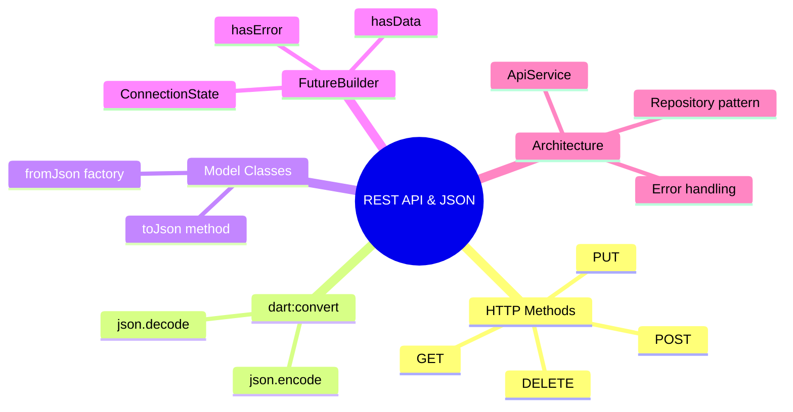

---
type: concept
module: 8
tags:
  - flutter/networking
  - flutter/rest-api
  - flutter/json
  - dart/async
slide: "[[Module8_Working with RESTful APIs & JSON in Flutter.pptx|Module 8 Slide]]"
lab: "[[8. API-powered List Screen Lab|Lab 8]]"
status: complete
date: 2026-05-11
---

# 8. Working with RESTful APIs & JSON

> [!abstract] TL;DR
> Flutter dùng package `http` để gọi REST API. JSON được decode bằng `dart:convert`. `FutureBuilder` bind async data vào UI. Tổ chức code vào `ApiService` class để separation of concerns.

---

## Key Topics



---

## Core Concepts

### 8.1 Setup — http Package

Thêm vào `pubspec.yaml`:
```yaml
dependencies:
  flutter:
    sdk: flutter
  http: ^1.2.0
```

```dart
import 'package:http/http.dart' as http;
import 'dart:convert';
```

---

### 8.2 HTTP Methods

#### GET Request

```dart
Future<List<Post>> fetchPosts() async {
  final uri = Uri.parse('https://jsonplaceholder.typicode.com/posts');

  final response = await http.get(uri, headers: {
    'Content-Type': 'application/json',
    'Authorization': 'Bearer $token',  // Nếu cần auth
  });

  if (response.statusCode == 200) {
    final List<dynamic> data = json.decode(response.body);
    return data.map((json) => Post.fromJson(json)).toList();
  } else {
    throw Exception('Failed to load posts: ${response.statusCode}');
  }
}
```

#### POST Request

```dart
Future<Post> createPost({required String title, required String body}) async {
  final response = await http.post(
    Uri.parse('https://jsonplaceholder.typicode.com/posts'),
    headers: {'Content-Type': 'application/json'},
    body: json.encode({
      'title': title,
      'body': body,
      'userId': 1,
    }),
  );

  if (response.statusCode == 201) {
    return Post.fromJson(json.decode(response.body));
  } else {
    throw Exception('Failed to create post');
  }
}
```

#### PUT & DELETE

```dart
// PUT: cập nhật toàn bộ resource
await http.put(
  Uri.parse('$baseUrl/posts/$id'),
  headers: {'Content-Type': 'application/json'},
  body: json.encode(updatedPost.toJson()),
);

// DELETE: xóa resource
final response = await http.delete(Uri.parse('$baseUrl/posts/$id'));
if (response.statusCode != 200 && response.statusCode != 204) {
  throw Exception('Failed to delete');
}
```

---

### 8.3 Model Class & JSON Parsing

```dart
class Post {
  final int id;
  final int userId;
  final String title;
  final String body;

  Post({
    required this.id,
    required this.userId,
    required this.title,
    required this.body,
  });

  // Deserialize: Map → Object
  factory Post.fromJson(Map<String, dynamic> json) {
    return Post(
      id: json['id'] as int,
      userId: json['userId'] as int,
      title: json['title'] as String,
      body: json['body'] as String,
    );
  }

  // Serialize: Object → Map
  Map<String, dynamic> toJson() => {
    'id': id,
    'userId': userId,
    'title': title,
    'body': body,
  };

  @override
  String toString() => 'Post(id: $id, title: $title)';
}
```

---

### 8.4 ApiService — Service Layer

```dart
class ApiService {
  static const String _baseUrl = 'https://jsonplaceholder.typicode.com';
  final http.Client _client;

  ApiService({http.Client? client}) : _client = client ?? http.Client();

  Future<List<Post>> getPosts() async {
    return _get('/posts', (data) =>
        (data as List).map((j) => Post.fromJson(j)).toList());
  }

  Future<Post> getPost(int id) async {
    return _get('/posts/$id', (data) => Post.fromJson(data));
  }

  Future<Post> createPost(Post post) async {
    return _post('/posts', post.toJson(), (data) => Post.fromJson(data));
  }

  // Generic helper
  Future<T> _get<T>(String path, T Function(dynamic) parser) async {
    final response = await _client.get(Uri.parse('$_baseUrl$path'));
    _checkStatus(response);
    return parser(json.decode(response.body));
  }

  Future<T> _post<T>(String path, Map body, T Function(dynamic) parser) async {
    final response = await _client.post(
      Uri.parse('$_baseUrl$path'),
      headers: {'Content-Type': 'application/json'},
      body: json.encode(body),
    );
    _checkStatus(response);
    return parser(json.decode(response.body));
  }

  void _checkStatus(http.Response response) {
    if (response.statusCode < 200 || response.statusCode >= 300) {
      throw HttpException(
        'HTTP ${response.statusCode}: ${response.reasonPhrase}',
        uri: response.request?.url,
      );
    }
  }

  void dispose() => _client.close();
}
```

---

### 8.5 FutureBuilder — Bind Async Data to UI

```dart
class PostListScreen extends StatefulWidget { ... }

class _PostListScreenState extends State<PostListScreen> {
  late Future<List<Post>> _postsFuture;
  final _apiService = ApiService();

  @override
  void initState() {
    super.initState();
    _postsFuture = _apiService.getPosts();
  }

  void _refresh() {
    setState(() {
      _postsFuture = _apiService.getPosts(); // Reload
    });
  }

  @override
  Widget build(BuildContext context) {
    return FutureBuilder<List<Post>>(
      future: _postsFuture,
      builder: (context, snapshot) {
        // Loading state
        if (snapshot.connectionState == ConnectionState.waiting) {
          return const Center(child: CircularProgressIndicator());
        }

        // Error state
        if (snapshot.hasError) {
          return Center(
            child: Column(
              mainAxisSize: MainAxisSize.min,
              children: [
                Icon(Icons.error_outline, size: 64, color: Colors.red),
                Text('Lỗi: ${snapshot.error}'),
                ElevatedButton(
                  onPressed: _refresh,
                  child: Text('Thử lại'),
                ),
              ],
            ),
          );
        }

        // Success state
        final posts = snapshot.data!;
        if (posts.isEmpty) {
          return const Center(child: Text('Không có dữ liệu'));
        }

        return RefreshIndicator(
          onRefresh: () async => _refresh(),
          child: ListView.builder(
            itemCount: posts.length,
            itemBuilder: (context, index) {
              final post = posts[index];
              return ListTile(
                leading: CircleAvatar(child: Text('${post.id}')),
                title: Text(post.title, maxLines: 2, overflow: TextOverflow.ellipsis),
                subtitle: Text(post.body, maxLines: 1, overflow: TextOverflow.ellipsis),
                onTap: () { /* Navigate to detail */ },
              );
            },
          ),
        );
      },
    );
  }
}
```

---

### 8.6 HTTP Status Codes

| Code | Ý nghĩa | Xử lý |
| :--- | :--- | :--- |
| `200 OK` | Thành công | Parse data |
| `201 Created` | Tạo mới thành công | Parse data mới |
| `204 No Content` | Xóa thành công | Không có body |
| `400 Bad Request` | Request sai | Hiển thị lỗi validation |
| `401 Unauthorized` | Chưa đăng nhập | Redirect về Login |
| `403 Forbidden` | Không có quyền | Thông báo không có quyền |
| `404 Not Found` | Không tìm thấy | Thông báo không có dữ liệu |
| `500 Server Error` | Lỗi server | Thông báo thử lại sau |

---

## Quick Reference

```dart
// Decode JSON
final map = json.decode(response.body);           // Object/Map
final list = json.decode(response.body) as List;  // Array

// Encode JSON
final body = json.encode({'key': 'value'});

// FutureBuilder connection states
ConnectionState.none     // Chưa có future
ConnectionState.waiting  // Đang chờ
ConnectionState.active   // Stream đang active
ConnectionState.done     // Hoàn thành
```

---

## Common Pitfalls

> [!warning] Không kiểm tra status code
> Luôn check `response.statusCode` trước khi parse body. Server có thể trả về 4xx/5xx với body rỗng hoặc HTML error page.

> [!warning] Gọi API trong `build()` method
> Đừng để API call trong `build()` — nó sẽ gọi mỗi khi rebuild. Dùng `initState()` hoặc `FutureBuilder` với future được lưu trong state.
> ```dart
> // ❌ Sai — gọi lại mỗi khi rebuild
> FutureBuilder(future: apiService.getPosts(), ...)
>
> // ✅ Đúng — lưu future trong state
> late final _future = apiService.getPosts();
> FutureBuilder(future: _future, ...)
> ```

> [!warning] Quên đóng http.Client
> Nếu tạo `http.Client` thủ công, gọi `.close()` khi không còn cần. Dùng `dispose()` trong widget.

---

## Related Notes

- **Slide:** [[Module8_Working with RESTful APIs & JSON in Flutter.pptx|Module 8 Slide]]
- **Lab:** [[8. API-powered List Screen Lab|Lab 8 - API-powered List Screen]]
- **Dart async:** [[3. Advanced Dart#3.1 Event Loop & Microtask Queue]]
- **Trước:** [[7. Forms & Validation]]
- **Tiếp theo:** [[9. Local Storage & Persistence]]
- [[Flutter Dashboard]]
