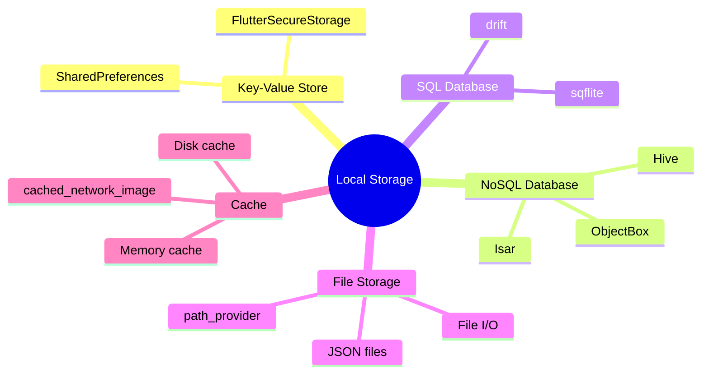

---
type: concept
module: 9
tags:
  - flutter/storage
  - flutter/persistence
  - flutter/database
slide: "[[Module9_Local Storage & Persistence in Flutter.pptx|Module 9 Slide]]"
lab: "*(coming soon)*"
status: complete
date: 2026-05-11
---

# 9. Local Storage & Persistence

> [!abstract] TL;DR
> Flutter có 3 tầng storage: `SharedPreferences` (key-value đơn giản) → `Hive` / `Isar` (NoSQL nhanh, offline-first) → `sqflite` (SQL đầy đủ). Chọn tool phù hợp với độ phức tạp của data.

---

## Key Topics



---

## Core Concepts

### 9.1 SharedPreferences — Key-Value Storage

Dùng cho: settings, user preferences, simple flags, small data.

```yaml
# pubspec.yaml
dependencies:
  shared_preferences: ^2.2.0
```

```dart
import 'package:shared_preferences/shared_preferences.dart';

class PrefsService {
  static const _keyDarkMode = 'dark_mode';
  static const _keyUsername = 'username';
  static const _keyOnboarded = 'onboarded';

  // Get instance (async, gọi 1 lần và cache)
  static late SharedPreferences _prefs;
  static Future<void> init() async {
    _prefs = await SharedPreferences.getInstance();
  }

  // Read
  static bool get isDarkMode => _prefs.getBool(_keyDarkMode) ?? false;
  static String get username => _prefs.getString(_keyUsername) ?? '';
  static bool get isOnboarded => _prefs.getBool(_keyOnboarded) ?? false;

  // Write
  static Future<void> setDarkMode(bool value) =>
      _prefs.setBool(_keyDarkMode, value);
  static Future<void> setUsername(String value) =>
      _prefs.setString(_keyUsername, value);
  static Future<void> setOnboarded() =>
      _prefs.setBool(_keyOnboarded, true);

  // Delete
  static Future<void> clearAll() => _prefs.clear();
}

// Khởi tạo trong main()
void main() async {
  WidgetsFlutterBinding.ensureInitialized();
  await PrefsService.init();
  runApp(MyApp());
}
```

| Method | Type | Default |
| :--- | :--- | :--- |
| `getBool(key)` | `bool?` | `null` |
| `getInt(key)` | `int?` | `null` |
| `getDouble(key)` | `double?` | `null` |
| `getString(key)` | `String?` | `null` |
| `getStringList(key)` | `List<String>?` | `null` |

---

### 9.2 Hive — Fast NoSQL Database

Dùng cho: objects phức tạp, offline-first apps, không cần SQL.

```yaml
dependencies:
  hive_flutter: ^1.1.0
dev_dependencies:
  hive_generator: ^2.0.0
  build_runner: ^2.4.0
```

```dart
// 1. Tạo Model với Hive annotations
import 'package:hive/hive.dart';
part 'task.g.dart'; // Generated file

@HiveType(typeId: 0)
class Task extends HiveObject {
  @HiveField(0)
  late String id;

  @HiveField(1)
  late String title;

  @HiveField(2)
  late bool isCompleted;

  @HiveField(3)
  late DateTime createdAt;
}

// 2. Generate code
// flutter pub run build_runner build

// 3. Init Hive
void main() async {
  WidgetsFlutterBinding.ensureInitialized();
  await Hive.initFlutter();
  Hive.registerAdapter(TaskAdapter()); // Generated adapter
  await Hive.openBox<Task>('tasks');
  runApp(MyApp());
}

// 4. CRUD Operations
class TaskRepository {
  final Box<Task> _box = Hive.box<Task>('tasks');

  List<Task> getAll() => _box.values.toList();

  Future<void> add(Task task) => _box.put(task.id, task);

  Future<void> update(Task task) => task.save(); // HiveObject method

  Future<void> delete(String id) => _box.delete(id);

  // Reactive: watch thay đổi
  Stream<BoxEvent> watch() => _box.watch();
}
```

---

### 9.3 sqflite — SQL Database

Dùng cho: data quan hệ phức tạp, cần JOIN, GROUP BY, transactions.

```yaml
dependencies:
  sqflite: ^2.3.0
  path: ^1.8.0
```

```dart
import 'package:sqflite/sqflite.dart';
import 'package:path/path.dart';

class DatabaseHelper {
  static Database? _db;
  static const _dbName = 'app_database.db';
  static const _dbVersion = 1;

  static Future<Database> get database async {
    _db ??= await _initDatabase();
    return _db!;
  }

  static Future<Database> _initDatabase() async {
    final path = join(await getDatabasesPath(), _dbName);
    return openDatabase(
      path,
      version: _dbVersion,
      onCreate: _onCreate,
      onUpgrade: _onUpgrade,
    );
  }

  static Future<void> _onCreate(Database db, int version) async {
    await db.execute('''
      CREATE TABLE tasks (
        id TEXT PRIMARY KEY,
        title TEXT NOT NULL,
        is_completed INTEGER NOT NULL DEFAULT 0,
        created_at TEXT NOT NULL
      )
    ''');
  }

  static Future<void> _onUpgrade(Database db, int oldVersion, int newVersion) async {
    // Handle schema migrations
    if (oldVersion < 2) {
      await db.execute('ALTER TABLE tasks ADD COLUMN priority INTEGER DEFAULT 0');
    }
  }
}

// Repository
class TaskSqlRepository {
  Future<List<Task>> getAll() async {
    final db = await DatabaseHelper.database;
    final maps = await db.query('tasks', orderBy: 'created_at DESC');
    return maps.map(Task.fromMap).toList();
  }

  Future<void> insert(Task task) async {
    final db = await DatabaseHelper.database;
    await db.insert('tasks', task.toMap(),
        conflictAlgorithm: ConflictAlgorithm.replace);
  }

  Future<void> update(Task task) async {
    final db = await DatabaseHelper.database;
    await db.update('tasks', task.toMap(),
        where: 'id = ?', whereArgs: [task.id]);
  }

  Future<void> delete(String id) async {
    final db = await DatabaseHelper.database;
    await db.delete('tasks', where: 'id = ?', whereArgs: [id]);
  }

  Future<List<Task>> query({bool? completed}) async {
    final db = await DatabaseHelper.database;
    final maps = await db.query(
      'tasks',
      where: completed != null ? 'is_completed = ?' : null,
      whereArgs: completed != null ? [completed ? 1 : 0] : null,
    );
    return maps.map(Task.fromMap).toList();
  }
}
```

---

### 9.4 path_provider — File System Access

```dart
import 'package:path_provider/path_provider.dart';
import 'dart:io';

class FileStorageService {
  Future<String> get _localPath async {
    final dir = await getApplicationDocumentsDirectory();
    return dir.path;
  }

  Future<File> _localFile(String filename) async {
    final path = await _localPath;
    return File('$path/$filename');
  }

  Future<void> writeJson(String filename, Map<String, dynamic> data) async {
    final file = await _localFile(filename);
    await file.writeAsString(json.encode(data));
  }

  Future<Map<String, dynamic>?> readJson(String filename) async {
    try {
      final file = await _localFile(filename);
      final content = await file.readAsString();
      return json.decode(content);
    } catch (e) {
      return null;
    }
  }
}
```

---

## So sánh các giải pháp Storage

| Solution | Use case | Complexity | Performance |
| :--- | :--- | :---: | :---: |
| `SharedPreferences` | Settings, flags, small values | ⭐ | ⭐⭐ |
| `Hive` | Objects, offline data, no relations | ⭐⭐ | ⭐⭐⭐⭐⭐ |
| `Isar` | Complex queries, full-text search | ⭐⭐⭐ | ⭐⭐⭐⭐⭐ |
| `sqflite` | Relational data, JOIN, transactions | ⭐⭐⭐⭐ | ⭐⭐⭐⭐ |
| `File I/O` | Large files, exports, custom formats | ⭐⭐ | ⭐⭐⭐ |

---

## Common Pitfalls

> [!warning] Quên `WidgetsFlutterBinding.ensureInitialized()`
> Bất kỳ code nào dùng platform channels (SharedPreferences, Hive, sqflite) **phải** gọi `ensureInitialized()` trước `runApp()` nếu cần await trong `main()`.

> [!warning] Lưu sensitive data trong SharedPreferences
> SharedPreferences **không được mã hóa**. Dùng `flutter_secure_storage` cho tokens, passwords.

---

## Related Notes

- **Slide:** [[Module9_Local Storage & Persistence in Flutter.pptx|Module 9 Slide]]
- **Trước:** [[8. Working with RESTful APIs & JSON]]
- **Tiếp theo:** [[10. Authentication & Notifications]]
- [[Flutter Dashboard]]
