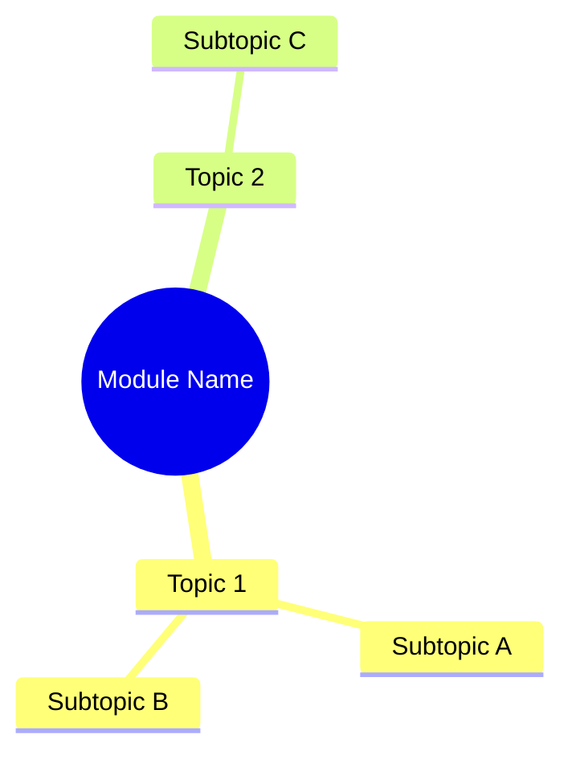

---
type: concept
module: 
tags: []
slide: ""
lab: ""
status: draft
date: {{date}}
---

# {{title}}

> [!abstract] TL;DR
> *Tóm tắt 1-2 câu nội dung chính của module này.*

---

## Mind Map / Key Topics



---

## Core Concepts

### Concept 1
*Giải thích ngắn gọn...*

> [!note] Key Point
> Điểm quan trọng cần nhớ.

---

### Concept 2
*Giải thích...*

```dart
// Code example
```

---

## Quick Reference

| Khái niệm | Ý nghĩa |
| :--- | :--- |
| | |

---

## Common Patterns

### Pattern 1: *Tên pattern*

```dart
// Code
```

---

## Common Pitfalls

> [!warning] Lỗi thường gặp
> Mô tả lỗi và cách tránh.

---

## Related Notes

- **Slide:** [[]]
- **Lab:** [[]]
- **Concepts liên quan:** [[]]
- [[Flutter Dashboard]]
